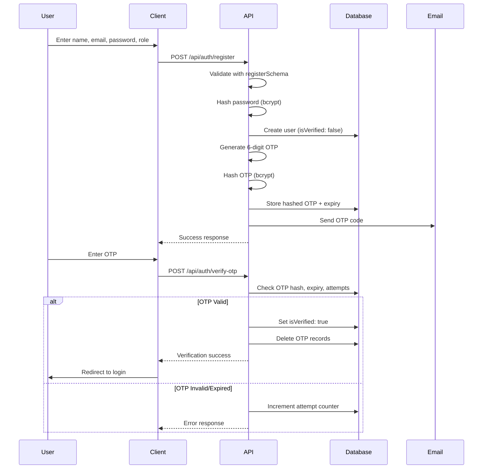
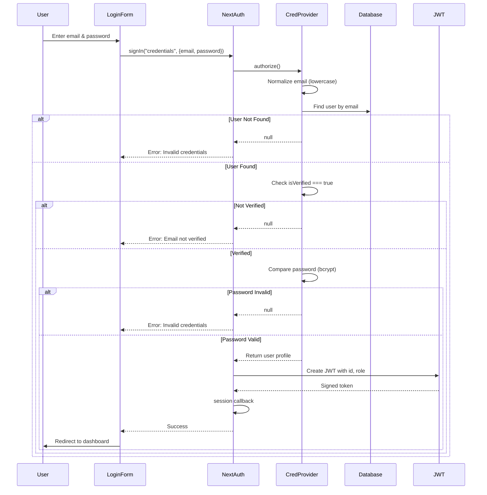
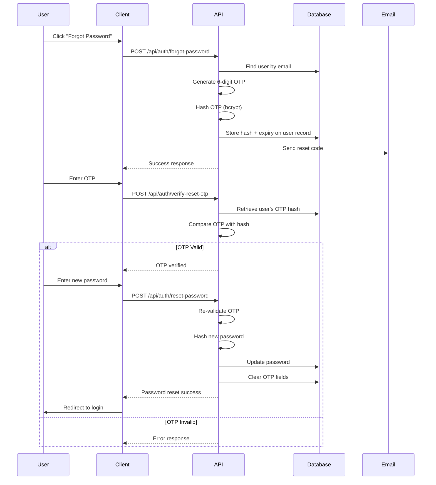

# Authentication System Documentation

## Table of Contents
1. [Overview](#overview)
2. [Registration Flow](#registration-flow)
3. [Sign-In Flow](#sign-in-flow)
4. [Password Reset Flow](#password-reset-flow)
5. [Technical Implementation](#technical-implementation)
6. [Security Features](#security-features)

---

## Overview

This authentication system provides a secure, OTP-verified user management solution built with Next.js, NextAuth.js, and JWT-based sessions.

### Key Features
- ✅ Email-based OTP verification
- ✅ JWT session management (1-hour lifetime)
- ✅ Role-based access control
- ✅ Password reset with OTP verification
- ✅ Rate limiting on sensitive endpoints
- ✅ Bcrypt password hashing

---

## Registration Flow



### Step-by-Step Process

#### 1. User Registration
**Endpoint:** `POST /api/auth/register`  
**File:** `app/api/auth/register/route.ts:11`

**Request Body:**
```json
{
  "name": "John Doe",
  "email": "john@example.com",
  "password": "SecurePass123!",
  "role": "user"
}
```

**Process:**
1. Validate input using `registerSchema`
2. Hash password with bcrypt
3. Create user record with `isVerified: false`
4. Generate random 6-digit OTP
5. Hash OTP and store with expiry timestamp
6. Send OTP via email
7. Return success response

#### 2. OTP Verification
**Endpoint:** `POST /api/auth/verify-otp`  
**File:** `app/api/auth/verify-otp/route.ts:9`

**Request Body:**
```json
{
  "email": "john@example.com",
  "otp": "123456"
}
```

**Process:**
1. Retrieve user's stored OTP hash and expiry
2. Check if OTP has expired
3. Verify OTP attempts limit not exceeded
4. Compare provided OTP with bcrypt hash
5. If valid:
   - Set `isVerified: true`
   - Delete all OTP records for user
   - Return success
6. If invalid:
   - Increment attempt counter
   - Return error

#### 3. Resend OTP
**Endpoint:** `POST /api/auth/resend-otp`  
**File:** `app/api/auth/resend-otp/route.ts:12`

**Features:**
- Rate limiting to prevent abuse
- Invalidates previous OTPs
- Generates new OTP with fresh expiry
- Sends new email

---

## Sign-In Flow



### Step-by-Step Process

#### 1. Login Form Submission
**Component:** `components/auth/login-form.tsx`

**Client-side:**
```typescript
await signIn("credentials", {
  email: email,
  password: password,
  redirect: false
});
```

#### 2. Credentials Provider
**File:** `app/api/auth/[...nextauth]/route.ts:96`

**Process:**
1. **Email Normalization:** Convert to lowercase
2. **User Lookup:** Query database by normalized email
3. **Verification Check:** Ensure `isVerified === true`
4. **Password Verification:** Compare with bcrypt hash
5. **Return Profile:** Minimal user object (id, name, email, role)

#### 3. JWT Callback
Stores user metadata in token:
```typescript
jwt.callback = async ({ token, user }) => {
  if (user) {
    token.id = user.id;
    token.role = user.role;
  }
  return token;
}
```

#### 4. Session Callback
Exposes data to client:
```typescript
session.callback = async ({ session, token }) => {
  session.user.id = token.id;
  session.user.role = token.role;
  return session;
}
```

### Session Configuration
- **Strategy:** JWT (stateless)
- **Lifetime:** 1 hour
- **Storage:** HTTP-only cookies
- **Error Redirect:** `/auth/login`

---

## Password Reset Flow



### Step-by-Step Process

#### 1. Request Password Reset
**Endpoint:** `POST /api/auth/forgot-password`  
**File:** `app/api/auth/forgot-password/route.ts:11`

**Request Body:**
```json
{
  "email": "john@example.com"
}
```

**Process:**
1. Validate email exists in database
2. Generate random 6-digit OTP
3. Hash OTP with bcrypt
4. Store `resetPasswordOtp` and `resetPasswordOtpExpiry` on user
5. Send reset code via email

#### 2. Verify Reset OTP
**Endpoint:** `POST /api/auth/verify-reset-otp`  
**File:** `app/api/auth/verify-reset-otp/route.ts:7`

**Request Body:**
```json
{
  "email": "john@example.com",
  "otp": "123456"
}
```

**Process:**
1. Retrieve user's `resetPasswordOtp` and expiry
2. Check if OTP has expired
3. Compare provided OTP with stored hash
4. Return success if valid

#### 3. Reset Password
**Endpoint:** `POST /api/auth/reset-password`  
**File:** `app/api/auth/reset-password/route.ts:7`

**Request Body:**
```json
{
  "email": "john@example.com",
  "otp": "123456",
  "newPassword": "NewSecurePass123!"
}
```

**Process:**
1. **Re-validate OTP** (double-check security)
2. Hash new password with bcrypt
3. Update user's password
4. Clear `resetPasswordOtp` and `resetPasswordOtpExpiry` fields
5. Return success

---

## Technical Implementation

### File Structure
```
app/
├── api/
│   └── auth/
│       ├── register/
│       │   └── route.ts              # Registration endpoint
│       ├── verify-otp/
│       │   └── route.ts              # OTP verification
│       ├── resend-otp/
│       │   └── route.ts              # OTP resend with rate limit
│       ├── forgot-password/
│       │   └── route.ts              # Reset request
│       ├── verify-reset-otp/
│       │   └── route.ts              # Reset OTP verification
│       ├── reset-password/
│       │   └── route.ts              # Password update
│       └── [...nextauth]/
│           └── route.ts              # NextAuth configuration
components/
└── auth/
    └── login-form.tsx                # Login UI component
```

### Database Schema

```typescript
// User Model
{
  id: string,
  name: string,
  email: string,              // Unique, normalized
  password: string,           // Bcrypt hash
  role: string,               // "user" | "admin" | etc.
  isVerified: boolean,        // Email verification status
  
  // Password reset fields
  resetPasswordOtp?: string,      // Bcrypt hash of OTP
  resetPasswordOtpExpiry?: Date,  // Expiration timestamp
  
  // Timestamps
  createdAt: Date,
  updatedAt: Date
}

// OTP Model (for registration)
{
  id: string,
  userId: string,             // Foreign key
  otpHash: string,            // Bcrypt hash
  expiresAt: Date,
  attempts: number,           // Failed verification count
  createdAt: Date
}
```

### Configuration Constants

```typescript
// OTP Settings
OTP_LENGTH = 6
OTP_EXPIRY = 10 minutes
MAX_OTP_ATTEMPTS = 5

// Session Settings
JWT_LIFETIME = 1 hour
SESSION_STRATEGY = "jwt"

// Password Requirements
MIN_PASSWORD_LENGTH = 8
BCRYPT_ROUNDS = 10
```

---

## Security Features

### 1. Password Security
- **Hashing Algorithm:** Bcrypt with 10 rounds
- **Storage:** Only hashed passwords stored, never plaintext
- **Validation:** Enforced minimum length and complexity

### 2. OTP Security
- **Generation:** Cryptographically random 6-digit codes
- **Storage:** Bcrypt-hashed, never stored in plaintext
- **Expiry:** 10-minute validity window
- **Attempt Limiting:** Max 5 verification attempts
- **One-time Use:** Deleted after successful verification

### 3. Session Security
- **JWT Strategy:** Stateless, server-signed tokens
- **HTTP-Only Cookies:** Prevents XSS attacks
- **Short Lifetime:** 1-hour expiration
- **Secure Transport:** HTTPS enforced in production

### 4. Rate Limiting
- **Resend OTP:** Prevents email bombing
- **Failed Login:** Protects against brute force
- **Password Reset:** Limits reset request frequency

### 5. Email Verification
- **Registration Gate:** Users cannot login until verified
- **isVerified Flag:** Database-level enforcement
- **Normalized Emails:** Lowercase storage prevents duplicate accounts

### 6. Input Validation
- **Schema Validation:** Zod schemas on all endpoints
- **Email Normalization:** Case-insensitive matching
- **Sanitization:** Prevents injection attacks

---

## Error Handling

### Common Error Responses

| Scenario | HTTP Status | Message |
|----------|-------------|---------|
| Invalid credentials | 401 | "Invalid email or password" |
| Unverified email | 403 | "Please verify your email first" |
| Expired OTP | 400 | "OTP has expired" |
| Invalid OTP | 400 | "Invalid OTP" |
| Max attempts exceeded | 429 | "Too many attempts" |
| Rate limit hit | 429 | "Too many requests" |
| User not found | 404 | "User not found" |
| Validation error | 400 | Schema-specific message |

### Client-side Error Handling
```typescript
// Example from login form
const result = await signIn("credentials", {...});

if (result?.error) {
  // Display error to user
  setError(result.error);
  // Redirect preserved for retry
}
```

---

## Complete User Journey

### New User Registration
1. User visits `/auth/register`
2. Fills form: name, email, password, role
3. Submits → `POST /api/auth/register`
4. Receives email with 6-digit OTP
5. Enters OTP → `POST /api/auth/verify-otp`
6. Account activated (`isVerified: true`)
7. Redirected to `/auth/login`
8. Logs in with credentials
9. NextAuth creates JWT session
10. Redirected to dashboard

### Returning User Login
1. User visits `/auth/login`
2. Enters email and password
3. `signIn("credentials")` called
4. Credentials provider validates
5. JWT token issued with id/role
6. Session created (1-hour lifetime)
7. Redirected to protected route

### Password Reset Journey
1. User clicks "Forgot Password" on login
2. Enters email → `POST /api/auth/forgot-password`
3. Receives reset OTP via email
4. Enters OTP → `POST /api/auth/verify-reset-otp`
5. OTP validated
6. Enters new password → `POST /api/auth/reset-password`
7. Password updated, OTP cleared
8. Redirected to login with new password

---

## API Quick Reference

| Endpoint | Method | Purpose | Auth Required |
|----------|--------|---------|---------------|
| `/api/auth/register` | POST | Create new user account | No |
| `/api/auth/verify-otp` | POST | Verify registration OTP | No |
| `/api/auth/resend-otp` | POST | Request new OTP | No |
| `/api/auth/forgot-password` | POST | Initiate password reset | No |
| `/api/auth/verify-reset-otp` | POST | Verify reset OTP | No |
| `/api/auth/reset-password` | POST | Update password | No |
| `/api/auth/[...nextauth]` | POST | NextAuth handlers (login) | No |

---

## Environment Variables Required

```env
# Database
DATABASE_URL="postgresql://..."

# NextAuth
NEXTAUTH_URL="http://localhost:3000"
NEXTAUTH_SECRET="your-secret-key"

# Email Service
EMAIL_HOST="smtp.gmail.com"
EMAIL_PORT="587"
EMAIL_USER="your-email@gmail.com"
EMAIL_PASSWORD="your-app-password"
EMAIL_FROM="noreply@yourapp.com"
```

---

## Best Practices Implemented

✅ **Separation of Concerns:** Auth logic separated from business logic  
✅ **Stateless Sessions:** JWT eliminates server-side session storage  
✅ **Defense in Depth:** Multiple security layers (hashing, expiry, attempts)  
✅ **Secure by Default:** Email verification required before login  
✅ **Rate Limiting:** Prevents abuse of sensitive endpoints  
✅ **Clear Error Messages:** User-friendly without exposing security details  
✅ **Audit Trail:** Timestamps on all auth-related records  
✅ **Token Rotation:** Short JWT lifetime forces regular re-authentication

---

## Testing Checklist

- [ ] Register with valid credentials
- [ ] Register with duplicate email (should fail)
- [ ] Verify OTP with correct code
- [ ] Verify OTP with incorrect code (5 attempts)
- [ ] Verify OTP after expiry
- [ ] Resend OTP multiple times (check rate limit)
- [ ] Login before email verification (should fail)
- [ ] Login with correct credentials
- [ ] Login with incorrect password
- [ ] Request password reset
- [ ] Reset password with valid OTP
- [ ] Reset password with expired OTP
- [ ] Session expiry after 1 hour
- [ ] Role-based access control

---

## Maintenance Notes

### Regular Tasks
- Monitor OTP delivery rates
- Review failed login attempts
- Audit expired OTP cleanup
- Check JWT secret rotation schedule
- Update bcrypt rounds as compute improves

### Security Considerations
- Never log passwords or OTPs
- Rotate `NEXTAUTH_SECRET` periodically
- Keep dependencies updated
- Monitor for brute force patterns
- Implement CAPTCHA if abuse detected

---

