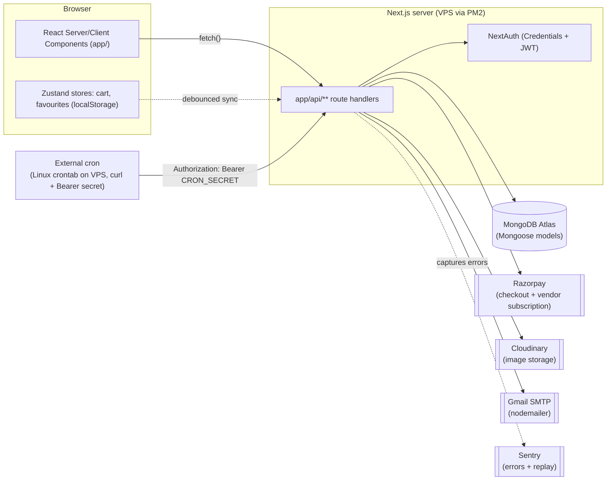
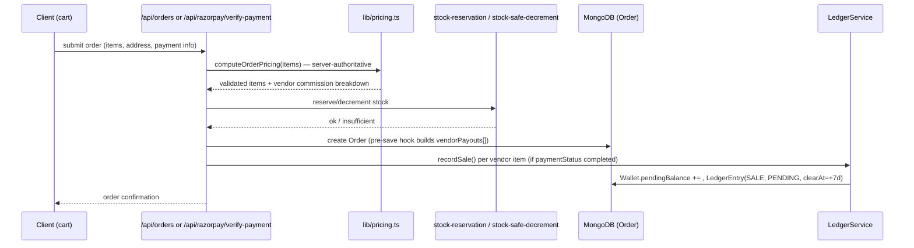
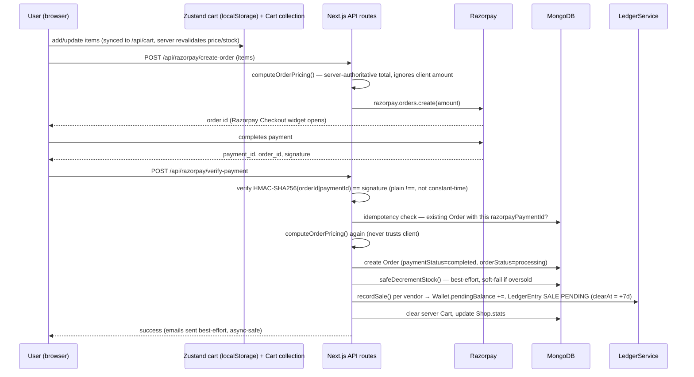
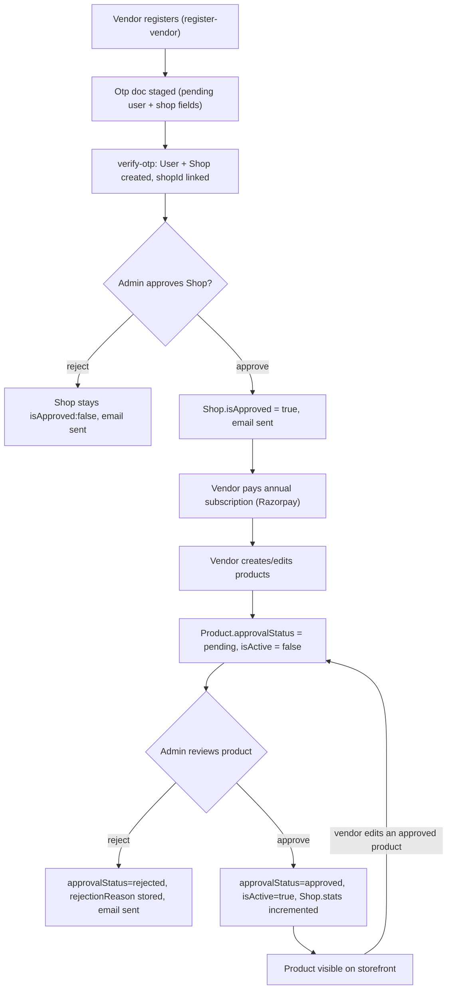

# LinknSmile — Project Source of Truth

> **Last verified against code:** 2026-08-13
> **This document is the authoritative architecture reference for AI-assisted development on this repo.** It was built by directly reading the codebase, not by trusting existing docs. Where existing docs (`README.md`, `DOCUMENTATION.md`, `Deployment.md`, the `.docx` files) conflict with the code, **the code wins** and the conflict is noted in §17.
>
> Package name in `package.json` is still `instapeels` — a legacy name from before the "LinkNSmile" rebrand. Branding is inconsistent across the codebase (see §16).

---

## 1. Project Overview

LinknSmile is a **multi-vendor e-commerce marketplace** (Next.js App Router monolith) for local/handcrafted Indian products. Three user roles share one codebase:

- **Customers** — browse, cart, checkout (Razorpay or COD), track orders, review products, wishlist/favourites.
- **Vendors** (`shop_owner` role) — register, get admin-approved, pay an annual subscription fee, list products (each product also needs separate admin approval), fulfill orders, and withdraw earnings via a wallet/payout system.
- **Admins** — approve vendors/products, manage categories/promos/blogs, moderate reviews, control payment settings, run analytics, approve payouts, manage the platform wallet.

**Tech stack (verified from `package.json` / config files):**

| Layer | Technology |
|---|---|
| Framework | Next.js 15.3.3 (App Router), React 18.3.1, TypeScript 5 (strict mode) |
| Styling | Tailwind CSS 4 (CSS-first config, no `tailwind.config.ts`) + shadcn/ui ("new-york" style) |
| Database | MongoDB via Mongoose 8.9.5 (no native driver usage) |
| Auth | NextAuth.js v4 (Credentials provider only, JWT session strategy) + a parallel custom `jsonwebtoken` scheme for mobile |
| Payments | Razorpay (checkout + vendor annual subscription), Cash on Delivery |
| Email | Nodemailer via Gmail SMTP (two separate wrapper modules — see §16) |
| Images/Storage | Cloudinary + local filesystem serving (both used, inconsistently — see §16) |
| State (client) | Zustand (cart store, favourites store) |
| Monitoring | Sentry (`@sentry/nextjs`), Vercel Analytics |
| Testing | Playwright (3 shallow smoke-test specs, not wired into CI) |
| Deployment | Self-hosted VPS via PM2 + GitHub Actions SSH deploy (see §11). A `Dockerfile` also exists but is **not used by any deploy path** — likely stale. |

There is **no `middleware.ts`** anywhere in the repo. All route protection is done per-API-route (server) and per-layout (`useSession()` client-side redirect for `/admin`, `/vendor`, `/profile`).

---

## 2. Architecture

Single Next.js application, no separate backend service:



- **No dedicated backend/API server** — `app/api/**` route handlers are the entire backend.
- **No message queue / background job runner** — "background" work (payout clearing, subscription sweeps) is done via HTTP-triggered cron routes protected by a `CRON_SECRET` bearer token, expected to be called by an external scheduler.
- **Production runs on a VPS via PM2**, not Vercel, despite a `vercel.json` defining Vercel Cron Jobs — those Vercel crons only fire if a parallel Vercel deployment exists (**Needs Verification** whether one does). The VPS is the confirmed real deployment (see `Deployment.md`, `ecosystem.config.js`, `.github/workflows/deploy.yml`).

---

## 3. Repository Structure

```
app/                    # Next.js App Router — pages + all API routes (app/api/**)
components/             # Shared React components (see §Module Inventory)
  ui/                   # shadcn/ui primitives
  auth/                 # login/register/otp forms, NextAuth SessionProvider wrapper
  admin/                # single admin widget (image-upload-field); most admin UI is inline in app/admin/**
hooks/                  # useFavourites, useFavouritesLoader, use-mobile, use-toast
lib/
  models/               # All Mongoose schemas (source of truth for DB shape)
  services/             # ledger-service.ts (double-entry wallet accounting)
  store/                # cart-store.ts (Zustand)
  scripts/              # seed-products.ts, reconcile.ts (manual-run only, no npm script)
  db.ts, env.ts, auth-options.ts, auth.ts, admin-check.ts,
  pricing.ts, stock-reservation.ts, stock-safe-decrement.ts,
  cloudinary.ts, email.tsx, EmailOtp.ts, otp.ts, rate-limit.ts,
  vendor-subscription-status.ts, cacheClient.ts, cors.ts, facebook-pixel.ts,
  home-cache.ts, constants.ts, utils.ts, validation.ts
types/                  # Only next-auth module augmentation (types/next.auth.d.ts)
scripts/deploy/         # deploy.sh, rollback.sh, lib/health-check.sh — VPS deploy automation
e2e/                    # 3 Playwright smoke-test specs (auth, cart, home)
public/                 # Static assets; uploaded content also served via app/api/serve-files, serve-upload
.github/workflows/      # ci.yml, deploy.yml, rollback.yml, dependabot.yml
```

**Files with no architectural significance omitted above** (generated output, node_modules, lockfiles, `.next/`). Note also several stray root-level files that look like accidental shell-redirect artifacts (`how HEAD --name-only`, `npx`, `~cls`) — harmless clutter, not part of the app.

---

## 4. Module Inventory

### 4.1 Storefront (customer-facing)
- **Location:** `app/page.tsx`, `app/products/**`, `app/categories/[slug]`, `app/shop/[slug]`, `app/cart`, `app/checkout`, `app/order-success/[id]`, `app/sellers`, plus static pages (about-us, contact-us, policies).
- **Key components:** `components/header.tsx`, `footer.tsx`, `promo-bar.tsx`, `home-carousel.tsx`, `category-slider.tsx`, `product-card.tsx`, `product-quick-view.tsx`, `product-filters.tsx`/`brand-filters.tsx`, `checkout-form.tsx`.
- **APIs:** `GET /api/products`, `GET /api/products/[id]`, `GET /api/categories`, `GET /api/shops`, `GET /api/promos`.
- **DB:** Product, Category, Shop, Promo (read-mostly).
- **Business rules:** Only `approvalStatus: "approved"` and non-`hiddenBySubscription` products are shown publicly. `/api/products` uses an in-memory 2-minute cache (per server process — **Needs Verification** on multi-instance PM2 cluster consistency, since PM2 runs 2 instances).

### 4.2 Cart
- **Location:** `lib/store/cart-store.ts` (Zustand, persisted to `localStorage`), `components/cart-sync.tsx`, `lib/models/cart.ts`, `app/api/cart/route.ts`.
- **Dependencies:** Product (for server-side revalidation).
- **Business rules:** Cart lives in **two places** — client Zustand/localStorage (source of truth while browsing, works for guests) and server `Cart` collection keyed by `userId` (source of truth across devices). `cart-sync.tsx` reconciles them on login/logout with a 500ms debounce. `POST /api/cart` always **revalidates price/stock/shopId from the DB**, never trusts client-sent values.

### 4.3 Checkout & Payments
- **Location:** `app/checkout/page.tsx`, `components/checkout-form.tsx`, `app/api/razorpay/create-order`, `app/api/razorpay/verify-payment`, `app/api/orders`, `lib/pricing.ts`, `lib/stock-reservation.ts`, `lib/stock-safe-decrement.ts`.
- **Dependencies:** Razorpay SDK, `lib/services/ledger-service.ts`, `lib/email.tsx`.
- **DB:** Order, Product, Cart, Shop, Wallet/LedgerEntry (via ledger service).
- **Business rules:** See §8.1 for the full flow. Key asymmetry: COD reserves stock atomically **before** creating the order (hard fail on oversell); Razorpay decrements stock **after** payment capture (soft fail, logs only) — flagged as a real business-logic risk in §16.

### 4.4 Reviews
- **Location:** `app/api/products/[id]/reviews`, `app/api/products/reviews/all`, `app/api/vendor/reviews*`, `app/api/admin/reviews*`.
- **DB:** Review (status: PENDING/APPROVED/REJECTED, `isVerifiedBuyer`, `auditLog[]`).
- **Business rules:** Only customers with a `delivered` order containing the product may review; vendors can't review their own products; edits reset status to PENDING; admin/vendor can reply. `products/reviews/all` (public feed for testimonials) does **not** filter by status — potential exposure of pending/rejected review content (§16).

### 4.5 Wishlist & Favourites
- **Location:** `app/api/wishlist*`, `app/api/favourites`, `hooks/useFavourites.ts`, `hooks/useFavouritesLoader.ts`, `components/FavouriteButton.tsx`/`SellerFavouriteButton.tsx`.
- **DB:** Wishlist (product-only, legacy?), Favourite (generic `type: product|seller` + `refId` — the more general/current mechanism).

### 4.6 Authentication & Onboarding
- See §7 for full detail. **Location:** `lib/auth-options.ts`, `app/api/auth/**`, `app/api/mobile-auth/login`, `components/auth/**`, `lib/otp.ts`, `lib/models/otp.ts`.

### 4.7 Vendor Portal
- **Location:** `app/vendor/**` (dashboard, products, orders, wallet, payouts, reviews, bank-details, settings), `app/api/vendor/**`.
- **Dependencies:** `lib/vendor-subscription-status.ts` (access gating), `lib/services/ledger-service.ts` (wallet/payouts).
- **DB:** Shop, Product, Order, Wallet, LedgerEntry, Payout, VendorSubscription, Review.
- **Business rules:** Gated by `app/vendor/layout.tsx` (role must be `shop_owner`) **and** live subscription-access state (blocks the whole dashboard UI behind a "Renew Subscription" screen if expired past grace period). Product create/edit is separately blocked if subscription is blocked, and editing an approved product resets it to `pending` (re-review required). See §8.3–8.4 for payout/subscription flow detail and §16 for a flagged parallel-payout-systems inconsistency.

### 4.8 Admin Panel
- **Location:** `app/admin/**`, `app/api/admin/**`.
- **Dependencies:** `lib/admin-check.ts`.
- **DB:** touches nearly every collection (User, Shop, Product, Order, Review, Category, Promo, Blog, PaymentSettings, VendorSubscriptionSettings, Wallet, Payout, LedgerEntry, AuditLog).
- **Business rules:** Vendor approval, per-product approval (individual + bulk), payout approval state machine, wallet freeze/unfreeze, review moderation, analytics dashboard (computed in JS from raw Order docs, not Mongo aggregation), global payment settings (enable/disable COD/Razorpay), vendor subscription fee configuration and manual overrides (cancel/extend/grant-free). **Note:** `admin/images/delete` and `admin/images/scan` have **no auth check at all** (§12/§16).

### 4.9 Wallet / Ledger / Payout System
- **Location:** `lib/models/wallet.ts`, `lib/models/ledger.ts`, `lib/models/payout.ts`, `lib/models/dispute.ts`, `lib/services/ledger-service.ts`, `lib/scripts/reconcile.ts`, `app/api/vendor/wallet*`, `app/api/vendor/payout*`, `app/api/admin/payouts`, `app/api/admin/wallet-*`, `app/api/cron/clear-funds`, `app/api/cron/clear-pending-funds`.
- **Business rules:** Double-entry accounting — `LedgerEntry` is documented as the source of truth, `Wallet` balances are a cache. **However**, `vendor/wallet` GET recomputes balances directly from `Order` documents instead of the ledger, and two separate cron routes (`clear-funds` vs `clear-pending-funds`) release pending vendor funds via two different data models (`Order.vendorPayouts[]` vs `LedgerEntry`). This is a confirmed architectural inconsistency — see §16 and §8.3.

### 4.10 Vendor Subscription
- **Location:** `lib/models/vendor-subscription.ts`, `lib/models/vendor-subscription-settings.ts`, `lib/vendor-subscription-status.ts`, `app/api/vendor/subscription/*`, `app/api/admin/vendor-subscription*`, `app/api/cron/vendor-subscription-sweep`.
- **Business rules:** Annual fee (admin-configurable), Razorpay-verified payment, 1-year expiry extended from later of now/current expiry, 7-day grace period, then blocked (no product create/edit), then 30 days post-expiry the sweep cron hides all the shop's products from the storefront (`hiddenBySubscription: true`, data preserved). Paying again immediately un-hides products without waiting for the cron.

### 4.11 Blogs, Categories, Promos, Companies (CMS-style content)
- **Location:** `app/admin/blogs*`, `app/admin/categories`, `app/admin/promos`, `app/api/blogs*`, `app/api/categories*`, `app/api/promos*`.
- **DB:** Blog, Category (self-referential `parent`), Promo, Company (brand/landing-page content referenced by Product/Category/Review/Blog).
- Note: there is **no public blog listing page** (`app/blog` doesn't exist) despite the Blog model and admin CRUD existing — content is manageable but not currently surfaced to customers (**Needs Verification** whether this is intentional/in-progress).

### 4.12 File Upload / Serving
- **Location:** `app/api/upload` (Cloudinary, admin/vendor only), `app/api/serve-files/[...path]`, `app/api/serve-upload/[...path]`, root catch-all `app/api/[...path]/route.ts`, `next.config.mjs` rewrites (`/uploads/*`, `/arrivals/*`, `/blogs/*`, `/carousel/*`, `/fonts/*`, `/shop-by-concern/*` → serve-files).
- **Business rules:** Three overlapping, unauthenticated file-serving implementations exist (functional triplication — §16). `users/profile` PUT writes avatar uploads to local filesystem directly (bypassing Cloudinary), inconsistent with the main upload path.

---

## 5. Data & Database

MongoDB via Mongoose (8.9.5). Connection: `lib/db.ts` uses the standard Next.js global-cached-singleton pattern (`connectDB()`), guards against reconnecting on hot reload/serverless re-invocation.

### Models (all in `lib/models/`)

| Model | File | Key fields | Relationships | Notes |
|---|---|---|---|---|
| **User** | `user.ts` | email(unique), password(hashed), role(`user`\|`admin`\|`shop_owner`), isVerified, isActive, shopId, resetOtpHash/Expires, pushTokens[] | `shopId → Shop` | Indexes: role, isVerified, {email,isVerified} |
| **Shop** (vendor) | `shop.ts` | ownerId(unique), shopName, slug(unique), commissionRate(default 10), isApproved, isActive, bankDetails, stats | `ownerId → User` | Index {isApproved,isActive} |
| **Product** | `product.ts` | name, slug, price, discountPrice, images[], category, shopId(default = platform shop), approvalStatus(pending/approved/rejected), stock, sizes[] (own price/stock/sku), isActive, hiddenBySubscription | `category→Category`, `shopId→Shop`, `company→Company`, `approvedBy→User` | Many compound indexes for storefront queries |
| **Category** | `category.ts` | name, slug, parent(self-ref), company | `parent→Category`, `company→Company` | — |
| **Company** | `company.ts` | name, slug(unique), banners/carousel/newArrivals content | Referenced by Product/Category/Review/Blog | Brand/landing-page content model |
| **Cart** | `cart.ts` | userId(unique), items[] (productId, price, qty, shopId **as plain String, not ObjectId ref** — inconsistent with rest of schema), version(optimistic lock) | `items.productId→Product` | `pre("save")` recalculates totalPrice |
| **Order** | `order.ts` | orderNumber(unique), user, items[] (product, qty, price, shopId, platformCommission, vendorEarnings, commissionRate), totalAmount, paymentStatus, orderStatus, razorpayOrderId/PaymentId, idempotencyKey(sparse unique), vendorPayouts[] | `user→User`, `items.product→Product`, `vendorPayouts.shopId→Shop` | `pre("save")` auto-builds `vendorPayouts` per shop |
| **Wishlist** | `wishlist.ts` | userId, productId | →User, →Product | Unique {userId,productId} |
| **Favourite** | `Favourite.ts` | userId(String), type(product\|seller), refId(String) | Loose string refs (not ObjectId) | Unique {userId,type,refId} |
| **Address** | `address.ts` | userId, label, street/city/state/pincode, isDefault | →User | — |
| **Review** | `review.ts` | product, company, user, rating, comment, status(PENDING/APPROVED/REJECTED), isVerifiedBuyer, reply{}, auditLog[] | →Product, →Company, →User | Indexes on product+status, etc. |
| **Promo** | `promo.ts` | title, message, link, isActive, priority | — | Uses `delete mongoose.models.Promo` re-registration pattern (anti-pattern vs. the rest of the models) |
| **Blog** | `blog.ts` | title, slug(unique), content, author, company, isPublished | →User, →Company | — |
| **Otp** | `otp.ts` | email, otpHash, expiresAt, attempts, many `pending*` fields (name/password/role/shop fields) | →User (optional) | Doubles as a staging table for pending registration data until OTP verified. Same re-registration anti-pattern as Promo. |
| **Wallet** | `wallet.ts` | shopId, type(VENDOR/RESERVE/PLATFORM_REVENUE/SYSTEM_ASSET), pendingBalance, withdrawableBalance, frozenBalance, status(ACTIVE/FROZEN/CLOSED), version | →Shop | Unique {shopId,type}. **Balances are a cache — LedgerEntry is the source of truth** (per code comments) |
| **LedgerEntry** | `ledger.ts` | transactionId, accountId(→Wallet), shopId, amount, type(SALE/PAYOUT/REFUND/COMMISSION/ADJUSTMENT/RESERVE), status(PENDING/CLEARED/VOIDED), clearAt | →Wallet, →Shop | Double-entry accounting log |
| **Payout** | `payout.ts` | shopId, amount, idempotencyKey(unique), status(REQUESTED/APPROVED/PROCESSING/COMPLETED/FAILED/CANCELLED), bank fields, orderIds[] | →Shop, →Order, →User(approvedBy), →LedgerEntry | — |
| **DisputeCase** | `dispute.ts` | shopId, orderId, type(CHARGEBACK/REFUND_DISPUTE/FRAUD), status | →Shop, →Order, →LedgerEntry | — |
| **AuditLog** | `audit-log.ts` | action, performedBy, targetEntity/Id, before/after(Mixed), createdAt | →Shop | **Immutable by design** — `pre` hooks block update operations |
| **PaymentSettings** | `payment-settings.ts` | enableCOD, enableRazorpay, minCODAmount, maxCODAmount | — | Singleton admin settings doc |
| **VendorSubscriptionSettings** | `vendor-subscription-settings.ts` | annualFeeAmount(default 4999), currency | — | Singleton admin settings doc |
| **VendorSubscription** | `vendor-subscription.ts` | shopId(unique), status, expiryDate, razorpayOrderId/PaymentId, paymentHistory[] | →Shop, →User(cancelledBy) | Index {status,expiryDate} |

**Data flow, order creation (simplified):**



---

## 6. API

Full endpoint inventory (method, auth, purpose) — grouped by area. All routes are under `app/api/`.

### Auth (`app/api/auth/*`, `app/api/mobile-auth/*`)
| Route | Method | Auth | Purpose |
|---|---|---|---|
| `auth/[...nextauth]` | GET/POST | — | NextAuth handler (Credentials provider) |
| `auth/login` | POST | rate-limited | Web/mobile hybrid login; issues a **custom** `jsonwebtoken` (7d), role remapped to `customer`/`vendor` |
| `auth/register` | POST | — | Validates via zod, stages user in `Otp` doc, emails OTP |
| `auth/register-vendor` | POST | — | Same as register + stages shop fields in `Otp.pending*` |
| `auth/verify-otp` | POST | — | Creates User (+ Shop if vendor) from staged Otp data |
| `auth/resend-otp` | POST | rate-limited | Resends OTP (30s min interval, 10/day max) |
| `auth/forgot-password` | POST | — | Emails a bcrypt-hashed 6-digit reset OTP (10 min expiry) |
| `auth/verify-reset-otp` | POST | — | Verifies reset OTP without clearing it |
| `auth/reset-password` | POST | — | Re-verifies OTP, sets new password |
| `auth/change-password` | POST | session required | Verifies current password, sets new one |
| `auth/me` | GET | Bearer JWT (custom, from `auth/login`) | Returns current user, role remapped |
| `mobile-auth/login` | POST | — | **Second, different** mobile login: issues a NextAuth-compatible cookie token via `encode()`, role NOT remapped. See §7 for why two mobile auth paths exist and which to prefer. |

### Products / Catalog
| Route | Method | Auth | Purpose |
|---|---|---|---|
| `products` | GET | — | List/filter/paginate (public); in-memory 2min cache |
| `products/[id]` | GET/PUT/DELETE | GET public; PUT/DELETE admin only | Product detail / admin edit / admin delete |
| `products/[id]/reviews` | GET/POST | GET public; POST verified-buyer only | Reviews for a product |
| `products/reviews/all` | GET | — | All reviews, all statuses (no filter — flagged §16) |
| `categories`, `categories/[id]` | GET/POST/PUT/DELETE | GET public; writes admin only | Category CRUD (hierarchical) |
| `shops` | GET | — | List approved+active shops |
| `blogs`, `blogs/[slug]` | GET/POST/PUT/DELETE | GET public (published only); writes admin only | Blog CRUD |
| `promos`, `promos/[id]` | GET/POST/PUT/DELETE | GET public; writes admin only | Promo banner CRUD |

### Cart / Orders / Payments
| Route | Method | Auth | Purpose |
|---|---|---|---|
| `cart` | GET/POST/DELETE | session or mobile Bearer JWT | Server cart persistence, server-revalidated pricing |
| `orders` | POST/GET | session | Create order (COD path — pre-reserves stock), list own orders |
| `orders/[id]` | GET/PUT | GET owner-only; PUT admin only | Order detail / admin status update |
| `razorpay/create-order` | POST | session | Create Razorpay order, server-computed amount |
| `razorpay/verify-payment` | POST | session, rate-limited | Verify signature, finalize order, credit ledger |

### Wishlist / Favourites / Addresses / Users
| Route | Method | Auth | Purpose |
|---|---|---|---|
| `wishlist`, `wishlist/[productId]` | GET/POST/DELETE | session | Wishlist CRUD |
| `favourites` | GET/POST | session | Generic favourite toggle (product/seller) |
| `addresses`, `addresses/[id]` | GET/POST/PUT/PATCH/DELETE | session, ownership-scoped | Address book |
| `users` | GET | **any session (not role-checked despite comment claiming admin-only — bug, see §16)** | List all users |
| `users/[id]` | PUT/DELETE | admin only | Update role/isActive, delete user |
| `users/profile` | GET/PUT | session | Own profile, avatar upload to local FS |

### Vendor (`app/api/vendor/*`) — all `shop_owner`-gated unless noted
`bank-details`, `exit`, `orders`, `orders/[id]`, `payout/request`, `payouts`, `products`, `products/[id]`, `products/reviews` (**bug: no shop filter, returns all reviews — see §16**), `products/stats`, `reviews`, `reviews/[id]/reply`, `settings`, `stats`, `status`, `subscription/create-order`, `subscription/verify-payment`, `wallet`, `wallet/ledger`, `wallet/orders`. Full behavior detail in §8.3–8.4.

### Admin (`app/api/admin/*`) — all `role==="admin"` unless noted
`analytics`, `images/delete` (**no auth — see §16**), `images/scan` (**no auth**), `orders`, `payment-settings`, `payment-settings/public` (public), `payouts`, `products/approve`, `products/approve-all`, `products/pending`, `reviews`, `reviews/[id]/reply` (**session only, no explicit role check**), `reviews/[id]/status`, `vendor-subscription-settings`, `vendor-subscriptions`, `vendor-subscriptions/[shopId]`, `vendors`, `vendors/[id]`, `wallet-action`, `wallet-overview`.

### Cron (`app/api/cron/*`) — `Authorization: Bearer $CRON_SECRET` (only enforced if `CRON_SECRET` env var is set)
`clear-funds` (releases `Order.vendorPayouts[]` after 7 days post-delivery), `clear-pending-funds` (releases `LedgerEntry` SALE entries after `clearAt`), `vendor-subscription-sweep` (expiry emails + storefront hiding). **These two "clear funds" crons operate on two different data models for what looks like the same purpose — see §16.**

### File serving / misc
`upload` (Cloudinary, admin/shop_owner), `serve-files/[...path]`, `serve-upload/[...path]`, root catch-all `[...path]` (all unauthenticated local-file servers — functional triplication, §16), `email/send` (session-only, sends order-confirmation emails to arbitrary `to` address — minor abuse surface), `health` (liveness probe, no DB touch).

### Dev/debug/setup routes — **flagged, likely should not exist in production** (see §12)
`debug/link-shop` (GET, no auth, **mutates** a hardcoded user's role), `temp-update-categories` (GET, no auth, **destructively wipes and reseeds Category collection**), `setup/brands`, `setup/categories` (POST, no auth, seed hardcoded data), `test`, `sentry-example-api`.

---

## 7. Authentication & Authorization

- **Provider:** NextAuth v4, `CredentialsProvider` only (email+password via bcryptjs) — no OAuth. Config in `lib/auth-options.ts`.
- **Session strategy:** JWT (`maxAge: 24h`, `updateAge: 1h`). `jwt`/`session` callbacks put `id`, `role`, `shopId` on the token/session.
- **Roles:** `User.role` ∈ `{"user", "admin", "shop_owner"}` (default `"user"`). Mobile-facing responses (`auth/login`, `auth/me`) remap `user→customer`, `shop_owner→vendor` — `mobile-auth/login` does **not** remap.
- **Route protection is NOT centralized** — no `middleware.ts` exists. Pattern used everywhere: `getServerSession(authOptions)` (or, inconsistently, bare `getServerSession()` with no options in a few routes like `categories` POST and `admin/reviews/[id]/reply` — **Needs Verification** these still resolve the session correctly) then a manual `session.user.role === "admin"` (or `"shop_owner"`) check per route. `lib/admin-check.ts` provides a reusable `isAdmin()`/`getAdminUser()` helper but is not used by every admin route.
- **Client-side guards:** `app/admin/layout.tsx`, `app/vendor/layout.tsx`, `app/profile/layout.tsx` are all client components using `useSession()` + redirect. Because these are client-side, a protected page can briefly render/hydrate before the redirect fires — not a hard server-side guarantee.
- **Two parallel mobile-auth mechanisms exist** (confirmed inconsistency, flag before building any new mobile feature):
  1. `app/api/auth/login` + `app/api/auth/me` — bespoke `jsonwebtoken` Bearer token, roles remapped to `customer`/`vendor`.
  2. `app/api/mobile-auth/login` — NextAuth-compatible token via `encode()`, meant to be sent back as the `next-auth.session-token` cookie so `getServerSession()` works identically to web (this is why `auth/change-password` works for both web and mobile via the same code path). Roles NOT remapped.

  **Which one the current mobile client actually uses is Needs Verification** — check the mobile client code (not in this repo) before assuming either is canonical.
- **Vendor onboarding auth flow:** register → OTP staged in `Otp` doc (not yet a `User`) → `verify-otp` creates `User` + `Shop` together. Vendor product/dashboard access additionally requires `Shop.isApproved` (admin action) and, separately, a live (non-blocked) `VendorSubscription`.

---

## 8. Important Business Flows

### 8.1 Checkout / Payment (end-to-end)



The **COD path** (`POST /api/orders`) differs: it calls `reserveStock()` (hard, pre-emptive `$inc` guard with rollback) **before** creating the Order, so a COD order can never be created if stock is actually insufficient — unlike the Razorpay path where payment is captured first and stock is only checked afterward. See §16 for why this matters.

### 8.2 Vendor Onboarding & Product Approval



Note the loop at the bottom: **editing an already-approved product resets it to `pending`** — not sticky across edits.

### 8.3 Vendor Wallet / Payout (as implemented — includes a known inconsistency)

1. On a completed sale, `LedgerService.recordSale()` creates a `PENDING` `SALE` `LedgerEntry` per vendor item (`clearAt = now + 7d`), credits `Wallet.pendingBalance`, and immediately credits the platform's `PLATFORM_REVENUE` wallet with commission (`CLEARED`, no delay).
2. Seven days later, `cron/clear-pending-funds` (`LedgerService.clearPendingFunds()`) flips those entries to `CLEARED` and moves `pendingBalance → withdrawableBalance`.
3. **Separately**, when a vendor marks an order `delivered`, `Order.vendorPayouts[].status` is set to `"pending"`, and a **different** cron (`cron/clear-funds`) independently releases that same money based on days-since-delivery on the `Order` document, in its own MongoDB transaction.
4. Once funds are `withdrawableBalance`, the vendor requests a payout (`vendor/payouts` POST, or the near-duplicate `vendor/payout/request`) → debits `withdrawableBalance` via `LedgerService.requestPayout`, creates a `Payout` doc (`REQUESTED`).
5. Admin reviews at `admin/payouts` PUT: approve / complete (requires bank `transactionId`, marks `Order.vendorPayouts.$.status="released"`) / reject (reverses the ledger debit).
6. Admin can freeze/unfreeze a wallet (blocks payout requests). Vendor can fully exit (`vendor/exit`), which force-settles any withdrawable balance as a final payout bypassing the minimum threshold.

**Confirmed inconsistency (Needs Verification before relying on wallet numbers):** steps 2 and 3 are two parallel "release funds" mechanisms over two different data models that don't appear to stay in sync with each other, and `vendor/wallet` GET bypasses both by recomputing balances directly from `Order` documents on every request instead of reading the ledger-derived `Wallet` cache. Do not assume the wallet balance shown to a vendor is ledger-consistent without re-verifying this against current code.

### 8.4 Vendor Subscription Lifecycle

Annual fee (admin-configurable) → Razorpay payment → 1 year access, extending from the later of "now" or existing expiry (early renewal doesn't lose remaining time) → 7-day grace period after expiry (full access) → blocked state (no product create/edit) → 30 days post-expiry, `cron/vendor-subscription-sweep` sets `hiddenBySubscription: true` on all the shop's products (data preserved, hidden from storefront). Paying again immediately un-hides products. Admin can `cancel` (skips grace period, pins expiry to cancellation date), `extend`, or `grant_free` days — all logged to `AuditLog`. **Access decisions are always computed live** via `getSubscriptionAccessState()` (`lib/vendor-subscription-status.ts`), so a missed cron run only delays reminder emails/storefront-hiding, not the actual access gate.

---

## 9. External Integrations

| Service | Wrapper | Used for | Notes |
|---|---|---|---|
| **Razorpay** | No shared wrapper — each route instantiates its own client from `RAZORPAY_KEY_ID`/`RAZORPAY_KEY_SECRET` | Checkout payments, vendor annual subscription payments | Signature verification uses a plain `!==` string compare, not `crypto.timingSafeEqual` (low-severity timing side-channel, §16) |
| **Cloudinary** | `lib/cloudinary.ts` | Product/shop image uploads (`app/api/upload`) | Reads `CLOUDINARY_*` vars directly from `process.env`, not via `lib/env.ts`'s `env` export |
| **Gmail SMTP (Nodemailer)** | **Two separate wrappers**: `lib/email.tsx` (orders/payouts/subscriptions) and `lib/EmailOtp.ts` (OTP/registration) | Transactional email | Both read `GMAIL_EMAIL`/`GMAIL_APP_PASSWORD`, both set `tls:{rejectUnauthorized:false}`. Templates mix "LinkNSmile"/"LinknSmile"/legacy "Instapeels" branding and domains — see §16 |
| **Sentry** | `sentry.server.config.ts`, `sentry.edge.config.ts`, `instrumentation(-client).ts`, wrapped in `next.config.mjs` | Error monitoring + session replay | DSN is **hardcoded** in all 4 config files (not env-driven); `tracesSampleRate: 1` (100%, expensive at scale); `sendDefaultPii: true` (sends PII — privacy consideration) |
| **Vercel Analytics** | `@vercel/analytics` dependency | Page-view analytics | Mount point not directly confirmed in this pass — Needs Verification |
| **Facebook Pixel** | `lib/facebook-pixel.ts` | Marketing conversion tracking | Hardcoded Pixel ID `997663834042843`; `hashEmail()` is a **stub** that just lowercases/trims rather than actually SHA-256 hashing — the code's own comment flags this as a placeholder |
| **Google Tag Manager** | `components/gtm-scripts.tsx` | Analytics/marketing tags | — |

---

## 10. Configuration

Environment variables, by validation status (see `lib/env.ts`). **No values reproduced here — names only.**

**Required at server startup** (`validateEnv()` throws and crashes the app if any are missing):
`MONGODB_URI`, `NEXTAUTH_SECRET`, `NEXTAUTH_URL`, `GMAIL_EMAIL`, `GMAIL_APP_PASSWORD`, `RAZORPAY_KEY_ID`, `RAZORPAY_KEY_SECRET`, `NEXT_PUBLIC_RAZORPAY_KEY_ID`.

**Optional / read elsewhere, not startup-validated:**
`EMAIL_FROM` (falls back to `GMAIL_EMAIL`), `CLOUDINARY_CLOUD_NAME`, `CLOUDINARY_API_KEY`, `CLOUDINARY_API_SECRET`, `CLOUDINARY_URL`, `NEXT_PUBLIC_SITE_URL`, `NODE_ENV`, `MIGRATION_SECRET` (purpose not located in this pass — Needs Verification), `CRON_SECRET` (gates `app/api/cron/*`; if unset, those routes are apparently **unauthenticated** — Needs Verification/should be treated as required in practice).

**Config files:** `next.config.mjs` (security headers, CORS restricted to `NEXTAUTH_URL`, image remote patterns, Sentry wrapping, `/uploads` etc. rewrites to `serve-files`), `tsconfig.json` (`strict: true`, path alias `@/*`), `components.json` (shadcn config), `.prettierrc`, `eslint.config.mjs` (minimal — extends `next/core-web-vitals` only).

**Known repo-hygiene issue:** `.env.example` (tracked in git) was found to contain **real, non-placeholder credential values**, not placeholder text — this has been separately flagged to the user for credential rotation; do not assume values currently in that file are safe/fake.

---

## 11. Deployment & Infrastructure

**Production is a self-hosted VPS, managed by PM2, deployed via GitHub Actions over SSH.** This is confirmed current and matches `Deployment.md`.

- **`ecosystem.config.js`**: PM2 app `linknsmile`, cluster mode, 2 instances, port 3004, `max_memory_restart: 500M`.
- **Releases + symlink pattern:** `/home/linknsmile.com/current` symlinks to a timestamped `releases/<ts>/` dir; `shared/.env` and `shared/logs` persist across releases; last 5 releases kept.
- **CI (`ci.yml`):** on push/PR to `main`/`develop` — `npm ci` → lint (`continue-on-error: true`, non-blocking) → `typecheck` (blocking) → `build` (blocking, injected with the required env vars as CI secrets). **No test step.**
- **Deploy (`deploy.yml`):** triggered after CI succeeds on `main`, SSHes in, runs `scripts/deploy/deploy.sh` — clones the commit, `npm ci && npm run build`, health-checks on a temp port (3999) via `/api/health` before touching the live symlink, then `pm2 startOrReload` + re-verifies `/api/health` on the real port. Fully documented in `Deployment.md` (verified current).
- **Rollback (`rollback.yml`):** manual dispatch, flips symlink to a prior release + PM2 reload, no rebuild (fast).
- **`vercel.json`** only configures two Vercel Cron Jobs (`clear-pending-funds`, `vendor-subscription-sweep`) — relevant only if a parallel Vercel deployment exists; **Needs Verification**. The third cron route, `clear-funds`, isn't referenced by `vercel.json` at all.
- **`Dockerfile`** (3-stage, pnpm-based, `node:22-slim`) exists but is **not referenced by any CI/CD workflow** and expects a `pnpm-lock.yaml` the repo doesn't have (repo uses `package-lock.json`/npm) — treat as stale/unused unless proven otherwise.
- **Health check:** `app/api/health/route.ts` — liveness probe, deliberately does not touch the DB.

---

## 12. Security & Error Handling

**Implemented protections:**
- Security headers set globally in `next.config.mjs` (X-Frame-Options DENY, X-Content-Type-Options nosniff, HSTS, Permissions-Policy, Referrer-Policy).
- CORS on `/api/*` restricted to `NEXTAUTH_URL` (not wildcard) — a code comment notes this replaced a prior wildcard policy.
- Rate limiting (`lib/rate-limit.ts`, in-memory/per-instance) on login, OTP send/resend, and payment verification.
- Server-side price/stock revalidation on cart, checkout, and order creation — client-supplied amounts are never trusted for money-moving operations.
- Idempotency keys used for COD orders (`X-Idempotency-Key` header), Razorpay payments (`razorpayPaymentId` lookup), and payouts.
- Immutable `AuditLog` model (mutation blocked at the schema level via `pre` hooks) for admin/ledger actions.
- Global error boundaries: `app/error.tsx`, `app/global-error.tsx`, `app/not-found.tsx`; Sentry captures unhandled request errors (`onRequestError` in `instrumentation.ts`).

**Confirmed gaps (verified in code, not speculative) — treat as real findings, not FUD:**
1. `app/api/debug/link-shop/route.ts` — **GET, no auth**, mutates a hardcoded user's role to `shop_owner`. Should be removed or admin-gated.
2. `app/api/temp-update-categories/route.ts` — **GET, no auth**, `Category.deleteMany({})` then reseeds — a destructive unauthenticated GET, trivially triggerable by crawlers. Should be removed or admin+POST-gated.
3. `app/api/setup/brands`, `app/api/setup/categories` — POST, no auth, seed hardcoded data. Lower risk (idempotent-ish) but still an open write endpoint.
4. `app/api/admin/images/delete`, `app/api/admin/images/scan` — **no session/role check** despite living under `/api/admin/`.
5. `app/api/users` GET — code comment claims "admin only" but the actual check only verifies a session exists, not the role — any logged-in user can enumerate all users (minus password).
6. `app/api/products/reviews/all` — returns reviews of all statuses (not just APPROVED), unlike the per-product endpoint.
7. `app/api/serve-files/[...path]`, `serve-upload/[...path]`, and the root catch-all `app/api/[...path]` — three overlapping unauthenticated file servers built from path segments without explicit `../` traversal sanitization confirmed in this pass — Needs Verification with a focused path-traversal test before treating as safe.
8. Razorpay signature comparison uses plain `!==`, not constant-time comparison — low-severity theoretical timing side-channel.
9. `app/api/cron/*` only enforce the `CRON_SECRET` check if that env var is set at all — if unset, these routes (which move money / delete data indirectly) are open.
10. Build-time safety nets are mostly advisory: `next.config.mjs` sets `typescript.ignoreBuildErrors: true` and `eslint.ignoreDuringBuilds: true`; CI's lint step is `continue-on-error: true`. Only `npm run typecheck` in CI is a real blocking gate — the actual VPS deploy script (`deploy.sh`) runs plain `npm run build`, which swallows both TS and lint errors.
11. `.env.example` contains real, non-placeholder secrets, already committed to git history (separately flagged to the user for rotation — see conversation context, not repeated here).

---

## 13. Testing

- **Framework:** Playwright (`@playwright/test`). Config: `playwright.config.ts` — Desktop Chrome only, serial (`workers: 1`), `baseURL: http://localhost:3004`, auto-starts `npm run dev`.
- **Location:** `e2e/` — only **3 spec files**, all shallow smoke tests:
  - `auth.spec.ts` — login page loads, invalid login shows error, unauthenticated `/checkout` redirects to login.
  - `cart.spec.ts` — empty cart state, `/products` listing renders.
  - `home.spec.ts` — homepage loads, `/products` and `/cart` reachable.
  - **No coverage** of checkout-with-payment, vendor dashboard, admin panel, wishlist/favourites, or the wallet/payout system.
- **Run command:** `npx playwright test` (no dedicated `npm run` script exists).
- **Not wired into CI** — `ci.yml` runs lint/typecheck/build only, never executes the e2e suite.
- `npm run typecheck` (`tsc --noEmit`) is the only real automated correctness gate, and only runs in CI (blocking there), not in the VPS deploy script.

---

## 14. Project Conventions

- **Mongoose model registration:** use the `mongoose.models.X || mongoose.model("X", schema)` guard (standard across almost all models). `Promo` and `Otp` instead use `delete mongoose.models.X` before redefining — don't copy that pattern for new models; it's inconsistent with the rest of the codebase.
- **Server-side authority for money/stock:** every money-moving or stock-affecting route recomputes price/stock/commission from the DB (`lib/pricing.ts`, `computeOrderPricing`) — never trust client-submitted amounts. Follow this pattern for any new checkout-adjacent feature.
- **Wallet/ledger mutations:** `lib/services/ledger-service.ts` documents itself as the only place allowed to mutate `Wallet` balances, using Mongo transactions + idempotency keys + optimistic locking (`version` field). New payout/wallet logic should go through `LedgerService`, not direct `Wallet.updateOne` calls (the existing `vendor/wallet` GET route that bypasses this is a known exception to fix, not a pattern to extend — see §16).
- **Auth checks:** the dominant pattern is `getServerSession(authOptions)` then a manual `session.user.role === "..."` check inside the route handler. Prefer this explicit style (and pass `authOptions`) for new routes rather than inventing a new mechanism; consider using/extending `lib/admin-check.ts` for admin routes.
- **Styling:** Tailwind v4 CSS-first config + shadcn/ui ("new-york"). Use `cn()` from `lib/utils.ts` for conditional classes. Path alias `@/*` maps to repo root.
- **Client-side data fetching:** plain `fetch()` + `useState`/`useEffect`, no SWR/React Query in this codebase — stay consistent unless a good reason to introduce a fetching library.
- **Client global state:** Zustand for cart/favourites, persisted to `localStorage` where cross-session persistence matters (cart). No Redux/Context-based state management beyond NextAuth's `SessionProvider`.

---

## 15. Dependency / Change Impact Map

| If you change... | You likely also need to check... |
|---|---|
| `lib/models/order.ts` (Order schema, `vendorPayouts` pre-save hook) | `lib/pricing.ts`, `lib/services/ledger-service.ts`, `app/api/orders/*`, `app/api/razorpay/verify-payment`, `app/api/vendor/orders/*`, `app/api/vendor/wallet*`, both `cron/clear-funds` and `cron/clear-pending-funds`, `app/api/admin/payouts` |
| `lib/models/wallet.ts` / `lib/models/ledger.ts` | `lib/services/ledger-service.ts`, `lib/scripts/reconcile.ts`, all `app/api/vendor/wallet*` and `app/api/vendor/payout*` routes, `app/api/admin/wallet-*`, both clear-funds crons |
| `lib/vendor-subscription-status.ts` (access gating logic) | `app/vendor/layout.tsx`, `app/api/vendor/products/*` (create/edit gate), `app/api/vendor/status`, `app/api/admin/vendor-subscriptions*`, `cron/vendor-subscription-sweep` |
| `lib/auth-options.ts` (session shape, role/shopId on token) | `types/next.auth.d.ts`, every route calling `getServerSession`, `app/admin/layout.tsx`, `app/vendor/layout.tsx`, `app/profile/layout.tsx`, `lib/admin-check.ts` |
| `lib/models/product.ts` (`approvalStatus`, `hiddenBySubscription`, `sizes[]`) | `app/api/products/route.ts` (public filter + cache), `app/api/vendor/products/*`, `app/api/admin/products/*`, `lib/pricing.ts`, `lib/stock-reservation.ts`, `lib/stock-safe-decrement.ts` |
| `lib/env.ts` required var list | `.env.example`/`.env.local`, `.github/workflows/ci.yml` (build-time secrets), `scripts/deploy/deploy.sh` (relies on `shared/.env`) |
| `next.config.mjs` rewrites (`/uploads/*` etc.) | `app/api/serve-files/[...path]`, `app/api/serve-upload/[...path]`, anywhere images are referenced by relative path in email templates or components |
| Email templates (`lib/email.tsx`, `lib/EmailOtp.ts`) | Every route that sends transactional email (orders, payouts, OTP, subscriptions) — no shared template system, changes must be made in both files if the change applies to both flows |

---

## 16. Known Issues / Technical Debt

**Confirmed in code (not speculative):**

1. **Two parallel "clear vendor funds" cron systems** operating on different data models (`Order.vendorPayouts[]` vs `LedgerEntry`) — plausible double-release risk; needs a decision on which is canonical and removal of the other, or an explicit reconciliation.
2. **`app/api/vendor/wallet` GET recomputes balances from `Order` documents**, bypassing the ledger entirely — architecturally inconsistent with the rest of the wallet system, which treats `LedgerEntry` as the source of truth.
3. **Asymmetric stock handling**: COD hard-reserves stock before order creation; Razorpay soft-decrements after payment capture — a paid online order can succeed with insufficient stock, COD cannot.
4. **Two duplicate email-sending modules** (`lib/email.tsx`, `lib/EmailOtp.ts`) with inconsistent branding in templates ("LinkNSmile" vs "LinknSmile" vs legacy "Instapeels" domain links).
5. **Two parallel mobile-auth mechanisms** with different token formats and different role-remapping behavior (§7) — unclear which the mobile client uses.
6. **Three overlapping unauthenticated file-serving routes** (`serve-files`, `serve-upload`, root catch-all) — consolidation candidate.
7. **Unauthenticated debug/setup/temp routes reachable in production** (`debug/link-shop`, `temp-update-categories`, `setup/brands`, `setup/categories`) — see §12, items 1–3.
8. **`vendor/products/reviews` route has no shop-scoping filter** — returns all platform reviews, contradicting its apparent purpose (contrast with the correctly-scoped `vendor/reviews`).
9. **Inconsistent admin auth checks**: some admin routes use `getAdminUser()`/`isAdmin()` from `lib/admin-check.ts`, others do inline `session.user.role==="admin"`, a few call bare `getServerSession()` without `authOptions`, and two (`admin/images/*`) have no check at all.
10. **Package name mismatch**: `package.json` name is `instapeels`, a legacy pre-rebrand name; branding is inconsistent across UI copy, email templates, and `robots.txt` (which points to `instapeels.com` while the app's canonical domain elsewhere is `linknsmile.com`).
11. **Build-time TypeScript/ESLint errors are suppressed** at the `next build` level (`ignoreBuildErrors`, `ignoreDuringBuilds`) and CI's lint step is non-blocking — only `tsc --noEmit` in CI is a real gate, and it isn't run again during the actual VPS deploy.
12. **`Dockerfile` appears unused/stale** — pnpm-based, not referenced by any deploy workflow, repo uses npm.
13. **No e2e coverage of checkout-with-payment, vendor dashboard, admin panel, or the wallet/payout system**, and the existing 3 specs aren't run in CI at all.
14. **Sentry DSN is hardcoded** in 4 config files rather than sourced from an env var — not a secret (DSNs are meant to be public) but inconsistent with how every other credential in this codebase is handled.
15. **Facebook Pixel `hashEmail()` is a stub** (lowercases/trims only, doesn't actually hash) — the code's own comment acknowledges this.
16. **No public blog listing page** despite a full Blog model + admin CRUD existing — content is manageable but not customer-facing (Needs Verification whether intentional/in-progress).
17. **`.env.example` contains real secret-shaped values** committed to git — a repo hygiene/security issue distinct from application code (already surfaced to the user separately for credential rotation).

**Potential concerns, not fully confirmed (Needs Verification):**
- Whether `MIGRATION_SECRET` and `CRON_SECRET` are actually set in the production `shared/.env` — if `CRON_SECRET` is unset, the cron routes are open.
- Whether the Vercel Cron Jobs in `vercel.json` are live (i.e., whether a parallel Vercel deployment exists) or dead config left over from an earlier hosting setup.
- Whether the in-memory `products` list cache (`app/api/products`) and the in-memory rate limiter (`lib/rate-limit.ts`) behave correctly across PM2's 2 clustered instances (each process has its own memory — potential cache/rate-limit inconsistency between instances).
- Whether `users/profile` avatar uploads (written to local filesystem) actually persist correctly given the VPS's release/symlink deploy pattern (a new release directory would not automatically have old uploads unless `public/uploads` is also symlinked to `shared/` — not confirmed either way in this pass).

---

## 17. Existing Documentation Audit

| Document | Classification | Notes |
|---|---|---|
| `Deployment.md` | **Current** | Matches `ecosystem.config.js`, `.github/workflows/{ci,deploy,rollback}.yml`, and `scripts/deploy/*.sh` closely on every specific claim checked (releases+symlink pattern, health-check-before-switch, PM2 cluster reload, concurrency locking). Treat as accurate for the deploy process. |
| `README.md` / `DOCUMENTATION.md` | **Stale (identical files — byte-for-byte duplicates)** | Project-structure section lists routes/pages that don't exist in the current code: `app/product/[id]/` (actual: `app/products/[id]/`), `app/shop/[company]/[category]/` (actual: `app/shop/[slug]/`), `app/blog/` (no public blog page exists), `app/admin/finance/`, `admin/vendor-payouts/`, `admin/promo-bar/` (actual: `admin/payouts/`, `admin/promos/`), `api/seed-products/` (actual: a manually-run script at `lib/scripts/seed-products.ts`, not an API route). Likely written early in the project and never updated as routes were renamed/restructured. **Do not use these files' Project Structure, API Reference, or Database Models sections without re-verifying against code** — this document (`PROJECT_SOURCE_OF_TRUTH.md`) supersedes them for architecture purposes. Their high-level "Project Overview"/"Tech Stack" framing is directionally still correct, however. |
| `LinknSmile_API_Reference.docx`, `LinknSmile_Documentation.docx` | **Unknown** | Binary `.docx` format not reviewed in this pass (out of scope for efficient text-based repo analysis). Given the `README.md`/`DOCUMENTATION.md` staleness found above, treat these as **likely stale too** until manually reviewed — do not cite them as authoritative without checking. |
| `.env.example` | **Stale / unsafe** | Contains real credential-shaped values rather than placeholders, and lists more variables than `lib/env.ts` actually validates as required (`MIGRATION_SECRET`, `NEXT_PUBLIC_SITE_URL`, `NODE_ENV` present in the file but not enforced by `validateEnv()`). |

---

## 18. AI Development Rules

Before changing code in this repository:

1. **Read this document first.**
2. **Identify affected modules** using §4 (Module Inventory) and §15 (Change Impact Map).
3. **Inspect the current implementation directly** — this document is a snapshot; the actual files in `lib/models/`, `app/api/`, etc. are the real spec. Several subsystems here (wallet/ledger, mobile auth, file serving) have **known duplicated/conflicting implementations** — re-verify which one is actually live/used before extending either.
4. **Check dependencies, APIs, database models, and business rules** relevant to your change, especially anything flagged in §16 (Known Issues) — don't assume a flagged inconsistency has been fixed unless you've re-checked.
5. **Make the smallest appropriate change.** This codebase already has redundant/parallel implementations in several places (email, mobile auth, fund-clearing crons, file serving) — avoid adding a fourth version of something; prefer consolidating toward the more correct existing implementation if the task allows, or ask before doing a big refactor as a side effect of a small fix.
6. **Run relevant tests/checks**: `npm run typecheck` (the only real blocking gate) and, where relevant, `npx playwright test` (not CI-wired, but still useful locally) and `npm run build` (note: build swallows TS/lint errors per `next.config.mjs`, so a clean build is not proof of correctness — typecheck separately).
7. **Update this document** if your change affects architecture, APIs, database models, business logic, integrations, or infrastructure — especially if it resolves one of the §16 known issues (move it from "Known Issue" to fixed, or update the relevant section) or introduces a new one.

**Remember: code is the ultimate source of truth.** This document describes the architecture as understood at the timestamp above and must be treated as potentially stale the moment new commits land — re-verify anything load-bearing against the actual files before relying on it for a non-trivial change.
