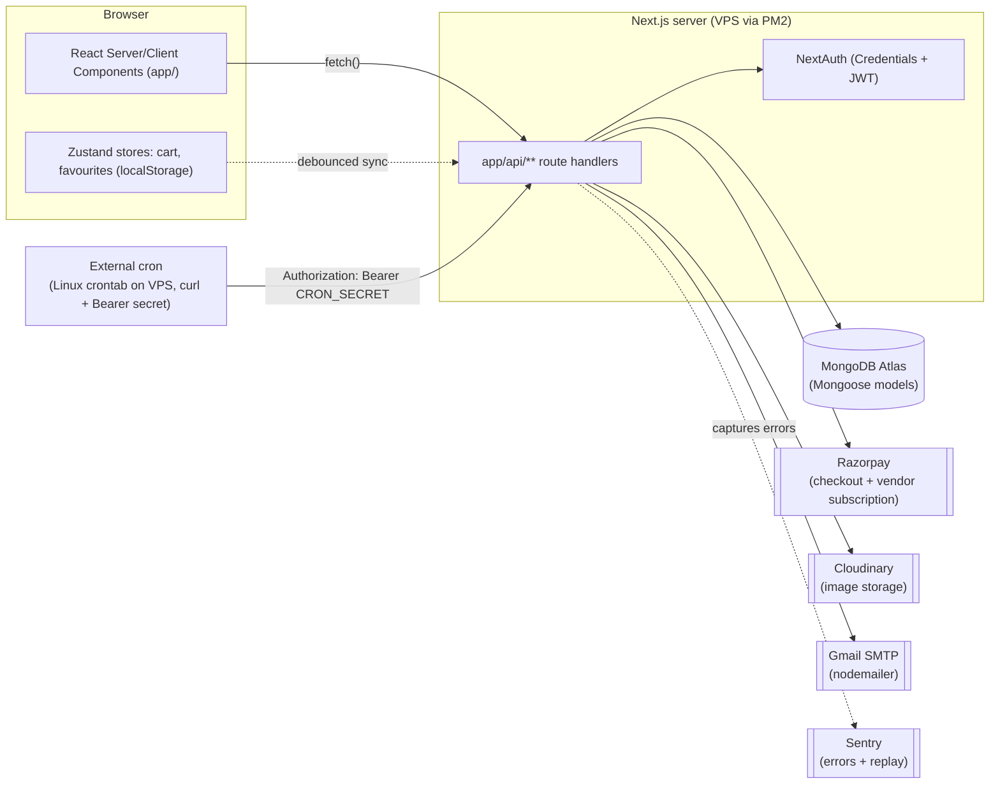
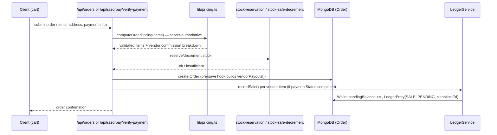
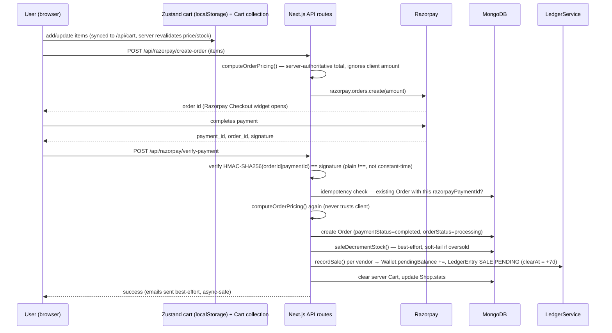
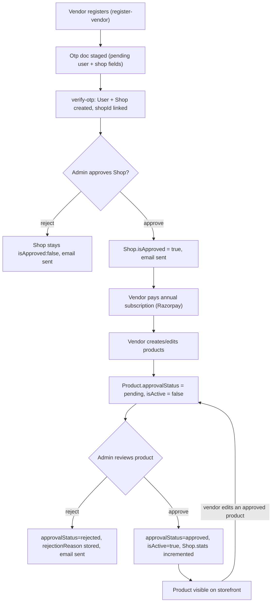

# LinknSmile — Project Source of Truth

> **Last verified against code:** 2026-08-13. **Partially re-verified 2026-08-18** for the subsystems touched in that session: vendor subscription cron scheduling, the wallet/ledger fund-clearing crons, Razorpay key configuration, and a new homepage-merchandising feature. **Partially re-verified 2026-08-19** for three features added that session: a vendor bulk product CSV upload, public blog listing/detail pages, and per-vendor coupon codes (§4.14). Sections not listed in those sessions' changes (§17 doc audit, most of §12, §13) were not re-checked and may have drifted further since 2026-08-13.
> **This document is the authoritative architecture reference for AI-assisted development on this repo.** It was built by directly reading the codebase, not by trusting existing docs. Where existing docs (`README.md`, `DOCUMENTATION.md`, `Deployment.md`, the `.docx` files) conflict with the code, **the code wins** and the conflict is noted in §17.
>
> Package name in `package.json` was `instapeels` (legacy pre-rebrand name) as of the last full audit — **observed already changed to `linknsmile` as of 2026-08-19** (not part of any fix below; found already updated while verifying an unrelated change). Branding is still inconsistent elsewhere in the codebase (see §16).

---

## 1. Project Overview

LinknSmile is a **multi-vendor e-commerce marketplace** (Next.js App Router monolith) for local/handcrafted Indian products. Three user roles share one codebase:

- **Customers** — browse, cart, checkout (Razorpay or COD), track orders, review products, wishlist/favourites.
- **Vendors** (`shop_owner` role) — register, get admin-approved, pay an annual subscription fee, list products (each product also needs separate admin approval), fulfill orders, and withdraw earnings via a wallet/payout system.
- **Admins** — approve vendors/products, manage categories/promos/blogs, moderate reviews, control payment settings, run analytics, approve payouts, manage the platform wallet.

**Tech stack (verified from `package.json` / config files):**

| Layer | Technology |
|---|---|
| Framework | Next.js 15.3.3 (App Router), React 18.3.1, TypeScript 5 (strict mode) |
| Styling | Tailwind CSS 4 (CSS-first config, no `tailwind.config.ts`) + shadcn/ui ("new-york" style) |
| Database | MongoDB via Mongoose 8.9.5 (no native driver usage) |
| Auth | NextAuth.js v4 (Credentials provider only, JWT session strategy) + a parallel custom `jsonwebtoken` scheme for mobile |
| Payments | Razorpay (checkout + vendor annual subscription), Cash on Delivery |
| Email | Nodemailer via Gmail SMTP (two separate wrapper modules — see §16) |
| Images/Storage | Cloudinary + local filesystem serving (both used, inconsistently — see §16) |
| State (client) | Zustand (cart store, favourites store) |
| Monitoring | Sentry (`@sentry/nextjs`), Vercel Analytics |
| Testing | Playwright (3 shallow smoke-test specs, not wired into CI) |
| Deployment | Self-hosted VPS via PM2 + GitHub Actions SSH deploy (see §11). A `Dockerfile` also exists but is **not used by any deploy path** — likely stale. |

There is **no `middleware.ts`** anywhere in the repo. All route protection is done per-API-route (server) and per-layout (`useSession()` client-side redirect for `/admin`, `/vendor`, `/profile`).

---

## 2. Architecture

Single Next.js application, no separate backend service:



- **No dedicated backend/API server** — `app/api/**` route handlers are the entire backend.
- **No message queue / background job runner** — "background" work (payout clearing, subscription sweeps) is done via HTTP-triggered cron routes protected by a `CRON_SECRET` bearer token, expected to be called by an external scheduler.
- **Production runs on a VPS via PM2**, not Vercel, despite a `vercel.json` defining Vercel Cron Jobs — those Vercel crons only fire if a parallel Vercel deployment exists (**Needs Verification** whether one does). The VPS is the confirmed real deployment (see `Deployment.md`, `ecosystem.config.js`, `.github/workflows/deploy.yml`).

---

## 3. Repository Structure

```
app/                    # Next.js App Router — pages + all API routes (app/api/**)
components/             # Shared React components (see §Module Inventory)
  ui/                   # shadcn/ui primitives
  auth/                 # login/register/otp forms, NextAuth SessionProvider wrapper
  admin/                # single admin widget (image-upload-field); most admin UI is inline in app/admin/**
hooks/                  # useFavourites, useFavouritesLoader, use-mobile, use-toast
lib/
  models/               # All Mongoose schemas (source of truth for DB shape)
  services/             # ledger-service.ts (double-entry wallet accounting)
  store/                # cart-store.ts (Zustand)
  scripts/              # seed-products.ts, reconcile.ts (manual-run only, no npm script)
  db.ts, env.ts, auth-options.ts, auth.ts, admin-check.ts,
  pricing.ts, stock-reservation.ts, stock-safe-decrement.ts,
  cloudinary.ts, email.tsx, EmailOtp.ts, otp.ts, rate-limit.ts,
  vendor-subscription-status.ts, cacheClient.ts, cors.ts, facebook-pixel.ts,
  home-cache.ts, constants.ts, utils.ts, validation.ts, coupon-pricing.ts,
  currency.ts (added 2026-08-19 — shared formatCurrency()/getCurrencySymbol(),
  safe to import client-side, see §16), site-config.ts (added 2026-08-19 —
  Sentry DSN, Facebook Pixel ID, GTM ID, Google Ads ID/label, same
  client-safe pattern as currency.ts, see §16)
types/                  # Only next-auth module augmentation (types/next.auth.d.ts)
scripts/deploy/         # deploy.sh, rollback.sh, lib/health-check.sh — VPS deploy automation
e2e/                    # 3 Playwright smoke-test specs (auth, cart, home)
public/                 # Static assets; uploaded content also served via app/api/serve-files, serve-upload
.github/workflows/      # ci.yml, deploy.yml, rollback.yml, dependabot.yml
```

**Files with no architectural significance omitted above** (generated output, node_modules, lockfiles, `.next/`). Note also several stray root-level files that look like accidental shell-redirect artifacts (`how HEAD --name-only`, `npx`, `~cls`) — harmless clutter, not part of the app.

---

## 4. Module Inventory

### 4.1 Storefront (customer-facing)
- **Location:** `app/page.tsx`, `app/products/**`, `app/categories/[slug]`, `app/shop/[slug]`, `app/cart`, `app/checkout`, `app/order-success/[id]`, `app/sellers`, plus static pages (about-us, contact-us, policies).
- **Key components:** `components/header.tsx`, `footer.tsx`, `promo-bar.tsx`, `home-carousel.tsx`, `category-slider.tsx`, `product-card.tsx`, `product-quick-view.tsx`, `product-filters.tsx`/`brand-filters.tsx`, `checkout-form.tsx`.
- **APIs:** `GET /api/products`, `GET /api/products/[id]`, `GET /api/categories`, `GET /api/shops`, `GET /api/promos`.
- **DB:** Product, Category, Shop, Promo (read-mostly).
- **Business rules:** Only `approvalStatus: "approved"` and non-`hiddenBySubscription` products are shown publicly. `/api/products` uses an in-memory 2-minute cache (per server process — **Needs Verification** on multi-instance PM2 cluster consistency, since PM2 runs 2 instances).

### 4.2 Cart
- **Location:** `lib/store/cart-store.ts` (Zustand, persisted to `localStorage`), `components/cart-sync.tsx`, `lib/models/cart.ts`, `app/api/cart/route.ts`.
- **Dependencies:** Product (for server-side revalidation).
- **Business rules:** Cart lives in **two places** — client Zustand/localStorage (source of truth while browsing, works for guests) and server `Cart` collection keyed by `userId` (source of truth across devices). `cart-sync.tsx` reconciles them on login/logout with a 500ms debounce. `POST /api/cart` always **revalidates price/stock/shopId from the DB**, never trusts client-sent values.

### 4.3 Checkout & Payments
- **Location:** `app/checkout/page.tsx`, `components/checkout-form.tsx`, `app/checkout/tap-return/page.tsx`, `app/api/razorpay/create-order`, `app/api/razorpay/verify-payment`, `app/api/tap/create-order`, `app/api/tap/verify-payment`, `app/api/tap/webhook`, `app/api/orders`, `lib/pricing.ts`, `lib/stock-reservation.ts`, `lib/stock-safe-decrement.ts`.
- **Dependencies:** `lib/payments/*` (gateway abstraction — see §4.15), Razorpay SDK, Tap Payments REST API, `lib/order-fulfillment.ts` (shared post-payment orchestration), `lib/services/ledger-service.ts`, `lib/email.tsx`.
- **DB:** Order, Product, Cart, Shop, Wallet/LedgerEntry (via ledger service).
- **Business rules:** See §8.1 for the full flow. Key asymmetry: COD reserves stock atomically **before** creating the order (hard fail on oversell); both online gateways decrement stock **after** payment capture (soft fail, logs only) — flagged as a real business-logic risk in §16. **Vendor coupon codes** (added 2026-08-19) are validated and applied inside `computeOrderPricing` itself — see §4.14 for the full money model (vendor absorbs the discount, commission unaffected) and `lib/coupon-pricing.ts`. **Which gateway is active** (`ACTIVE_GATEWAY`/`PAYMENT_GATEWAY`, see §4.15) determines whether checkout is a client-side widget (Razorpay) or a full-page redirect (Tap) — `components/checkout-form.tsx` and `app/checkout/page.tsx` branch on this rather than hardcoding Razorpay.

### 4.4 Reviews
- **Location:** `app/api/products/[id]/reviews`, `app/api/products/reviews/all`, `app/api/vendor/reviews*`, `app/api/admin/reviews*`.
- **DB:** Review (status: PENDING/APPROVED/REJECTED, `isVerifiedBuyer`, `auditLog[]`).
- **Business rules:** Only customers with a `delivered` order containing the product may review; vendors can't review their own products; edits reset status to PENDING; admin/vendor can reply. `products/reviews/all` (public feed for testimonials, confirmed by its only real caller — `app/page.tsx`'s homepage) now filters to `status: "APPROVED", isDeleted: false` — **fixed 2026-08-24**, see §12 item 6.

### 4.5 Wishlist & Favourites
- **Location:** `app/api/wishlist*`, `app/api/favourites`, `hooks/useFavourites.ts`, `hooks/useFavouritesLoader.ts`, `components/FavouriteButton.tsx`/`SellerFavouriteButton.tsx`.
- **DB:** Wishlist (product-only, legacy?), Favourite (generic `type: product|seller` + `refId` — the more general/current mechanism).

### 4.6 Authentication & Onboarding
- See §7 for full detail. **Location:** `lib/auth-options.ts`, `app/api/auth/**`, `app/api/mobile-auth/login`, `components/auth/**`, `lib/otp.ts`, `lib/models/otp.ts`.

### 4.7 Vendor Portal
- **Location:** `app/vendor/**` (dashboard, products, coupons, orders, wallet, payouts, reviews, bank-details, settings), `app/api/vendor/**`. Coupons specifically: see §4.14.
- **Dependencies:** `lib/vendor-subscription-status.ts` (access gating), `lib/services/ledger-service.ts` (wallet/payouts).
- **DB:** Shop, Product, Order, Wallet, LedgerEntry, Payout, VendorSubscription, Review.
- **Business rules:** Gated by `app/vendor/layout.tsx` (role must be `shop_owner`) **and** live subscription-access state (blocks the whole dashboard UI behind a "Renew Subscription" screen if expired past grace period). Product create/edit is separately blocked if subscription is blocked, and editing an approved product resets it to `pending` (re-review required). See §8.3–8.4 for payout/subscription flow detail and §16 for a flagged parallel-payout-systems inconsistency.
- **As of 2026-08-18**, server-side `isBlocked` gating (via `getShopSubscriptionAccessState`) was extended beyond products to also cover: `vendor/orders` (GET), `vendor/orders/[id]` (GET/PATCH), `vendor/reviews` (GET), `vendor/reviews/[id]/reply` (POST), `vendor/bank-details` (GET/PUT) — all return 403 with a renewal message when blocked. **Deliberately left ungated**: `vendor/wallet*` and `vendor/payout*` (wallet/payout code was explicitly out of scope for that change — see §16), and `vendor/products/[id]` `DELETE` (a blocked vendor can still delete their own products — a known, accepted gap, not yet closed).
- **Bulk product CSV upload, added 2026-08-19**: `app/api/vendor/products/bulk-upload/route.ts` (POST) and `app/vendor/products/bulk-upload/page.tsx`, linked from a "Bulk Upload" button on `app/vendor/products/page.tsx`. Accepts a `multipart/form-data` CSV file (max 2MB, max 500 data rows — the whole file is rejected with no partial processing if the row cap is exceeded), gated by the exact same three checks as `vendor/products` POST in this order: session role `shop_owner`, `Shop.isApproved`, and `getShopSubscriptionAccessState(shopId).isBlocked` (403 if blocked). Parsed with `papaparse` (new dependency — no CSV library previously existed anywhere in this repo, confirmed by checking `package.json` first per §18). Each row is validated independently — name required, price a positive number, stock (optional, defaults to 0 like the single-product form) a non-negative integer if present, category resolved against the shop-independent `Category` collection by case-insensitive slug or name match, and a duplicate-slug check both within the file and against existing `Product` slugs (same "slug already exists" rejection the single-product route uses, not a new rule). Valid rows are created via `Product.create()` with the identical shape the single-product POST route uses (`approvalStatus: "pending"`, `isActive: false`, `submittedAt: new Date()`) — invalid or duplicate rows are skipped and reported, so one bad row never blocks the rest of the file (partial-success model). The `images` column is comma-separated, already-hosted URLs only (e.g. Cloudinary) — there is no in-CSV file upload in this v1. A static template lives at `public/templates/product-bulk-upload-template.csv`, linked from the upload page.

### 4.8 Admin Panel
- **Location:** `app/admin/**`, `app/api/admin/**`.
- **Dependencies:** `lib/admin-check.ts`.
- **DB:** touches nearly every collection (User, Shop, Product, Order, Review, Category, Promo, Blog, PaymentSettings, VendorSubscriptionSettings, Wallet, Payout, LedgerEntry, AuditLog).
- **Business rules:** Vendor approval, per-product approval (individual + bulk), payout approval state machine, wallet freeze/unfreeze, review moderation, analytics dashboard (computed in JS from raw Order docs, not Mongo aggregation), global payment settings (enable/disable COD/Razorpay), vendor subscription fee configuration and manual overrides (cancel/extend/grant-free). **Note:** `admin/images/delete` and `admin/images/scan` have **no auth check at all** (§12/§16).
- `/admin/vendors/subscriptions` (list of all vendor subscriptions with status/expiry/last-payment, plus an "Annual Fee Settings" card wired to `admin/vendor-subscription-settings`) is now linked from the sidebar `navItems` in `app/admin/layout.tsx` — previously the page existed and worked but had no nav entry (fixed 2026-08-18).
- New homepage-merchandising admin pages added 2026-08-18: `/admin/home-banner` and `/admin/hero-products` — see §4.13.

### 4.9 Wallet / Ledger / Payout System
- **Location:** `lib/models/wallet.ts`, `lib/models/ledger.ts`, `lib/models/payout.ts`, `lib/models/dispute.ts`, `lib/services/ledger-service.ts`, `lib/scripts/reconcile.ts`, `app/api/vendor/wallet*`, `app/api/vendor/payout*`, `app/api/admin/payouts`, `app/api/admin/wallet-*`, `app/api/cron/clear-pending-funds`.
- **Business rules:** Double-entry accounting — `LedgerEntry` is documented as the source of truth, `Wallet` balances are a cache. `vendor/wallet` GET recomputes balances directly from `Order` documents instead of the ledger (still true, an open inconsistency). The `clear-funds` cron this section previously described (a second, independent fund-release path over `Order.vendorPayouts[]`) has been deleted — `clear-pending-funds`/`LedgerEntry` is now the sole mechanism, and a related concurrency bug in it was fixed 2026-08-18. See §16 and §8.3 for full detail.

### 4.10 Vendor Subscription
- **Location:** `lib/models/vendor-subscription.ts`, `lib/models/vendor-subscription-settings.ts`, `lib/vendor-subscription-status.ts`, `app/api/vendor/subscription/*` (Razorpay), `app/api/vendor/subscription/tap/*` (Tap, added 2026-08-20 — see §4.15), `app/vendor-tap-return/page.tsx`, `app/api/admin/vendor-subscription*`, `app/api/cron/vendor-subscription-sweep`.
- **Business rules:** Annual fee (admin-configurable), gateway-verified payment (Razorpay or Tap, per `ACTIVE_GATEWAY` — see §4.15), 1-year expiry extended from later of now/current expiry, 7-day grace period, then blocked (no product create/edit), then 30 days post-expiry the sweep cron hides all the shop's products from the storefront (`hiddenBySubscription: true`, data preserved). Paying again immediately un-hides products without waiting for the cron. `app/vendor/layout.tsx`'s `handleRenew()` branches on `ACTIVE_GATEWAY`: Razorpay opens the existing widget in-page; Tap does a full-page redirect (`window.location.href`) and the return leg is handled by `app/vendor-tap-return/page.tsx`, which re-fetches subscription status on the vendor dashboard's next mount.
- **`cron/vendor-subscription-sweep` is confirmed actually scheduled in production as of 2026-08-18** — a real crontab entry (`0 3 * * *`, `Authorization: Bearer $CRON_SECRET`) was added on the VPS and verified end-to-end (401 without a valid token, 200 with one, real execution confirmed). Previously this cron was registered only in `vercel.json` (inert on this VPS/PM2 deployment — see §11) and not actually scheduled anywhere. **`cron/clear-pending-funds` has NOT yet been scheduled** — that remains open (see §8.3).

### 4.11 Blogs, Categories, Promos, Companies (CMS-style content)
- **Location:** `app/admin/blogs*`, `app/admin/categories`, `app/admin/promos`, `app/api/blogs*`, `app/api/categories*`, `app/api/promos*`, plus the new public blog pages below.
- **DB:** Blog, Category (self-referential `parent`), Promo, Company (brand/landing-page content referenced by Product/Category/Review/Blog).
- **Public blog pages added 2026-08-19**: `app/blog/page.tsx` (paginated listing, 9/page via `?page=`) and `app/blog/[slug]/page.tsx` (full post view, `notFound()` → `app/not-found.tsx` if the slug doesn't exist or `isPublished` is false). Both are async Server Components that query `Blog` directly (`connectDB()` + `Blog.find/findOne`, mirroring the same `isPublished: true` filter and `.populate("author"/"company")` shape already used in `app/api/blogs*`) rather than fetching the app's own API route — same server-side-DB-access pattern `app/sitemap.ts` already used, and it meant **zero changes to `app/api/blogs*`** (both GET handlers were confirmed, not modified, to already filter to `isPublished: true` for non-admin/non-`all=true` callers — see §6). The detail page uses `generateMetadata` (title/description/OG image) — the **first use of `generateMetadata` anywhere in this codebase**; every other page (products, categories, shop) is a `"use client"` component with no per-route metadata, so this is a new-but-standard pattern introduced for this feature rather than an existing convention being matched. `content` is rendered as plain pre-wrapped text (`whitespace-pre-wrap`, no `dangerouslySetInnerHTML`), matching how the admin editor actually stores it (a plain `<Textarea>`, not rich text/HTML). Linked from `components/header.tsx` and `components/footer.tsx` nav.
- **Two related bugs found while building the above, fixed the same session (2026-08-19):**
  1. `app/sitemap.ts`'s `baseUrl` was hardcoded to the legacy `https://instapeels.com/` domain *with* a trailing slash, producing wrong-domain, double-slash URLs for every route in the sitemap (not just blog). Changed to `process.env.NEXTAUTH_URL ?? "https://linkn-smile.vercel.app"` — the same expression `app/robots.ts` already uses, so the domain `robots.txt` declares and the domain `sitemap.xml` actually emits are now guaranteed to agree. Verified live: `/sitemap.xml` now emits `https://linknsmile.com/...` with no double slashes.
  2. `app/api/companies` **did not exist at all**, despite three existing "use client" forms depending on it and silently failing closed: `app/admin/blogs/add/page.tsx` and `app/admin/blogs/[slug]/edit/page.tsx` (company dropdown when tagging a blog to a brand — the "Add Blog" form's `<select>` has `required`, so blog creation via the admin UI was **unsubmittable** without this), and `app/vendor/products/edit/[id]/page.tsx` (brand dropdown). Added `app/api/companies/route.ts` — GET only, public, mirrors the `app/api/categories` convention (`?all=true` for every company, default `{ isActive: true }`), returns a plain array of `{_id, name, slug}` matching exactly what all three consumers already expected. Verified live against real data (3 companies returned). No write endpoints were added — none of the three consumers needed one, and it wasn't asked for.
- Public company/brand **landing** pages still do not exist (no `app/company/[slug]`) — blog posts still display `company.name` as a plain label, not a link. Not addressed; out of scope (this was about the missing read API, not a missing public page).

### 4.12 File Upload / Serving
- **Location:** `app/api/upload` (Cloudinary, admin/vendor only), `app/api/serve-files/[...path]`, `app/api/serve-upload/[...path]`, root catch-all `app/api/[...path]/route.ts`, `next.config.mjs` rewrites (`/uploads/*`, `/arrivals/*`, `/blogs/*`, `/carousel/*`, `/fonts/*`, `/shop-by-concern/*` → serve-files).
- **Business rules:** Three overlapping, unauthenticated file-serving implementations exist (functional triplication — §16). `users/profile` PUT writes avatar uploads to local filesystem directly (bypassing Cloudinary), inconsistent with the main upload path.

### 4.13 Homepage Merchandising (added 2026-08-18)
- **Location:** `lib/models/home-banner.ts`, `lib/models/hero-product.ts`, `app/api/admin/home-banner*`, `app/api/home-banner`, `app/api/admin/hero-products*`, `app/api/hero-products`, `app/admin/home-banner/page.tsx`, `app/admin/hero-products/page.tsx`, `components/home-carousel.tsx`, `app/page.tsx`.
- **Dependencies:** `@dnd-kit/core`/`@dnd-kit/sortable`/`@dnd-kit/utilities` (new dependency, added for this feature — not used anywhere else in the codebase).
- **Business rules:** Admin-managed homepage hero carousel (`HomeBanner`: image, optional title/description, `linkType` of `product`/`shop`/`url`/`none`, `sortOrder`, `isActive`) and a curated homepage "Featured" product spotlight (`HeroProduct`: ref to `Product`, `sortOrder`, `isActive`). Both admin pages support drag-and-drop reordering. Public GET routes resolve `linkType`/`linkValue` into a real `href` server-side (product → `/products/[id]`, shop → looks up the shop's slug, url → literal).
- **Fixed a pre-existing bug as a side effect:** `components/home-carousel.tsx` previously had **hardcoded** fallback images and a hardcoded click handler that navigated slides 1/2 to `/shop/instapeels` / `/shop/dermaflay` — leftover from before the LinkNSmile rebrand (see §16 item 10 re: the `instapeels` package name), not real LinknSmile shops. `app/page.tsx` now feeds it real data from `/api/home-banner`, and the click handler navigates per-slide based on each banner's own resolved `href`.

### 4.14 Vendor Coupons (added 2026-08-19)
- **Location:** `lib/models/coupon.ts`, `lib/coupon-pricing.ts`, `app/api/vendor/coupons`, `app/api/vendor/coupons/[id]`, `app/api/coupons/validate`, `app/vendor/coupons/page.tsx`, `app/vendor/coupons/add/page.tsx`, `app/vendor/coupons/edit/[id]/page.tsx`. Read-only admin visibility added to the existing `app/api/admin/vendors/[id]` GET response (a `coupons` array, alongside the `products`/`orders` it already returned) and a new "Coupons" tab on `app/admin/vendors/[id]/page.tsx` — no new admin route or page.
- **Dependencies:** `lib/pricing.ts` (`computeOrderPricing` gained an optional second `options: { couponCode?, userId? }` argument — see below), `lib/vendor-subscription-status.ts` (create/edit gate), `app/api/razorpay/create-order`, `app/api/razorpay/verify-payment`, `app/api/orders` (all three now accept an optional `couponCode` in their request body and pass it through).
- **Money model (confirmed with the user before implementing, not guessed):**
  - Coupons are **vendor-scoped**: `Coupon.shopId` is required, and the discount only ever applies to that vendor's line items in a cart — never the whole multi-vendor order. `code` is unique per-shop (compound index `{shopId, code}`), not globally — two different vendors can both run "SAVE20".
  - The **vendor absorbs the full discount**. `platformCommission` is still computed on the original pre-discount price (the existing `computeOrderPricing` formula, untouched); only `vendorEarnings` is reduced by the discount amount. A vendor's own coupon never costs the platform anything.
  - `discountAmount` is capped so a vendor's earnings on the order can never go negative — floors at 0 regardless of how the coupon's `discountValue`/`maxDiscountAmount` were configured.
  - `minOrderValue` is checked against that vendor's **subtotal within the cart**, not the whole multi-vendor cart total.
  - Coupon create/edit (not delete) is blocked by the same `getShopSubscriptionAccessState(shopId).isBlocked` gate `vendor/products` POST uses. Delete is deliberately **not** gated, matching the existing `vendor/products/[id]` DELETE precedent (§16).
- **How it's wired into pricing (the part that had to not break anything):** `computeOrderPricing(items, options?)` — the entire pre-existing per-item loop is byte-for-byte unchanged; when `options?.couponCode` is omitted, the function returns from the exact same point it always did, so every caller that doesn't pass a coupon is unaffected. When a code IS passed, it delegates to `lib/coupon-pricing.ts`'s `validateAndApplyCoupon()`, which validates (exists/`isActive`/not expired/shop-matches-cart-items/`minOrderValue`/`usageLimit`/`perUserLimit`) and then redistributes the discount proportionally across the affected vendor's items (remainder to the last item, to avoid paisa-level rounding drift) — keeping `sum(items[].vendorEarnings)` for that shop exactly equal to `vendorPayouts[shopId].amount`, the same invariant the undiscounted path already relies on. This one function is called identically from the new validate-only endpoint, `razorpay/create-order`, `razorpay/verify-payment`, and the COD `app/api/orders` — so a coupon is re-verified server-side at all four points, never trusted from the client (per §14's existing money/stock convention).
- **Usage tracking is idempotent by construction, not by a new idempotency key:** `redeemCoupon()` (an atomic `findOneAndUpdate` guarded by `usageCount < usageLimit`, the same conditional-`$inc` pattern `lib/stock-reservation.ts` already uses for stock) is called ONLY after `Order.create()` succeeds in `razorpay/verify-payment` and `app/api/orders` — never in the validate-only endpoint or `create-order` (so cart-preview and an abandoned Razorpay checkout never increment usage). Both of those two commit routes already have their own idempotency guard (`razorpayPaymentId` lookup / `X-Idempotency-Key`) that runs *before* order creation, so a retry never reaches `redeemCoupon` twice for the same order — deliberately reusing the existing guards rather than adding a parallel one.
- **New Order fields (additive only):** `Order.appliedCoupon: { code, shopId, discountAmount }` (top-level, set only when a coupon was used) and `Order.items[].discountAmount` (that item's share of the discount, already subtracted from its `vendorEarnings`). Both default to absent/0, so existing orders and the no-coupon path are unaffected.
- **Checkout UI:** a coupon input on `app/checkout/page.tsx`'s order summary calls `POST /api/coupons/validate` (session-required, runs the exact same server-side validation as the real checkout) to preview the discount before payment — but the actual charge in all three submit paths (COD, Razorpay create-order, Razorpay verify-payment) is always the server's own recomputation; the client-previewed `discountAmount` is display-only and is never sent as a trusted amount.

### 4.15 Payment Gateway Abstraction — Tap Payments added (Step 6 of the multi-country project, 2026-08-20)

- **Location:** `lib/payments/types.ts` (shared interface + `ACTIVE_GATEWAY`), `lib/payments/razorpay.ts`, `lib/payments/tap.ts`, `lib/payments/index.ts` (`getPaymentGateway()`, server-side dispatch), `lib/order-fulfillment.ts` (`fulfillPaidOrder`), `lib/subscription-fulfillment.ts` (`fulfillSubscriptionPayment`).
- **Why:** the multi-country audit (§16) flagged the codebase as structurally coupled to Razorpay, which only operates in India — the UAE/Qatar/Saudi deployments need a genuinely different gateway (Tap Payments, developers.tap.company). This step built a real abstraction, not a Tap-specific bolt-on, since Tap is the live gateway for 3 of the 4 planned deployments. Razorpay stays the gateway for India; `PAYMENT_GATEWAY`/`NEXT_PUBLIC_PAYMENT_GATEWAY` (env, default `"razorpay"`) selects which one is active per-deployment (each country is a separate DB/deployment — see §2 — so this is a build-time choice per deployment, not a runtime multi-gateway switch within one deployment).
- **The abstraction's scope is deliberately narrow:** `PaymentGatewayAdapter` (`createPaymentOrder`, `verifyPayment`) only talks to the gateway. Pricing (`computeOrderPricing`), coupons, stock, ledger, and email are untouched and live in `lib/order-fulfillment.ts`/`lib/subscription-fulfillment.ts`, which both gateways' routes call into identically — this is what let Razorpay's existing behavior be preserved exactly (verified by code-level comparison, not just "should be fine") while adding Tap alongside it.
- **Checkout-model difference the abstraction has to account for:** Razorpay (`checkoutMode: "widget"`) is a client-side JS popup — the page never unloads, so the browser holds all checkout state (items, shipping address) in memory across create-order → widget → verify-payment. Tap (`checkoutMode: "redirect"`) is a server-driven **hosted redirect** — `createPaymentOrder` returns a `redirectUrl`, the browser fully navigates away to Tap's own page and back via `?tap_id=`, so anything not already in the DB (shippingAddress, couponCode, and for subscriptions just `shopId`) has to survive that round trip via Tap's `metadata` field (echoed back verbatim on retrieve). `app/checkout/page.tsx`/`components/checkout-form.tsx` branch UI behavior on `ACTIVE_GATEWAY` for exactly this reason — a hardcoded `"razorpay"` checkout-method id would silently break under Tap.
- **Schema (hybrid, chosen after explicit user sign-off — the separate-DB-per-country architecture was the deciding fact):** `Order.razorpayOrderId`/`razorpayPaymentId` and `VendorSubscription.razorpayOrderId`/`razorpayPaymentId` (+ `paymentHistory[].razorpayOrderId`/`razorpayPaymentId`) are **frozen, never renamed** — each country is its own DB, so there's no cross-deployment migration to simplify by renaming, and renaming would only add risk to India's live data for zero benefit. New gateways (Tap, and any future one) instead use new generic fields: `Order.paymentGateway`/`gatewayOrderId`/`gatewayPaymentId`, `VendorSubscription.paymentGateway`/`gatewayOrderId`/`gatewayPaymentId` (+ matching `paymentHistory[]` fields). `Order.paymentMethod` enum extended `["cod","razorpay"] → ["cod","razorpay","tap"]`. All new fields are optional/additive — existing Razorpay documents are unaffected. `Order` gained a sparse index on `gatewayPaymentId`; `VendorSubscription.paymentHistory[].razorpayOrderId` had to become optional (was `required: true`) since Tap entries don't populate it. `lib/order-fulfillment.ts`/`lib/subscription-fulfillment.ts` branch idempotency lookups on `gateway.paymentMethod === "razorpay"` (frozen fields) vs. else (generic fields) — see those files' own comments for why they aren't unified into one field.
- **Tap-specific implementation notes (verified against Tap's real docs before writing any code, not guessed from Razorpay's pattern):**
  - Auth is **secret-key-only** (`TAP_SECRET_KEY`, Bearer) — no publishable/public key needed for the redirect flow, unlike Razorpay's `NEXT_PUBLIC_RAZORPAY_KEY_ID` (confirmed with the user as a deliberate deviation from the original assumption).
  - `POST /v2/charges/` to create, `GET /v2/charges/{id}` to retrieve/verify. Only charge `status === "CAPTURED"` means the money actually moved (full enum: `INITIATED, ABANDONED, CANCELLED, FAILED, DECLINED, RESTRICTED, AUTHORIZED, CAPTURED, VOID, TIMEDOUT, UNKNOWN`).
  - Amounts are the gateway's **major currency unit** (e.g. `"10.50"` AED), formatted to that currency's correct decimal places — 3 for KWD/BHD/OMR, 2 for everything else Tap supports (AED/SAR/QAR/USD/EUR/GBP) — not an integer smallest-unit like Razorpay's paise.
  - **Webhook exists for Tap** (`app/api/tap/webhook`, `app/api/vendor/subscription/tap/webhook`) — Tap's docs explicitly provide a `hashstring`-signed server-to-server POST for this, which Razorpay's integration has never had (§16 item 19, still unfixed for Razorpay — out of scope here). Verifies via `crypto.timingSafeEqual` over an HMAC-SHA256 of a specific field-concatenation (`'x_id'+id+'x_amount'+amount+'x_currency'+currency+'x_gateway_reference'+...+'x_payment_reference'+...+'x_status'+status+'x_created'+created` — confirmed against Tap's own code sample, not an unofficial blog's simpler/incompatible variant). This is a deliberate choice **not** made in the new code's sibling: Razorpay's existing signature check (`lib/payments/razorpay.ts`) keeps its original plain `!==` comparison unchanged (a known, audit-flagged timing side-channel, §16 item 8) — fixing it wasn't in scope and this refactor must not change Razorpay's behavior; the new Tap code simply doesn't copy that weakness into itself.
  - **Redirect/webhook URL disambiguation:** `CreatePaymentOrderParams` gained optional `redirectPath`/`webhookPath` overrides (default to the order-checkout paths, `/checkout/tap-return` / `/api/tap/webhook`) specifically because order-checkout and vendor-subscription-renewal are two different flows sharing one `tapAdapter.createPaymentOrder()` implementation — the vendor subscription create-order routes pass `redirectPath: "/vendor-tap-return"` and `webhookPath: "/api/vendor/subscription/tap/webhook"` to route Tap's redirect/webhook to the correct return page.
  - **`app/vendor-tap-return/page.tsx` is deliberately NOT nested under `app/vendor/`** (i.e. not `app/vendor/tap-return`) — `app/vendor/layout.tsx` renders a full-screen "Access Suspended" block instead of `children` whenever `subscription.isBlocked` is true, which is exactly the state a vendor renewing from that blocked screen is in; nesting the return page under that layout would make it unreachable for the vendors who most need it. `app/checkout/tap-return/page.tsx` has no equivalent gating concern and stays under `app/checkout/`.
- **New routes:** `app/api/tap/create-order`, `app/api/tap/verify-payment`, `app/api/tap/webhook` (order checkout); `app/api/vendor/subscription/tap/create-order`, `.../verify-payment`, `.../webhook` (vendor subscription renewal) — full detail in §6. The existing `app/api/razorpay/*` and `app/api/vendor/subscription/{create-order,verify-payment}` routes were refactored into **thin wrappers** around `lib/payments/razorpay.ts` + `lib/order-fulfillment.ts`/`lib/subscription-fulfillment.ts` — response shapes and every side effect are unchanged; this was a wrapper extraction, verified by code comparison, not a rewrite.
- **`lib/models/payment-settings.ts`'s `enableRazorpay` field was deliberately NOT renamed** — it's reused generically as "online payment enabled" regardless of which gateway is actually active. `app/checkout/page.tsx`'s `availablePaymentMethods()` maps it to a gateway-agnostic `"online"` checkout-method id (previously hardcoded `"razorpay"`) that then branches on `ACTIVE_GATEWAY` inside `handleCheckout()`.
- **What could NOT be verified without real credentials:** the user has not yet supplied `TAP_SECRET_KEY` (sandbox or live). Everything above was verified against Tap's published API docs, `npm run typecheck` (clean), and code-level comparison for the Razorpay-unchanged requirement — but no real charge has been created, captured, or verified end-to-end against Tap's actual servers, and the webhook signature algorithm has not been exercised against a real webhook payload. Treat the Tap integration as implementation-complete but **not yet live-tested** until sandbox credentials are added and a real charge is run through create → redirect → return/webhook → fulfillment.

### 4.16 Platform Settings — admin-editable general site config (added 2026-08-21)

- **Location:** `lib/models/platform-settings.ts`, `app/api/admin/platform-settings/route.ts` (admin GET/PUT), `app/api/platform-settings/public/route.ts` (public read), `hooks/usePlatformSettings.ts`, `app/admin/platform-settings/page.tsx`.
- **Why:** support email/phone were hardcoded literals scattered across the codebase (not env vars, despite `MULTI_COUNTRY_REQUIREMENTS.md` §4 informally referring to a `SUPPORT_EMAIL` concept that was never actually implemented) — changing them required a code edit and redeploy. This gives admins a DB-backed settings doc they can edit directly, no redeploy needed.
- **Deliberately excluded** (stay exactly as they were): `CURRENCY_CODE`/`LOCALE`/`PAYMENT_GATEWAY`/brand name — deployment-identity env vars, not admin-editable; tracking IDs — already covered by `lib/site-config.ts`; payment gateway secrets; any real tax computation.
- **Fields:** `supportEmail` (default `support@linknsmile.com`), `supportPhone` (default `+91 8355991099`), `brandTagline` (default `"Net & Work Builds Up Net-Worth"`), `taxRatePercent` (default `0`, **placeholder only** — see below).
- **Scope decisions made explicitly with the user before implementing:**
  - **One `supportEmail` field, not two.** The codebase actually had two different addresses in live use — `care@linknsmile.com` (footer's "Customer Support") and `support@linknsmile.com` (everywhere else, including footer's "Vendor Support" block, which — separately — had a bug: its `href` pointed at `care@` while its displayed text said `support@`). Per the user's explicit choice, both collapse to one admin-editable `supportEmail`, and the footer mismatch was fixed as part of the same edit (both blocks now show/link the same value, consistently).
  - **One `supportPhone` field, general-support only.** `+91 8355991099` (~9 files) is now admin-editable. A second, genuinely different number, `+91 9820623835`, appears only in the bulk-order-contact modals (`components/product-card.tsx`, `app/products/[id]/page.tsx`) as an alternate contact option — left as a hardcoded literal, per explicit user decision, since it's a different concept (bulk/sales contact) not "support."
  - **`lib/email.tsx` deliberately NOT wired up.** Its support-email references are inside synchronous string-template functions called from many order/subscription/vendor email call sites — making them DB-driven would mean threading a new parameter through every call site, a much bigger ripple than this task's scope. Per explicit user decision, `lib/email.tsx` keeps its hardcoded `support@linknsmile.com` literal for now; this is an intentional, documented gap, not an oversight.
  - **No "announcement/banner" field** — originally part of the requested scope, but dropped after discovering `lib/models/promo.ts` (`Promo`, `/admin/promos`, `components/promo-bar.tsx`) already **is** a full sitewide-banner system (message, link, colors, priority, multiple entries, admin CRUD) — a second, weaker single-message field on `PlatformSettings` would have been exactly the kind of parallel-system duplication already flagged elsewhere in this doc (§16). Use the existing Promo system for sitewide announcements; nothing added here.
- **Client-side wiring pattern:** every consumer of these fields (`footer.tsx`, `contact-us`/`about-us` pages, `product-card.tsx`, `why-choose.tsx`, `app/page.tsx`'s WhatsApp links, `app/cart/page.tsx`, `app/products/[id]/page.tsx`, `orders-and-returns`/`refund-policy` pages, `vendor/layout.tsx`'s error alert) is a **Client Component** — none can read the DB directly. `hooks/usePlatformSettings.ts` is a small Zustand store (same convention as `useFavourites.ts`, per §14) that fetches `GET /api/platform-settings/public` once and shares the result across every consumer, so e.g. the many `product-card` instances on a single page don't each independently re-fetch. Falls back to the same hardcoded literals as the DB defaults on fetch failure — never a broken/blank render.
- **Two more pre-existing bugs found and fixed in passing** while wiring `app/orders-and-returns/page.tsx` and `app/refund-policy/page.tsx` for `supportPhone`: both also had a `care@instapeels.com` email — the **legacy pre-rebrand domain**, not `linknsmile.com` — now replaced with `supportEmail`. **The same `care@instapeels.com` literal still exists, unfixed, in three files this task did not touch**: `app/termsofservice/page.tsx`, `app/privacy-policy/page.tsx`, and `app/api/setup/brands/route.ts` (the last already flagged elsewhere in this doc, §12, as a dev/setup route that shouldn't be reachable in production at all) — see §16.
- **`taxRatePercent` was a placeholder as of this doc's original writing (2026-08-21) — no longer true.** It's now read by `computeOrderPricing` and actually applied to every order — see §4.17, added later the same day.
- **Live-verified, not just typechecked:** logged in as the real admin account, `GET` (creates the default doc on first access, same lazy-init pattern as `PaymentSettings`/`VendorSubscriptionSettings`) → `PUT` new values → confirmed `GET /api/platform-settings/public` reflected them immediately → confirmed via a real headless-browser render (not just curl, which only sees pre-hydration SSR output) that `footer.tsx` and `contact-us` actually re-rendered with the live values → reverted to defaults afterward.

### 4.17 Tax / VAT Engine — Step 7 of the multi-country project (added 2026-08-21)

- **Location:** the tax step lives inside `computeOrderPricing` (`lib/pricing.ts`) itself, not a separate module — reads `PlatformSettings.taxRatePercent` (§4.16), applies it, and returns the result as two new `PricingResult` fields (`taxRatePercent`, `taxAmount`) alongside the existing ones. Threaded into `lib/models/order.ts` (new `taxRatePercent`/`taxAmount` fields), `lib/order-fulfillment.ts`, `app/api/orders`, `app/api/coupons/validate`, and the cart/checkout UI (`app/cart/page.tsx`, `app/checkout/page.tsx`).
- **Rates, confirmed with the user before implementing (not the earlier audit's rough estimates):** UAE 5% flat, Saudi Arabia 15% flat, Qatar 0% (a genuine zero — VAT is confirmed not yet implemented there as of 2026, not a placeholder pending a future rate). None of these are hardcoded anywhere in code — each deployment's own `PlatformSettings.taxRatePercent` (admin-editable, per §4.16) is set to the correct value for that country's separate database/deployment (Path B architecture, §2) once it goes live; India's stays 0.
- **Money model, confirmed explicitly before implementing given real legal/financial stakes:** tax is additive on top of the order subtotal **after** any coupon discount is applied, charged to the customer, and does **not** change vendor commission/payout math — `platformCommission`/`vendorEarnings` are computed on the pre-tax amount exactly as before this existed (verified live: a 5% test order showed `platformCommission`/`vendorEarnings` unchanged from the no-tax case, only `totalAmount` grew by the tax amount). The platform collects the tax as a separate, tracked amount and is responsible for remitting it — this is deliberately consistent with "deemed supplier" marketplace VAT treatment (KSA/UAE, modeled on the EU/OECD e-commerce framework), under which the *platform* is the party obligated to register/collect/remit, not each individual vendor; that compliance-obligation question is orthogonal to the pre-tax commission split, which stays a purely commercial/contractual matter unaffected by it. **Explicitly not verified by this work** (out of scope, flagged to the user as requiring actual tax/legal counsel, not a code question): whether this specific business's KSA/UAE operations trigger deemed-supplier registration thresholds or any other jurisdiction-specific compliance obligation beyond "compute and charge the right number."
- **How it hooks into `computeOrderPricing` (`lib/pricing.ts`):** applied as a final step *after* the existing coupon branch resolves (whether or not a coupon was used), operating on whatever `totalAmount` that branch produced — so tax is computed on the post-discount subtotal automatically, no special-casing needed in `lib/coupon-pricing.ts` itself (that file is untouched). `processedItems[]`/`vendorPayouts` are never touched by the tax step, which is what guarantees the commission-math invariant above. `totalAmount` in the returned `PricingResult` becomes the final tax-inclusive chargeable amount (continuing the precedent coupons already established — `totalAmount` is "the actual amount to charge," not a pristine pre-adjustment subtotal); `taxRatePercent`/`taxAmount` are always present (unlike `appliedCoupon`, which is genuinely absent when unused) so every order has an explicit, auditable tax breakdown even at 0%.
- **Order schema (`lib/models/order.ts`):** `taxRatePercent`/`taxAmount`, both `default: 0`. These are a **snapshot of what was actually charged at order time**, never a live reference to current `PlatformSettings` — same reasoning as why `razorpayOrderId` etc. are frozen fields (§4.15): if the admin changes the tax rate tomorrow, every past order must still show what it actually charged, not be silently reinterpreted under the new rate.
- **Threaded through all four call sites that hit `computeOrderPricing`, exactly as required — server-computed and re-verified at every one, never trusted from the client:** `app/api/razorpay/create-order` and `app/api/tap/create-order` needed **zero code changes** — they already just forward whatever `totalAmount` `computeOrderPricing` returns to the gateway, so it became tax-inclusive automatically. `lib/order-fulfillment.ts`'s `fulfillPaidOrder()` (shared by Razorpay verify-payment, Tap verify-payment, *and* Tap's webhook) and `app/api/orders` (COD) both now pass `taxRatePercent`/`taxAmount` into `Order.create()`. `app/api/coupons/validate` now returns `taxRatePercent`/`taxAmount` in its preview response alongside the existing `discountAmount`.
- **An important, non-obvious consequence of hooking in at `computeOrderPricing` rather than per-route:** this automatically covers **Tap's** routes too, even though the user's requirement list named only the four Razorpay/COD/coupon-preview entry points by name — and Tap is precisely the gateway that will actually charge non-zero tax in production (UAE/Saudi/Qatar all run `PAYMENT_GATEWAY=tap`, per §4.15), so this coverage is more important in practice than the four explicitly-named Razorpay/COD routes, which will only ever see India's 0% rate.
- **Cart/checkout UI (`app/cart/page.tsx`, `app/checkout/page.tsx`):** the cosmetic "Tax: Included" label is gone from both, replaced with a real computed line (`"Tax (5%)"` / amount, or just an explicit `₹0.00` when the rate is 0 — never blank, never a lie). `taxRatePercent` is now exposed via `GET /api/platform-settings/public` (previously admin-only — see §4.16, updated) and read through the existing shared `usePlatformSettings()` hook, so no new fetch infrastructure was needed. The displayed tax amount is a **client-side preview only**, computed with the exact same formula/inputs (`postDiscountSubtotal × rate / 100`, rounded to 2 decimals the same way) as the server — so it's mathematically identical to what the server will actually charge, but is still never the trusted value; `computeOrderPricing` recomputes it server-side at the real commit points regardless, same convention as `totalPrice`/`payableTotal` already being client-computed previews before this. `CheckoutForm`'s "Place Order · ₹X" button total was also updated to the tax-inclusive grand total.
- **India no-op, confirmed live, not assumed:** with `PlatformSettings.taxRatePercent` at its default (0, or the doc entirely absent), a real `razorpay/create-order` call returned `totalAmount: 299` for a ₹299 product — byte-identical to pre-tax behavior. Setting the rate to 5% and repeating produced `totalAmount: 313.95` (`amount: 31395` paise to Razorpay), and a real COD order created through the same path stored `taxRatePercent: 5, taxAmount: 14.95` on the `Order` doc while `platformCommission`/`vendorEarnings` on its items stayed identical to the no-tax case — confirming the money-model invariant, not just the arithmetic. Also confirmed via a real headless-browser render that `app/cart/page.tsx` shows the matching `"Tax (5%)" / ₹14.95` line. All test data (the Razorpay order-intent objects, the COD `Order` doc, the `Shop.stats` increment it caused) was reverted/cleaned up afterward; the rate was reset to 0.
- **Explicitly out of scope, per the user's own requirement 5 — not built:** vendor-facing tax reporting, invoice generation, VAT registration number collection (no India-style `gstNumber`-equivalent field added for GCC vendors), or e-invoicing compliance (e.g. Saudi ZATCA Fatoora). This work computes the correct amount, charges it, and records what was charged — nothing more. Admin analytics/revenue dashboards (§4.8, already documented as "computed in JS from raw `Order` docs, not aggregation") were **not** audited or adjusted for the fact that `Order.totalAmount` is now tax-inclusive — same as how those dashboards were never adjusted for coupon discounts already being baked into `totalAmount` since 2026-08-19; this is a pre-existing, unaddressed consideration, not a new gap introduced here.

### 4.18 i18n / RTL — Step 8 of the multi-country project, Phase 1 of N (added 2026-08-21)

**This is a proof-of-concept, deliberately not a full sweep.** Scope was explicitly limited to infrastructure plus a working example on three representative files (`components/header.tsx`, `components/footer.tsx`, `app/page.tsx`) — proving the library, the RTL approach, and the per-deployment two-locale pattern all work end-to-end, not maximizing file coverage. Roughly 147 other files with hardcoded English strings (per the original audit's ~150 estimate, minus the 3 done here) remain untouched — see the punch list at the end of this section.

- **Location:** `i18n/request.ts` (next-intl request config), `lib/i18n-config.ts` (client-safe deployment-locale helper), `lib/actions/locale.ts` (the **first Server Action in this codebase** — everything else here is API routes, per §14's existing convention; a Server Action was the natural fit for next-intl's own documented cookie-switching pattern rather than inventing a POST route to do the same thing), `components/locale-switcher.tsx`, `messages/{en,hi,ar}.json`, `next.config.mjs` (plugin wiring), `app/layout.tsx` (provider + `lang`/`dir` attributes).
- **Library: next-intl**, confirmed via live research (not assumed) as the current App Router standard — native Server/Client Component support, actively maintained; `next-i18next` is Pages-Router-only and a dead end for new App Router work.
- **Routing mode — a deliberate deviation from the standard tutorial, confirmed with the user before implementing:** next-intl's default/most-documented setup puts every route under `app/[locale]/...` with URL-prefixed locales via middleware. That pattern was rejected for this codebase: restructuring ~150 existing routes under a new `[locale]` segment would be a large, high-risk mechanical migration disconnected from actual translation work, and doesn't fit Path B anyway (each deployment is already its own separate domain/DB with exactly two locales — there's no need for crawlable per-locale URLs the way a single global multi-locale site would need). Used next-intl's officially-documented **["without i18n routing"](https://next-intl.dev/docs/getting-started/app-router/without-i18n-routing) mode** instead: no `[locale]` folder, no route restructuring, locale stored in a `NEXT_LOCALE` cookie, read per-request in `i18n/request.ts`, switched via `lib/actions/locale.ts`'s Server Action + `revalidatePath("/")`.
- **Per-deployment two-locale pattern, not a global N-language switcher (explicitly confirmed, this was the whole point):** `NEXT_PUBLIC_SECONDARY_LOCALE` (new, optional, empty = English-only = a no-op for the current India deployment) is the **only** language configuration a given deployment has. `lib/i18n-config.ts`'s `SUPPORTED_LOCALES` is never more than `["en"]` or `["en", secondaryLocale]` — there is deliberately no master list of every possible language. `i18n/request.ts` only ever resolves to a locale this deployment actually declared support for (falls back to English for any other cookie value, including a stale cookie from before the deployment's secondary locale was set/changed), so there's no path to accidentally serving a locale with no message catalog.
- **Distinct from `lib/currency.ts`'s `LOCALE`** (e.g. `"en-IN"`, an `Intl` formatting locale for dates/currency) — `NEXT_PUBLIC_SECONDARY_LOCALE`/next-intl govern which language UI *text* renders in, a completely separate concern that was previously conflated as a risk in the original audit. Both systems were kept fully independent; neither was changed to accommodate the other.
- **RTL:** confirmed Tailwind v4 needs no plugin — it ships native logical-property utilities (`ms-*`/`me-*`/`ps-*`/`pe-*`, `text-start`/`text-end`, and `start-*`/`end-*` for logical inset positioning) plus an `rtl:` variant keyed off the `dir` attribute. `dir="rtl"` is set on `<html>` in `app/layout.tsx` whenever the active locale is in `lib/i18n-config.ts`'s `RTL_LOCALES` set (only `"ar"` today — extending to another RTL language later means adding to that set, not touching the RTL logic itself). Every physical Tailwind utility found in the three POC files (`text-left` → `text-start`, `ml-2`/`mr-*` → `ms-2`/`me-*`, fixed-position `left-4`/`right-5` on the floating action buttons → `start-4`/`end-5`) was converted to its logical equivalent. Directional icons (the "View all →" and "View All Sellers →" chevrons) use `rtl:rotate-180` so they visually flip along with the layout, not just sit in a mirrored position pointing the wrong way.
- **Locale switcher (`components/locale-switcher.tsx`):** renders nothing if `NEXT_PUBLIC_SECONDARY_LOCALE` is unset — a no-op, matching every other optional-config pattern in this codebase (payment gateway, currency, tracking IDs, support email/phone). A single toggle button (not a dropdown), since a given deployment only ever has at most two locales to choose between. Wired into the header's desktop nav and into both mobile dropdown menus (logged-in and logged-out) — the header's own render is gated behind a client-only `mounted` check (pre-existing, unrelated to this work), so the switcher only appears post-hydration, not in raw SSR HTML.
- **Message catalogs (`messages/en.json`, `hi.json`, `ar.json`):** namespaced by component/page (`Header`, `Footer`, `HomePage`), matching next-intl's own documented convention. All three files have the full POC-scope key set populated — **no placeholder/TODO markers were used**. Both Arabic and Hindi got real translations (not just Arabic, which is all the task's own scope required a justification for): every string in scope is a short-to-medium common e-commerce UI/navigation/marketing string (nav labels, footer links, section headings, a few marketing sentences), not specialized or legally-sensitive content, so real translation was judged in-scope confidence rather than guessing. **This is not a substitute for native-speaker review** — recommend a review pass on both `hi.json` and `ar.json` before either goes live in production, same as any first-pass translation.
- **Deliberately NOT touched, per explicit instruction:** `lib/validation.ts` error messages, toast strings, `lib/email.tsx` templates, and every page/component outside the three named above. These remain 100% hardcoded English and will need extraction in a future session.
- **Live-verified end-to-end via a real browser (not just typechecked, not just curl — curl only sees pre-hydration SSR output and the Header specifically never renders server-side due to its pre-existing `mounted` gate):**
  - English default (no cookie): `<html lang="en" dir="ltr">`, header/footer/homepage render the English strings correctly.
  - Clicked the real locale-switcher control → `NEXT_LOCALE` cookie set to `"ar"` by the Server Action → page updated to `<html lang="ar" dir="rtl">` → header/footer now show real Arabic text, English text confirmed gone (not just appended).
  - **Layout mirroring specifically confirmed, not just text direction:** the floating WhatsApp button's bounding box moved from `x≈16` (near the left edge) in English to `x≈1216` (near the right edge, 1280px-wide viewport) in Arabic — direct proof the logical-property conversion actually causes a real positional flip, the strongest test available for "did RTL actually work" versus just "did Arabic text appear."
  - `CategorySlider` (rendered on the homepage but explicitly outside this session's 3-file scope) correctly continued showing English in the Arabic screenshot — confirms the scope boundary held exactly where intended, nothing accidentally translated and nothing accidentally left half-translated within the files that were in scope.
- **Punch list for the next session (the ~147-file sweep):** every other page/component still has 100% hardcoded English. Suggested order, not yet started: (1) checkout/cart page copy (money-adjacent, high-traffic), (2) product listing/detail pages, (3) auth/registration forms, (4) `lib/validation.ts` + toast strings (explicitly deferred here), (5) vendor/admin dashboards (lower priority — internal tooling, not customer-facing, arguably fine to stay English-only even at full launch), (6) `lib/email.tsx` templates (explicitly deferred here; note this one requires threading a locale parameter through many call sites, same shape of ripple already documented for `supportEmail` in §4.16). RTL logical-property conversion needs to happen file-by-file alongside the translation work, not as a separate pass — the two are naturally done together per file, as this session did.

---

### 4.19 i18n / RTL — Batch 2: core purchase funnel (added 2026-08-21)

**Scope, per explicit instruction — the customer-facing purchase funnel, following the exact §4.18 pattern, no new infrastructure:** `app/products/page.tsx` (listing), `app/products/[id]/page.tsx` (detail — the largest file in scope), `components/product-card.tsx`, `components/product-quick-view.tsx`, `components/product-filters.tsx` (dead code — no importer found via grep, translated anyway per explicit scope), `app/cart/page.tsx`, `app/checkout/page.tsx`, `components/checkout-form.tsx`, `app/order-success/[id]/page.tsx`. Vendor portal (`app/vendor/**`) and admin panel (`app/admin/**`) explicitly excluded — see the scoping flag at the end of this section.

- **New message-catalog namespaces** (same `ComponentName.subGroup.key` convention as `Header`/`Footer`/`HomePage`): `ProductsPage`, `ProductFilters`, `ProductCard`, `ProductQuickView`, `ProductDetail`, `Cart`, `Checkout`, `CheckoutForm`, `OrderSuccess`. All populated in `messages/{en,hi,ar}.json` with real translations — no placeholders. Same confidence judgment as §4.18: everything in scope is ordinary UI/toast/form copy, not specialized or legally-sensitive content.
- **ICU plural handling (new requirement for this batch, §4.18 didn't need it):** next-intl's ICU `plural` syntax is used for every count-sensitive string instead of string-concatenation — product/result counts (`ProductsPage.resultsSubtitle`/`resultsCount`/`showResults`), review counts (`ProductDetail.reviewsCount`), cart item counts (`Cart.itemCount`/`subtotalWithCount`, `Checkout.itemCount`/`itemsFromSellers`). English/Hindi use `one`/`other` (plus explicit `=0` where the source had a distinct empty-state phrase); **Arabic uses the full CLDR category set (`zero`/`one`/`two`/`few`/`many`/`other`)** since Arabic genuinely inflects by count in a way English/Hindi UI copy doesn't. This was live-verified working correctly, not just typechecked — see below. Flagged for the same native-speaker review recommendation as §4.18: the Arabic plural word-forms (e.g. `منتج`/`منتجان`/`منتجات`/`منتجًا`) were constructed from CLDR category rules, not certified by a native speaker.
- **`t` variable naming collision fixed:** `app/products/[id]/page.tsx` had a local tabs loop variable named `t` (`["ingredients","benefits","usage"].map((t) => ...)`) that would have shadowed the conventional `const t = useTranslations(...)` — renamed to `tabKey`.
- **RTL logical-property conversion**, same treatment as §4.18, applied across all 8 files: `text-left`/`text-right` → `text-start`/`text-end`; `ml-*`/`mr-*` → `ms-*`/`me-*`; `pl-*`/`pr-*` → `ps-*`/`pe-*`; fixed/absolute `left-*`/`right-*` → `start-*`/`end-*` (kept the same `start-*`/`end-*` naming already established in `app/page.tsx`'s §4.18 POC, not the IDE linter's alternate `inset-s-*`/`inset-e-*` suggestion, for consistency); `border-l-2`/`pl-3` → `border-s-2`/`ps-3` on the review "Seller reply" block. Centering transforms (`left-1/2 -translate-x-1/2`) were deliberately left as-is — symmetric, no flip needed, same call as the §4.18 POC. Directional `ChevronRight` icons got `rtl:rotate-180` (breadcrumbs, "View all"/"You May Also Like" links); the cart's "Continue shopping" back-arrow — which was unconditionally rotated 180° in the source to always point left/backward — got `rotate-180 rtl:rotate-0` instead, since "backward" points the opposite physical direction in RTL.
- **Live-verified end-to-end via a real headless-browser session** (`NEXT_PUBLIC_SECONDARY_LOCALE=ar` set temporarily in `.env.local`, reverted after — same method as §4.18), covering the actual interactive funnel, not just static pages:
  - Browse → detail → cart, in both English and Arabic: `dir`/`lang` on `<html>` switch correctly (`ltr`/`en` vs `rtl`/`ar`), translated strings render correctly (search placeholder, page titles, toast messages matched the catalog exactly).
  - **Real layout mirroring confirmed via bounding-box measurement** (the same rigor as §4.18's WhatsApp-button test, now proven through an interactive flow rather than only static pages): a product card's wishlist button sat at 88% of the card's width from its start edge in English and 3% in Arabic — a genuine positional flip, not just a text-direction change. The cart page's price column showed the same mirror (83% → 7%).
  - **`rtl:rotate-180` confirmed actually applying** (worth noting precisely, since a naive check first suggested otherwise): Tailwind v4 compiles `rotate-*` utilities to the standalone CSS `rotate` property, not the legacy `transform` shorthand, so `getComputedStyle(el).transform` reads `"none"` regardless of locale — checking `getComputedStyle(el).rotate` is required and confirmed `"180deg"` under `dir="rtl"` vs `"none"` under `dir="ltr"`. This same caveat applies to the already-shipped §4.18 icons too, in case that's ever debugged again.
  - **Arabic ICU plural confirmed selecting the correct grammatical category, not just interpolating a number:** a 2-item cart rendered `"سلة التسوق(عنصران)"` — `عنصران` is the Arabic *dual* form, correctly selected by `Intl.PluralRules` for count=2 via the `two` category, not the generic plural `عناصر`.
  - Checkout page itself could not be exercised authenticated in this pass — it correctly redirects unauthenticated sessions to `/auth/login` (expected, unrelated to this work), and creating a real verified test account requires a genuine OTP email round-trip (`isVerified` gate in `app/api/auth/login/route.ts`), which was judged disproportionate for a UI-text/RTL check against the shared production database. The cart page (same card/price/RTL patterns, fully exercised) and `CheckoutForm`'s and checkout page's source were typechecked and pattern-matched against the same already-verified conventions instead. Flagging this as the one part of the funnel not live-clicked, in case a future session wants to close that gap with a disposable verified account.
- **Runs on the India deployment as a genuine no-op**, same as §4.18 — nothing here changes behavior unless `NEXT_PUBLIC_SECONDARY_LOCALE` is set.
- **Scoping observation, flagged back per explicit instruction, not yet actioned:** the vendor portal (`app/vendor/**`) is used by real vendors — actual UAE/Qatar/Saudi business owners per the multi-country plan — so it likely needs translation before a GCC launch, unlike the admin panel (`app/admin/**`), which is the platform's own internal team and can plausibly stay English-only indefinitely. Neither was touched in this batch. Recommend prioritizing vendor portal ahead of admin panel in whichever batch tackles them.
- **Punch list, updated:** of the ~147-file estimate from §4.18 (144 remaining after the 3-file POC), this batch covered 8, leaving roughly 136. Suggested next batches, in the order flagged as highest-value: (1) auth/registration forms (`app/auth/**`, `app/register-as-seller`, `app/vendor-apply`), (2) vendor portal (`app/vendor/**` — see scoping observation above), (3) `lib/validation.ts` + toast strings + `lib/email.tsx` templates (still explicitly deferred, same ripple-effect note as §4.18), (4) admin panel (`app/admin/**` — lowest priority per the observation above).

---

### 4.20 i18n / RTL — Batch 3: vendor portal, first slice (added 2026-08-21)

**Scope, per explicit instruction — the vendor-workflow pages a vendor touches most/earliest, following the exact §4.18/§4.19 pattern:** `app/vendor/layout.tsx` (nav + subscription-blocked/grace-period screens), `app/vendor/page.tsx` (dashboard), `app/vendor/products/page.tsx` + `add/page.tsx` + `edit/[id]/page.tsx` + `bulk-upload/page.tsx`, `app/vendor/orders/page.tsx` + `[id]/page.tsx` — 8 files, ~3,700 lines. Explicitly **not** touched: `app/vendor/wallet/**`, `app/vendor/payouts/**`, `app/vendor/reviews/**`, `app/vendor/bank-details/**`, `app/vendor/settings/**`, `app/vendor/coupons/**`, `app/vendor/subscription/**` (the user's own instruction anticipated this batch might not cover the whole vendor portal in one pass and asked for an explicit done-vs-remaining split rather than shallow coverage of everything — see punch list below) — and, as with every batch, `app/admin/**` remains untouched.

- **New message-catalog namespaces**, same convention as before: `VendorLayout`, `VendorDashboard`, `VendorProductsPage`, `VendorAddProduct`, `VendorEditProduct`, `VendorBulkUpload`, `VendorOrdersPage`, `VendorOrderDetail`. `VendorAddProduct`/`VendorEditProduct` are two separate namespaces with substantial key overlap (field labels like "Product Name", "Price", "SKU" are duplicated across both) rather than a shared namespace — consistent with the duplication-over-new-shared-pattern precedent already established in batch 2 (e.g. "Continue"/"Call Now" repeated per-component there).
- **Money/business terminology (flagged for extra scrutiny per explicit instruction 6):** commission, payout, subscription, and wallet-balance strings were translated with real, standard commercial terms — Hindi uses widely-recognized Indian-fintech loanwords (`कमीशन` commission, `वॉलेट` wallet) alongside native terms (`निकासी`/`भुगतान` for payout/withdraw, `सदस्यता` for subscription); Arabic uses standard commercial vocabulary (`عمولة` commission, `المحفظة` wallet, `اشتراك` subscription, `سحب الأرباح`/`الأرباح` for payout/earnings). These are ordinary, well-established terms, not obscure jargon, so translation confidence is reasonable — but per the user's own instruction this category carries real trust risk if wrong, so **explicitly flagging these specific strings for native-speaker review** ahead of the general recommendation already in place for `hi.json`/`ar.json`, rather than treating them as equally low-risk as button labels.
- **ICU plural handling**, same CLDR-aware approach as batch 2 (Arabic `zero`/`one`/`two`/`few`/`many`/`other`): stock-unit counts (`VendorProductsPage.stockUnits`), review counts (`VendorDashboard.reviewsCount`), CSV bulk-upload row/product counts (`VendorBulkUpload.rowsProcessed`/`toastSuccessCount`/`toastFailedCount`/`submittedForApprovalDesc`), and the subscription grace-period day count (`VendorLayout.gracePeriodMsg`).
- **Bug fixed in passing, directly relevant to this batch's work, not a separate audit:** `app/vendor/orders/[id]/page.tsx` had a hardcoded `new Date(...).toLocaleDateString("en-US", {...})` for the order-date display — exactly the anti-pattern already called out in this doc's "Date/number locale formatting" convention (§ engineering conventions, added 2026-08-19: always pass `LOCALE` from `lib/currency.ts`, never a hardcoded locale string). Fixed to use `LOCALE` while touching this file for translation anyway. Not a broader audit of the codebase's other `toLocaleDateString()` call sites (several elsewhere call it with no locale argument at all, which defaults sensibly to the browser locale and isn't the same anti-pattern of *hardcoding the wrong one* — left alone as out of this batch's scope).
- **RTL logical-property conversion**, same treatment as prior batches, applied across all 8 files — the vendor portal is a denser shadcn Table/Card admin-style UI than the storefront, so this batch had a higher volume of `mr-*`/`ml-*` icon-spacing conversions (→ `me-*`/`ms-*`) than batches 1–2: table `text-right` → `text-end`, absolute-positioned image badges/remove-buttons (`right-2`/`left-2` on upload previews) → `end-2`/`start-2`, search-icon/input padding (`left-2.5`/`pl-8`) → `start-2.5`/`ps-8`, and the file-input pseudo-element spacing utility `file:mr-4` → `file:me-4`. Centering transforms (tooltip `left-1/2 -translate-x-1/2`) left as-is, same call as prior batches. `justify-end`/`justify-start` flex utilities were **not** touched — confirmed these are already direction-aware via the CSS flexbox spec itself (unlike `left`/`right`), so no conversion was needed there, unlike absolute positioning.
- **Verification approach — real gap, handled honestly rather than worked around with test data:** every `app/vendor/**` route is gated behind `app/vendor/layout.tsx`'s client-side redirect (unauthenticated or non-`shop_owner` sessions get pushed to `/auth/login` before any of the 8 pages' translated content renders), so the interactive-flow live-verification rigor used in batch 2 (bounding-box mirroring on real rendered content) **could not be performed the same way** — there is no unauthenticated path into any of these 8 pages, unlike batch 2 where products/cart were reachable without login. Creating a real vendor account requires an admin-approved `Shop` document and, per this doc's own §4.7, ideally an active subscription to avoid the blocked-access screen — judged disproportionate to fabricate against the shared production database purely to view translated UI, consistent with the explicit instruction for this batch. Two substitute verifications were used instead:
  1. **Static cross-check** (a real gap this project doesn't otherwise cover: there's no next-intl typed-messages augmentation, so `tsc` does not catch a wrong `t("key")` string) — every `t(...)` call across all 8 files was extracted and checked against all three message catalogs. Result: 328 calls checked, 0 missing keys in any locale.
  2. **Live browser check of what is actually reachable**: all 8 routes loaded successfully (HTTP 200, no Next.js error overlay, no `next-intl`/`MISSING_MESSAGE` console errors) in both English and Arabic, with `<html>`'s `dir`/`lang` attributes correctly reflecting `ltr`/`en` vs `rtl`/`ar` on every route — then confirmed (by waiting past the client-side redirect) that unauthenticated visits still correctly land on `/auth/login`, exactly as before this batch's changes, i.e. the auth gate itself was not disturbed.
  - **What this does not prove**, stated plainly: real rendered layout mirroring (bounding-box positions) on actual vendor dashboard cards/tables, ICU plural rendering against real order/product counts, and the ~40–60 translation keys per file that only resolve once past the auth gate were not visually confirmed in a browser. The static key-audit (item 1 above) is the strongest available substitute — it proves every string reference resolves to real translated text in all three locales, just not that the specific visual layout renders correctly on real data.
- **Runs on the India deployment as a genuine no-op**, same as every prior batch.
- **Punch list for the vendor portal specifically, per the user's own request for an explicit done-vs-remaining split:** done — layout/nav, dashboard, products (list/add/edit/bulk-upload), orders (list/detail). **Remaining, not started:** `app/vendor/wallet/**` (+ `WalletDashboardClient.tsx`), `app/vendor/payouts/**`, `app/vendor/reviews/**`, `app/vendor/bank-details/**`, `app/vendor/settings/**`, `app/vendor/coupons/**` (list/add/edit), `app/vendor/subscription/**`. Wallet/payouts/bank-details are the natural next slice — same money-terminology care as this batch's commission/payout strings would apply there too, likely more so.

---

### 4.21 i18n / RTL — Batch 3b: vendor portal complete (added 2026-08-21)

**Scope, per explicit instruction — the remaining vendor-portal pages, closing out the section entirely:** `app/vendor/wallet/WalletDashboardClient.tsx` (the largest file in the entire i18n sweep so far — 843 lines, wallet balance cards, order-earnings breakdown table, ledger, payout history, all in one client component), `app/vendor/payouts/page.tsx`, `app/vendor/bank-details/page.tsx`, `app/vendor/reviews/page.tsx`, `app/vendor/settings/page.tsx`, `app/vendor/coupons/page.tsx` + `add/page.tsx` + `edit/[id]/page.tsx` — 8 files (`app/vendor/wallet/page.tsx` is a trivial server-side auth-redirect wrapper with no translatable content). **`app/vendor/subscription/**` does not exist as a separate route** — the subscription renewal flow (Tap/Razorpay gateway branching, grace-period banner, "Renew Subscription" button) lives entirely inside `app/vendor/layout.tsx`, already fully translated in §4.20 (batch 3). Flagging this back per the user's request to note it clearly: nothing new to do there.

- **New message-catalog namespaces**: `VendorWallet`, `VendorPayouts`, `VendorBankDetails`, `VendorReviews`, `VendorSettings`, `VendorCouponsPage`, `VendorAddCoupon`, `VendorEditCoupon`. `VendorAddCoupon`/`VendorEditCoupon` again duplicate their shared field labels rather than share a namespace, consistent with the established precedent.
- **This batch is almost entirely money/business terminology, per explicit instruction weighted harder than §4.20** — wallet balance states (total/withdrawable/pending-clearance/frozen), payout status, commission, bank/SWIFT/IFSC/UPI details, subscription-adjacent coupon-earnings language. Before translating, **the actual backend enums were read from `lib/models/ledger.ts` and `lib/models/payout.ts` rather than inferred from the UI alone** — this surfaced that `LedgerEntry.type` (`SALE`/`PAYOUT`/`REFUND`/`COMMISSION`/`ADJUSTMENT`/`RESERVE`), `LedgerEntry.status` (`PENDING`/`CLEARED`/`VOIDED`), and `Payout.status` (`REQUESTED`/`APPROVED`/`PROCESSING`/`COMPLETED`/`FAILED`/`CANCELLED`) are the real, complete, uppercase enum sets rendered raw in `WalletDashboardClient`'s ledger/payout tabs — all now translated with full label maps rather than left as raw English enum values leaking through untranslated (which is what would have happened translating from the JSX alone, since the file's own TS types don't declare literal unions for these fields).
- **Money/business terms flagged for native-speaker review, per explicit instruction to flag liberally rather than sparingly:**
  - **Ledger/accounting terminology** (Hindi `लेजर`/`समाशोधन`/`निपटान`, Arabic `دفتر الحسابات`/`تسوية`) — more formal/technical register than everyday UI copy; confident these are correct standard terms but this is exactly the specialized-vocabulary category worth a native check.
  - **`VOIDED` vs `CANCELLED`** were deliberately translated as two different words in both languages (Hindi: `अमान्य किया गया` vs `रद्द`; Arabic: `باطل` vs `ملغى`) to avoid collapsing two distinct backend states into one ambiguous translated word — worth confirming this distinction reads naturally to a native speaker rather than as two odd synonyms.
  - **Bank name placeholder examples** were localized per-language (Hindi/English: "HDFC Bank, SBI"; Arabic: "بنك الراجحي" / Al Rajhi Bank) rather than literally transliterating the Indian bank names — reasonable for a GCC deployment's `ar.json`, but a business/product call, not a translation-accuracy one.
  - General recommendation from §4.18/§4.19 continues to apply: no placeholder markers were used, everything is a real best-effort translation, but none of `hi.json`/`ar.json` has been certified by a native speaker.
- **ICU plural handling**, same CLDR-aware approach (Arabic `zero`/`one`/`two`/`few`/`many`/`other`): held-order counts, review counts, order-found counts in the wallet's order-earnings tab, and CSV-style count strings carried over from the established pattern.
- **`t.rich()` used for the first time in this sweep** (Phase 1/batch 2/batch 3 never needed it): three strings genuinely require an embedded interactive element or inline emphasis inside a translated sentence — `WalletDashboardClient`'s "How payments work" explainer (embeds `<strong>`/`<em>` around the commission rate and clearance period) and its "Make sure your bank details are saved in **Settings**" hint (embeds a real `<Link>`), plus `VendorSettings`' commission-rate sentence and `VendorBankDetails`' security notice (both embed `<strong>`). This is next-intl's own documented mechanism for exactly this case — not a new invented pattern — and was live-verified afterward to confirm the ICU tag syntax didn't throw at runtime (see verification below).
- **Bug caught and fixed during wiring, not a separate audit:** `WalletDashboardClient`'s order-summary table had two originally-different English strings ("Platform (X%)" in the table header vs "Platform Fee (X%)" in the summary boxes below it) that were briefly collapsed into one key by mistake while wiring, then caught and split back into `colPlatformWithRate`/`platformFeeWithRate` before finishing — worth noting only because it's exactly the class of subtle-but-wrong mistake the static key-audit below is designed to catch structurally (though this particular one was a same-text-different-key mismatch, not a missing key, so the audit wouldn't have caught this specific case — caught by re-reading the diff instead).
- **RTL logical-property conversion**, same treatment as prior batches — this batch's densest RTL surface was `WalletDashboardClient`'s multiple data tables (order breakdown, ledger, payout history): `text-left`/`text-right` → `text-start`/`text-end` throughout, `pr-4` → `pe-4`, icon-input padding (`left-3`/`pl-7`/`pl-9`) → `start-3`/`ps-7`/`ps-9` across the withdrawal panel and every bank-details/settings input with a leading icon, `ml-auto` → `ms-auto` on bank-details status badges, and a `border-r` divider between the reviews page's sidebar and content column → `border-e` (confirmed CSS Grid's explicit `grid-template-columns` track order is itself already direction-aware, so only the divider needed a logical-property swap, not the column order). Directional arrow characters embedded directly in translated text (`→`/`←` in "View Order →" and pagination) were manually flipped within the Arabic translation strings themselves, since CSS cannot mirror a literal Unicode glyph the way it mirrors an icon component's `rtl:rotate-180`.
- **Verification — same auth-wall limitation as §4.20, same substitute approach, now covering the full vendor portal:**
  1. **Static cross-check, expanded to all 16 vendor-portal files from both batches**: every `t(...)` and `t.rich(...)` call across `app/vendor/**` was extracted and checked against all three message catalogs. Result: 664 keys checked, 0 missing in any locale — this also structurally confirms every `t.rich()` call's key exists (though not that its embedded-tag names match between JSX and catalog string, which was verified by inspection instead).
  2. **Live browser check**: all 8 new routes loaded successfully (HTTP 200, no Next.js error overlay, no `next-intl`/`MISSING_MESSAGE` console errors) in both English and Arabic, with correct `dir`/`lang` switching — this is the check that would have caught a malformed `t.rich()` ICU tag (next-intl throws on render if a message references a tag name the code doesn't supply, or vice versa), and it passed clean.
  - Same stated limitation as §4.20: real rendered layout on actual wallet/payout/coupon data (bounding-box mirroring, ICU plurals against real counts, the ledger/payout status label maps against real backend values) was not visually confirmed in a browser, since no route is reachable without a real vendor session. Not fabricated against the production DB, per explicit instruction.
- **Runs on the India deployment as a genuine no-op**, same as every prior batch.
- **Vendor portal i18n is now complete.** Every `app/vendor/**` page across batches 3 and 3b (16 files total) has been translated and RTL-audited. `app/admin/**` remains deliberately untouched (internal-only, lower priority, per the standing decision first raised in batch 2 and reaffirmed each batch since).
- **Updated running total for the full site sweep:** of the original ~150-file estimate (§4.18), Phase 1 + batch 2 + batch 3 + batch 3b have together covered 3 + 8 + 8 + 8 = 27 files. Roughly ~123 files remain — see `MULTI_COUNTRY_REQUIREMENTS.md`'s punch list for the suggested next order (auth/registration forms next, then `lib/validation.ts`/toasts/email templates, then the "everything else" tier — profile pages, wishlist, static/policy pages, misc — then finally the admin panel).

---

### 4.22 i18n / RTL — Batch 4: auth/registration forms (added 2026-08-24)

**Scope, per explicit instruction — the auth and registration flows, following the exact established pattern:** `components/auth/login-form.tsx`, `components/auth/register-form.tsx`, `components/auth/otp-form.tsx` (embedded inside `RegisterForm`'s post-registration step), `app/auth/verify-otp/page.tsx` (standalone OTP page, shared by both the register-vendor and forgot-password flows), `app/auth/reset-password/page.tsx`, `app/auth/forgot-password/page.tsx`, `app/auth/register-vendor/page.tsx` — 7 files. `app/auth/login/page.tsx`, `app/auth/register/page.tsx`, and `components/auth/session-provider.tsx` were read and confirmed to have zero translatable text (thin wrapper/provider components) — no work needed on those three.

- **New message-catalog namespaces:** `LoginForm`, `RegisterForm`, `OtpForm`, `VerifyOtpPage`, `ResetPasswordPage`, `ForgotPasswordPage`, `RegisterVendorPage`. All populated in `messages/{en,hi,ar}.json` with real translations, no placeholders — same confidence judgment as prior batches (ordinary auth-form UI/validation copy, not specialized or legally-sensitive).
- **OTP digit-direction question, resolved per explicit instruction not to assume:** forced `dir="ltr"` (an HTML attribute, not a Tailwind class) on the three numeric-entry inputs in scope — `verify-otp/page.tsx`'s OTP input, `otp-form.tsx`'s OTP input, and `register-vendor/page.tsx`'s phone-number input — this is the standard production fix for the bidi confusion numeric-only fields suffer under an ambient `dir="rtl"` page (digits are Unicode "weak" bidi characters; without this, both text alignment and typing order can get confused). Pincode was deliberately left alone — not a digit-entry-order-sensitive field the way OTP/phone are.
- **Arabic-Indic digit bug found and flagged in this batch, fixed in a dedicated follow-up session (2026-08-24), see §4.23.**
- **Dead button found and flagged, not fixed:** `verify-otp/page.tsx`'s "Resend Code" button (`t("resendCode")` now) has no `onClick` handler at all — pre-existing, unrelated to translation work, noted in passing.
- **`lib/validation.ts` shared-scope question, resolved per explicit instruction to check rather than assume:** confirmed via grep that none of the 7 files import from `lib/validation.ts` — all client-side validation (email regex, password length, name length, confirm-password match) is defined locally per component. Translating these validation messages was safe and fully contained to this batch, no shared-scope risk. Separately, the existing structural limitation is restated (not new): server-side API error strings (e.g. `data.error || t("registrationFailed")`) pass the raw API string through untranslated when the API does return one — translating only the client-side fallback doesn't fully localize that path, same as every prior batch.
- **GST/PAN fields, resolved per explicit instruction to translate labels but not silently fix or ignore the regional-assumption question:** `register-vendor/page.tsx`'s `gstNumber`/`panNumber` fields are India-specific tax-ID concepts. `gstNumber` was already tracked as a known regional-assumption gap in `MULTI_COUNTRY_REQUIREMENTS.md` (§2's open-items table) before this batch. This batch translated the field *labels* only (`"GST (Opt)"` → Arabic `"الرقم الضريبي GST (اختياري)"`, etc.) — the fields themselves were not touched, added, or removed. `panNumber` folded into the same already-tracked concern rather than treated as a new item, since it's the same category of India-only tax-ID field.
- **New discovery, not previously flagged anywhere: stale "Instapeel" branding on `forgot-password/page.tsx`.** The left brand panel and mobile footer still say "Instapeel" / "Beauty & Skincare Excellence" / "Secure recovery powered by Instapeel", inconsistent with "Linknsmile" used everywhere else in the shipped catalogs. Treated as an untranslated proper noun (same convention as "Linknsmile" itself never being translated) rather than silently fixed. **Compounding discovery made during live verification:** the logo image this section references, `/companylogo.jpg`, doesn't exist in `public/` at all — confirmed via `ls` — which produces a genuine broken image and a `400` from Next's image optimizer (`/_next/image?url=%2Fcompanylogo.jpg...`) on every load of this page, in both locales. This is a real, currently-shipping bug independent of any i18n work, flagged here because it surfaced during this batch's verification pass, not fixed (out of scope — a branding/asset fix, not a translation task).
- **No ICU-plural need in this batch, confirmed rather than silently omitted:** no count-sensitive strings exist anywhere in scope — neither OTP UI has a resend-cooldown timer (`otp-form.tsx`'s `resend()` has no cooldown logic; `verify-otp/page.tsx`'s resend button isn't wired up at all, see dead-button note above), and no attempt-counters exist.
- **`t.rich()` used once:** `RegisterForm`'s OTP-step description ("Enter the code we sent to **{email}**") embeds the email in a bolded `<span>` — the message catalog uses a `<bold>{email}</bold>` tag (`RegisterForm.verifyEmailDesc`) rather than a plain `{email}` placeholder, since next-intl's function-value substitution requires tag syntax, not plain interpolation. Caught and fixed during wiring (an early attempt tried passing a JSX function against a plain-variable placeholder, which doesn't work in next-intl — corrected in all three catalogs before finishing).
- **RTL logical-property conversion**, same treatment as prior batches, applied across all 7 files: `pr-*`/`pl-*` → `pe-*`/`ps-*`, `mr-*`/`ml-*` → `me-*`/`ms-*`, `right-*` (icon/checkmark positioning) → `end-*`, `border-r` (brand-panel dividers) → `border-e`. Directional icons — `ArrowLeft` (verify-otp's "Back to Login"), `ChevronLeft`/`ChevronRight` (register-vendor's step nav) — got `rtl:rotate-180`. Embedded arrow *characters* (not icon components) were handled per their code shape: `RegisterForm`'s `"Sign in →"` was baked into one translated string with the arrow manually flipped in the Arabic value (`"← تسجيل الدخول"`, same technique as batch 3b's `"View Order →"`), while `ForgotPasswordPage`'s structurally-separate `<span>→</span>` used `rtl:rotate-180`/`rtl:inline-block` on the span instead (matching the existing `app/page.tsx` precedent for a standalone arrow glyph) — both are legitimate for their respective code shapes, not an inconsistency. `register-vendor/page.tsx`'s `slide-in-from-right-4` step-transition animation (3 occurrences) was deliberately left unfixed for RTL — CSS-specificity fragility risk judged not worth it for a minor cosmetic detail, consistent with the "leave centering transforms as-is" precedent from earlier batches.
- **Verification — the auth-wall limitation from batches 3/3b does NOT apply here, confirmed and exploited:** every route in this batch's scope is reachable without authentication, so full live verification (not the batches 3/3b static-substitute approach) was performed:
  1. `npm run typecheck` — clean, no errors.
  2. **Live headless-browser pass via Playwright** (`NEXT_PUBLIC_SECONDARY_LOCALE=ar` set temporarily in `.env.local`, reverted immediately after — same method as batch 2), covering all 6 live routes (`/auth/login`, `/auth/register`, `/auth/register-vendor`, `/auth/forgot-password`, `/auth/verify-otp`, `/auth/reset-password`) in both English and Arabic: `<html dir>` correctly switched `ltr`↔`rtl` on every route, zero hydration-mismatch or `next-intl`/`MISSING_MESSAGE` console errors, zero horizontal overflow (`scrollWidth` vs `clientWidth`) on any page in either locale.
  3. **Full-page screenshots taken and visually inspected** for real bounding-box/layout confirmation (the fuller batch-2-style rigor, not just a static key-audit): confirmed the OTP input's digits render left-to-right in Western numerals with the surrounding card correctly right-aligned/RTL-mirrored around it (`verify-otp`); confirmed `register-vendor`'s multi-step form fully mirrors (labels/icons on the right, step-progress dots, chevron directions) with the phone field visibly LTR; confirmed the stale-Instapeel/broken-image bug is visible in the screenshot but doesn't break surrounding RTL layout in either locale.
  - `.env.local`'s temporary `NEXT_PUBLIC_SECONDARY_LOCALE=ar` line was confirmed reverted via `git diff` (clean, matches original) before finishing; the dev server and all scratch verification scripts were also cleaned up.
- **Runs on the India deployment as a genuine no-op**, same as every prior batch.
- **Updated running total for the full site sweep:** of the original ~150-file estimate (§4.18), Phase 1 + batch 2 + batch 3 + batch 3b + batch 4 have together covered 3 + 8 + 8 + 8 + 7 = 34 files. Roughly ~116 files remain — see `MULTI_COUNTRY_REQUIREMENTS.md`'s punch list for the suggested next order (`lib/validation.ts`/toasts/email templates next, then the "everything else" tier — profile pages, wishlist, static/policy pages, misc — then finally the admin panel).

---

### 4.23 Bug fix — Arabic-Indic OTP digit input (added 2026-08-24)

**Standalone bug fix, not part of the i18n sweep** — fixes the Arabic-Indic digit-stripping bug flagged (not fixed) in §4.22/Batch 4. No translation strings touched, no scope expansion beyond this specific bug.

- **Two separate root causes found in the two OTP input locations, not one shared cause:**
  - `app/auth/verify-otp/page.tsx`'s OTP input actively **stripped** Arabic-Indic digits: its `onChange` ran `e.target.value.replace(/[^0-9]/g, "")`, a regex that only matches ASCII `0-9` and silently deletes anything else, including Arabic-Indic numerals (٠-٩).
  - `components/auth/otp-form.tsx`'s OTP input had **no filtering at all** (`onChange={(e) => setOtp(e.target.value)}`) — it didn't strip Arabic-Indic digits, but it also didn't normalize them, so a user typing an Arabic-Indic OTP would have it submitted to the backend as literal Arabic-Indic characters, which almost certainly fails comparison against a backend that stores/expects standard digits. Different mechanism, same user-facing symptom (can't complete OTP entry with Arabic-Indic digits).
- **Fix:** new shared helper `lib/normalize-digits.ts` exporting `normalizeArabicIndicDigits()`, which maps ٠-٩ (U+0660–U+0669) to their 0-9 equivalents via direct character-code lookup. Both OTP inputs' `onChange` handlers now run input through `normalizeArabicIndicDigits()` first, then the existing `/[^0-9]/g` digit-only filter, then `.slice(0, 6)` — so Arabic-Indic and Western digits are both accepted and normalized to standard digits before being held in state/submitted, rather than either being rejected or silently mismatching the backend. `dir="ltr"` on both inputs (already set in Batch 4) is unchanged.
- **Live-verified with real typed keystrokes, not just code inspection:** a Playwright session with `NEXT_LOCALE=ar` cookie set and `NEXT_PUBLIC_SECONDARY_LOCALE=ar` temporarily enabled in `.env.local` (reverted after, same method as every prior i18n batch) used `page.keyboard.type()` to type the Arabic-Indic string `١٢٣٤٥٦` character-by-character into both inputs' live DOM elements — genuine keystroke events, not a value assignment. Both inputs' resulting `value` read back as `"123456"`. A Western-digit sanity check (typing `654321` normally) confirmed no regression. `components/auth/otp-form.tsx` isn't reachable through a real unauthenticated URL (it only renders inside `RegisterForm`'s post-registration OTP step), so a temporary throwaway route (`app/dev-otp-harness/page.tsx`, rendering `<OtpForm email="test@example.com" onSuccess={() => {}} />` with no backend calls needed to prove the input-normalization behavior) was created for this one test and deleted immediately after — confirmed via `git status` that no trace of it remains.
- **`npm run typecheck`** — clean.
- Confirmed `.env.local`'s temporary `NEXT_PUBLIC_SECONDARY_LOCALE=ar` line reverted via `git diff` (clean) before finishing.
- **Explicitly not touched, per the fix's own scope:** the missing `public/companylogo.jpg` / stale "Instapeel" branding bug and the dead "Resend Code" button on `verify-otp/page.tsx` — both still open, both flagged separately in §4.22 and `MULTI_COUNTRY_REQUIREMENTS.md`, neither related to this fix.

---

### 4.24 i18n / RTL — Batch 5: validation messages, toast strings, email templates (added 2026-08-24)

**Scope, per explicit instruction — the batch deferred since the original §4.18 proof-of-concept.** This batch opened with two architectural questions that had to be resolved before translating anything (not mechanical extraction like prior batches), then a toast-string sweep that turned out to be far smaller than the original ~86-call estimate once investigated. Email-template translation itself is **paused pending explicit confirmation** — investigated and proposed, not implemented.

**Question 1 — `lib/validation.ts` zod messages: investigated, concluded no translation work is needed, none done.**
- Of the three exported schemas, `loginSchema` and `productSchema` are **dead code** — zero importers anywhere in the codebase (confirmed via grep; `lib/models/product.ts`'s own `productSchema` is an unrelated Mongoose schema that happens to share the name).
- `registerSchema` has exactly one importer, `app/api/auth/register/route.ts`, used **purely server-side**. On failure it returns `{ error: validation.error.errors }` — the raw Zod issues array, not a string.
- Traced into `components/auth/register-form.tsx`: `setError(data.error || t("registrationFailed"))` writes into a string-typed `error` state, then renders `{error && <p>{error}</p>}`. If the raw array ever actually lands there, React throws *"Objects are not valid as a React child"* — this path doesn't display untranslated English, **it crashes**.
- This path is also nearly unreachable in normal use: `RegisterForm` already runs its own local, already-translated validation (batch 4) before ever calling the API, closely matching the zod rules — the server-side check only fires if the API is called directly, bypassing the UI.
- **Conclusion, acted on directly (not a design decision requiring sign-off): no translation work done here.** Translating these strings would mean polishing text that's either unreachable or, when reached, doesn't render as text in *any* locale today — it's a separate, pre-existing correctness bug (raw Zod array into a string-typed error state) plus two dead exports, flagged for a future engineering session, not fixed here (out of scope for a translation batch).

**Question 2 — email-template locale determination: investigated, proposed, PAUSED pending confirmation, nothing implemented.**
- Neither `User` nor `Order` has any locale field today (confirmed).
- `lib/email.tsx` exports 11 email builders; 2 are admin-only (`getAdminOrderNotificationEmail`, `getAdminVendorSubscriptionPaidEmail`) and should stay hardcoded English permanently, consistent with the standing admin-panel-stays-English decision — not a locale question at all.
- Traced all 14 call-site files. Several fire with **zero request/cookie context** — the Tap webhook route, the vendor-subscription cron sweep — ruling out "read the live cookie at send time" for a meaningful fraction of triggers, independent of which design is chosen.
- At nearly every trigger point a `User` doc (directly, or via `Shop.ownerId → User`) is already loaded or cheaply loadable — including the moment a `User` doc is first created (registration, both customer and vendor), which **is** a live browser request with real cookies.
- **Recommended approach (not yet implemented — awaiting confirmation): store `locale` on `User`, captured from the `NEXT_LOCALE` cookie at registration time**, not a per-`Order` snapshot. Reasoning: captured exactly once at the one guaranteed-live-cookie moment in the whole system; every downstream email trigger already touches a `User` doc so this is one extra field read, not a new lookup; unlike currency/tax, a notification-language preference isn't a fact that needs freezing at time of purchase — if a user's preference changes, future emails (including resends) should honor the current one, arguing against also snapshotting on `Order`; fallback to `"en"` for pre-existing users and any undeterminable case. Flagged, not resolved: Google OAuth sign-in creates `User` docs via a separate NextAuth callback, not the OTP-registration route — capturing locale there needs its own (likely best-effort) handling not yet traced in detail.
- **Nothing in `lib/email.tsx`/`lib/EmailOtp.ts` was translated or otherwise modified this batch.** RTL/HTML-email layout considerations (flagged by the user as a distinct concern from web-page RTL) are deferred until the locale-determination design itself is confirmed — no point auditing RTL on templates that might still change shape depending on the answer.

**Toast-string sweep — much smaller than the original ~86-call/~15-file estimate once actually investigated:**
- Inventoried every file importing either `sonner`'s `toast` or the shadcn `useToast()` hook: 29 files total, 8 of them under `app/admin/**` and excluded per the standing admin-stays-English decision (unchanged from every prior batch).
- Of the remaining ~17 non-admin files, **16 already had their toast strings fully translated** — they were wired as part of batches 2/3/3b's page-level translation work (the original ~86-call estimate predates that work and was never recounted). Verified this directly by grep, not assumed.
- Only two genuine gaps found: `app/(customer)/wishlist/page.tsx` (untouched by any prior batch — 3 raw `toast.error`/`toast.success` calls: `"Could not load wishlist"`, `"Removed from wishlist"`, `"Could not remove item"`) and one line inside `app/vendor/reviews/page.tsx` (already-translated file, but one fallback string was missed in batch 3b: `throw new Error(data.error || "Failed to post reply")`, whose `.message` flows directly into an already-translated toast's `description`).
- **New namespace `WishlistPage`** (3 keys: `loadFailed`, `removedSuccess`, `removeFailed`) added to `messages/{en,hi,ar}.json` — deliberately minimal, only the 3 toast strings, not a full-page sweep of `wishlist/page.tsx` (which still has plenty of other hardcoded UI text — headings, empty-state copy, buttons — left for the "everything else" tier per the punch list, per explicit scope instruction not to expand beyond toast strings). One new key `replyFailedGeneric` added to the existing `VendorReviews` namespace.
- **No RTL-property conversion needed this batch** — no JSX structure changed, only string literals replaced with `t()` calls inside existing `toast(...)` invocations; there was no new visual layout to audit.
- **New bug found and flagged, not fixed, while mapping toast call sites:** `sonner`'s own `<Toaster>` component (the thing that actually renders sonner's `toast()` calls to the screen) is **never mounted anywhere in the app** — confirmed via grep across all four `layout.tsx` files (`app/layout.tsx`, `app/admin/layout.tsx`, `app/vendor/layout.tsx`, `app/profile/layout.tsx`); only the separate shadcn `useToast()`/`<Toaster />` system (from `@/components/ui/toaster`) is mounted, in the root layout. This means **every `toast()` call from `import { toast } from "sonner"` across 14 files is currently a silent no-op in production** — nothing renders, in any locale. Pre-existing, unrelated to translation. Translating these strings anyway was still worthwhile (correct regardless of the rendering bug, and the likely fix is simply mounting the missing `<Toaster>`, not touching the strings) — flagged clearly rather than silently worked around or silently fixed.
- **Verification:** `npm run typecheck` clean. Static cross-check of every `t(...)` call in the two touched files (`wishlist/page.tsx`, `vendor/reviews/page.tsx`) against all three catalogs — 0 missing keys. Live browser check (`NEXT_LOCALE` cookie, `NEXT_PUBLIC_SECONDARY_LOCALE=ar` temporarily set in `.env.local`, reverted after) confirmed both pages load with correct `dir` switching and zero console/hydration errors in both locales, and that the vendor-portal auth gate remains intact (same auth-wall limitation as batches 3/3b — `vendor/reviews` isn't reachable unauthenticated). The actual toast triggers require an authenticated session with real data, and even then wouldn't visually render for the `sonner`-based ones per the bug above — so the static key cross-check is the meaningful proof here, not a live-triggered screenshot; stated plainly rather than overclaimed.
- **Runs on the India deployment as a genuine no-op**, same as every prior batch.

**Updated running total:** the file-sweep total is unchanged at **34/~150 files** — this batch's toast work touched 2 files but neither is being counted as a newly "completed" file in the running total, since `wishlist/page.tsx` still has substantial untranslated content outside its toast calls (counting it as done would overstate coverage) and `vendor/reviews/page.tsx` was already counted as done in batch 3b. `lib/validation.ts` needs no further i18n work (see Question 1). Email templates remain fully untranslated, blocked on confirmation of the Question 2 proposal above.

---

### 4.25 i18n — Email templates fully translated, locale-on-User infrastructure built (added 2026-08-24)

**Follow-up to §4.24's Question 2, implemented after explicit confirmation of the proposed approach plus one refinement:** store `locale` on `User`, captured at registration, **kept in sync on every subsequent locale-switch by a logged-in user** (not just frozen at signup) — the refinement was requested specifically so a user who registered in English but later switches to Arabic still gets emails in Arabic, not stuck with whatever they signed up under.

**Locale-capture infrastructure — exactly 3 write points, as scoped during investigation:**
- **`lib/models/user.ts`**: new optional `locale` field, no default (absence is meaningful — resolved to `"en"` only at read time, in `lib/email-locale.ts`, never assumed at write time).
- **`app/api/auth/verify-otp/route.ts`**: both customer and vendor OTP-registration flows converge on this single route for the actual `User.create()`/`user.save()` call (confirmed by tracing `app/api/auth/register/route.ts` and `app/api/auth/register-vendor/route.ts` — both just stash pending data on the `Otp` doc; neither creates a `User`). Locale captured here from the request's `NEXT_LOCALE` cookie via the new shared helper `resolveLocaleFromCookieValue()` (`lib/i18n-config.ts` — extracted from what `i18n/request.ts` was already doing inline, so both share one resolution rule now instead of two copies).
- **`lib/auth-options.ts`**: Google OAuth's `jwt` callback creates a `User` doc on first sign-in when none exists — same cookie-read-and-resolve pattern applied there for parity with the OTP path.
- **`lib/actions/locale.ts`**'s `setLocale()` Server Action: after setting the cookie (unchanged behavior), now also checks `getServerSession(authOptions)` and, if authenticated, `User.findByIdAndUpdate(session.user.id, { locale })` — this is the refinement. Small, self-contained addition using a session-lookup pattern already used throughout the codebase's API routes.

**`lib/email-locale.ts` (new)**: `resolveEmailLocale(rawLocale)` (validates against `SUPPORTED_LOCALES`, falls back to `"en"`) and `getEmailTranslator(locale, namespace)` (dynamic-imports the matching `messages/{locale}.json` and wraps it in next-intl's `createTranslator()` — the non-React, imperative counterpart to `useTranslations()`). Deliberately reuses the exact same `messages/{en,hi,ar}.json` catalogs the web app already uses — one source of translations, not a parallel email-specific system.

**8 of `lib/email.tsx`'s 11 email builders translated, all made `async` (they now `await` the dynamically-imported catalog) — every call site updated accordingly:**
- Customer/vendor-facing, translated: `getWelcomeEmail`, `getOrderConfirmationEmail`, `getOrderStatusUpdateEmail`, `getPayoutStatusEmail`, `getVendorSubscriptionPaymentEmail`, `getVendorSubscriptionExpiryReminderEmail`, `getVendorSubscriptionCancelledEmail`, `getVendorSubscriptionStorefrontWarningEmail`. New namespaces of the same names (`Email` + function purpose, e.g. `EmailWelcome`) in all three catalogs.
- **Admin-only, deliberately left hardcoded English, per the standing admin-stays-English decision**: `getAdminOrderNotificationEmail`, `getAdminVendorSubscriptionPaidEmail` — and, non-obviously, **`getPayoutRequestedEmail`**, which despite its name and lack of an "Admin" prefix is actually sent to the platform's own inbox (`process.env.GMAIL_EMAIL`) whenever a vendor requests a payout, confirmed by reading its one call site in `app/api/vendor/payouts/route.ts` rather than assumed from the function name.
- `lib/EmailOtp.ts`'s `sendOtpEmail`/`buildOtpHtml` translated the same way (new `EmailOtpVerification` namespace). Its sibling `buildWelcomeHtml`/`sendWelcomeEmail` in the same file are **dead code** — confirmed zero callers anywhere — left untouched and untranslated, consistent with the dead-code-isn't-translation-work precedent set in §4.24's Question 1.
- Call sites updated to resolve and pass locale (12 files): `app/api/auth/verify-otp/route.ts` (`user.locale`, just captured), `app/api/auth/register/route.ts` + `resend-otp/route.ts` (request cookie — no `User` exists yet at this point in the flow), `app/api/auth/forgot-password/route.ts` (`user.locale` — deliberately the account's *stored* preference, not the requesting browser's cookie, since a password-reset request may come from a different device than the one the user normally browses on), `lib/order-fulfillment.ts` (added a `User.findById(userId).select("locale")` lookup), `app/api/orders/[id]/route.ts` (already-populated `order.user`), `app/api/admin/payouts/route.ts` + `lib/subscription-fulfillment.ts` + `app/api/cron/vendor-subscription-sweep/route.ts` + `app/api/admin/vendor-subscriptions/[shopId]/route.ts` (all four needed `"locale"` added to an existing `.populate("ownerId", "name email")` field-select list — silently missing this would have made `resolveEmailLocale()` see `undefined` and fall back to English for every vendor regardless of their actual preference, a easy-to-miss mistake caught by tracing each populate call rather than assuming full-document population everywhere), `app/api/email/send/route.ts` (a generic authenticated manual-send utility endpoint — resolves locale from the *caller's own* session, the only sensible interpretation for an endpoint with no fixed recipient concept).

**RTL treatment**: `dir`/`lang` set on each template's `<html>` (or root `<div>` for `lib/EmailOtp.ts`'s templates, which don't have a full HTML document wrapper). Of the file's 20 directional CSS declarations, the ones inside translated templates (`border-left`/`padding-left`/`text-align: left|right` in `getWelcomeEmail`'s features-list and `getOrderConfirmationEmail`/`getOrderStatusUpdateEmail`'s info-card and items-table) were converted to locale-conditional values computed once per call (`const startSide = isRtl ? "right" : "left"`, etc.) — the same logical-property *effect* as the web app's Tailwind `ms-*`/`me-*` classes, but expressed as plain conditional CSS since these are raw HTML strings with no build-time class processing. The remaining directional declarations, inside `getAdminOrderNotificationEmail` (admin-only, permanently English/LTR), were left untouched. HTML `<table>` column order was **not** manually reversed — confirmed (and visually verified, see below) that setting `dir="rtl"` on an ancestor is sufficient for browsers/most email clients to mirror table column order natively, the same behavior already relied on for plain text-alignment.

**Two real bugs found and fixed during verification, not just theorized:**
1. **next-intl rejects literal `<tag>` syntax in a plain `t()` call** — `INVALID_MESSAGE: INVALID_TAG`, thrown at request time inside the actual Next.js runtime, not caught by `npm run typecheck` (a JS-string-content error, invisible to TypeScript) and **not** reproduced by an isolated `node -e` test against the bare `next-intl` package (which silently passed the same tag-containing string through — a real, misleading discrepancy between the standalone-package code path and the actual in-app runtime, worth remembering if this comes up again). Affected exactly 5 keys that had literal HTML tags baked into the catalog string itself rather than only appearing in an interpolated value: `supportNote` (4 subscription-email namespaces, containing `<a href="...">`) and `EmailOtpVerification.expiryNote` (containing `<strong>`). Fixed by stripping the attribute out of the catalog value (ICU tags carry no attributes, only a name) and switching those 5 call sites from `t(...)` to `t.rich(...)` with a tag-callback function that returns the wrapped HTML string directly — confirmed `createTranslator`'s `t.rich()` can return a plain string (not just `ReactNode`) when the callback itself returns a string, which is exactly what imperative HTML-string building needs. This did **not** affect the many other calls that pass a tag-wrapped value (e.g. `t("greeting", { name: `<strong>${name}</strong>` })`) — those tags live in the *interpolated value*, never in the parsed message template, so they were never at risk and needed no change.
2. **Bidi visual reordering of embedded LTR content inside RTL paragraphs** — caught by actually looking at rendered screenshots, not just checking for thrown errors. Formatted dates (e.g. a sentence ending in "...on 24 August 2026." rendered with the date's word order visually scrambled) and every template's `© {year} Linknsmile` footer line could reorder unpredictably under `dir="rtl"` since plain text runs get no directional isolation by default. Fixed by wrapping every formatted-date expression (4 call sites) and every `footerCopyright` render (9 call sites across `lib/email.tsx` and `lib/EmailOtp.ts`) in an explicit `dir="ltr"` span — the same category of fix as the OTP/phone-field `dir="ltr"` treatment from batch 4 and the Arabic-Indic digit fix (§4.23), applied here to a new context (embedded formatted dates/legal text rather than input fields).
3. **`lib/validation.ts` non-entanglement finding still holds** — this batch's changes are entirely additive (new field, new file, new namespaces); nothing here touches validation.

**Verification:**
- `npm run typecheck` — clean throughout (both bugs above were runtime/content issues invisible to the type checker).
- **Static, per-function-scoped key cross-check** (stricter than a flat "does this key exist anywhere" scan, which would have been fooled by keys like `greeting`/`footerCopyright` that legitimately repeat across namespaces): every `t(...)`/`t.rich(...)` call was matched to its own enclosing `getEmailTranslator(locale, "Namespace")` call and checked against that specific namespace only, in all three catalogs. 74 unique keys checked across 9 function blocks — 0 mismatches, in en/hi/ar alike.
- **Live rendering check via a temporary preview route** (`app/api/dev-email-preview/route.ts` — returned each template's actual generated HTML directly as the HTTP response for inspection, no real email sent; deleted immediately after, confirmed via `git status`): all 8 `lib/email.tsx` templates rendered and screenshotted in both English and Arabic (`NEXT_PUBLIC_SECONDARY_LOCALE=ar` temporarily set in `.env.local`, reverted after) — 16 combinations total, zero client-side console errors. **Critically, this is also how both bugs above were actually caught**: the `INVALID_MESSAGE` error only surfaced in the dev server's own terminal output (server-side console, not a browser `pageerror` event — a client-only error listener alone would have missed it and silently shown fallback `"Namespace.key"` text instead), and the bidi date/copyright reordering was only visible by actually opening the rendered screenshots, not from any error signal at all. Both fixes were re-verified with a second full rendering pass afterward, confirming the fallback-key text and the bidi artifacts were both gone.
- **Hindi was validated only via the static per-function key cross-check, not live-rendered this session** — `SUPPORTED_LOCALES` only ever holds two entries per deployment (English + one secondary), so testing Arabic (the RTL, non-Latin, highest-risk case) meant Hindi couldn't be exercised in the same dev-server pass without restarting under a different `NEXT_PUBLIC_SECONDARY_LOCALE` value. Stated plainly as a lighter-touch spot rather than silently assumed equivalent — the static check does confirm every Hindi key exists and is well-formed JSON, just not that it renders/wraps correctly in a real browser.
- `sendOtpEmail` itself (the one function using `t.rich()` inside `lib/EmailOtp.ts` rather than `lib/email.tsx`) wasn't reachable through the preview route (it isn't a `lib/email.tsx` export) — its `EmailOtpVerification` namespace and `t.rich()` usage were covered by the static key cross-check, and its `t.rich()` pattern is byte-for-byte the same mechanism already proven live for the 4 `supportNote` fixes above, so this is judged low-risk, not unverified.

**Runs on the India deployment as a genuine no-op**, same as every prior batch — `User.locale` is simply unused (always falls back to `"en"`) unless `NEXT_PUBLIC_SECONDARY_LOCALE` is set.

**Updated running total:** file-sweep count unchanged at 34/~150 (email templates were never counted as "files" in that tally — they're a separate infrastructure/content piece, now complete). `MULTI_COUNTRY_REQUIREMENTS.md`'s email-locale decision item is resolved; remaining i18n punch-list items are unchanged (the "everything else" tier, then the admin panel).

---

### 4.26 i18n / RTL — Batch 6: static/policy pages (added 2026-08-25)

**Recomputed the file count directly before starting, per explicit instruction not to trust the previously-reported "~116 remaining" figure.** Method: `find app -name "*.tsx" | grep -v /admin/ | grep -v /api/` plus `find components -name "*.tsx" | grep -v /ui/ | grep -v /admin/` (81 in-scope candidate files), then `grep -l "useTranslations\|getTranslations"` across that set. Result: **36 files were already translated before this batch, not 34** — the prior tally had drifted by 2 (undercounted), most likely `app/(customer)/wishlist/page.tsx` and `app/order-success/[id]/page.tsx` picking up `useTranslations` during Batch 5's toast-string work without the running total being updated at the time. This confirms the drift the instruction anticipated; the number below is the directly-recomputed one, not a carried-forward estimate.

**Scope actually completed this batch — the 6 static/policy pages, not the stretch-goal profile pages:** `app/termsofservice/page.tsx`, `app/privacy-policy/page.tsx`, `app/refund-policy/page.tsx`, `app/orders-and-returns/page.tsx`, `app/about-us/page.tsx`, `app/contact-us/page.tsx`. Given the discovered density (the 4 legal-adjacent pages alone are ~1050 lines of dense legal template-literal content, not typical UI copy) and the explicit instruction to treat them carefully rather than rush, this batch stopped here instead of also attempting profile pages — see the punch-list update in `MULTI_COUNTRY_REQUIREMENTS.md` for what that leaves open.

**`contact-us`/`about-us` were confirmed NOT pre-done, despite both already using `usePlatformSettings()`** — that hook only supplies three admin-editable values (`supportEmail`, `supportPhone`, `brandTagline`), an entirely separate concern from translation. Every heading, feature description, category label, and button on both pages was still 100% hardcoded English; both were fully in-scope, confirmed by reading the files rather than assumed from the hook's presence.

**New namespaces added to all three catalogs (`messages/{en,hi,ar}.json`):** `TermsOfServicePage`, `PrivacyPolicyPage`, `RefundPolicyPage`, `OrdersAndReturnsPage`, `AboutUsPage`, `ContactUsPage`. Dynamic values (`supportEmail`, `{step}`, `{year}`) kept as ICU interpolation placeholders rather than baked in, so pages that already read from `usePlatformSettings()` (refund-policy, orders-and-returns) keep that dynamic behavior after wiring. `about-us`'s "B2B and B2C e-commerce platform" inline bolded phrase uses `t.rich()` so the bold span survives translation instead of being hardcoded into the string.

**Legal content — flagging comprehensively, not selectively, per explicit instruction:** every translated string in the 4 legal-adjacent pages (`TermsOfServicePage`, `PrivacyPolicyPage`, `RefundPolicyPage`, `OrdersAndReturnsPage`) needs professional legal/native-speaker review before launch in `hi.json`/`ar.json` — all of it, not just the parts flagged as uncertain during this pass. This is a stronger bar than the standing "native-speaker review recommended" note that already applies to every other batch's UI copy (§4.18 onward): legal/policy text carries real risk if subtly wrong in a language that wasn't verified by a native speaker, not just a UX rough edge.

**Pre-existing issues carried through unchanged, not fixed (consistent with every prior batch's don't-silently-fix-unrelated-bugs discipline):**
- **`care@instapeels.com`** (legacy pre-rebrand domain, should be `@linknsmile.com`) — hardcoded in `termsofservice/page.tsx` and `privacy-policy/page.tsx`, already tracked in §16 item 22 as found-but-not-fixed for exactly these two files. Carried into the English catalog value unchanged. (`refund-policy`/`orders-and-returns` already had this fixed in an earlier session, per their own code comments — unaffected by this batch.)
- **"Instapeel"/"Instapeels.com"** old brand name — appears extensively in dense legal prose across all 4 legal-adjacent pages (e.g. "This website is operated by Instapeels.com"). Kept as a literal untranslated proper noun, same precedent as Batch 4's forgot-password page — fixing brand references inside legal paragraph text is a content-authoring change, out of scope for a translation pass.
- ~~**"WooCommerce" reference** in `privacy-policy/page.tsx` §3~~ — **fixed in a follow-up session (2026-08-25).** The original sentence ("We use WooCommerce to power our online store") was a copy-paste leftover from a template privacy policy; WooCommerce is unrelated to this actual Next.js/MongoDB codebase, and Batch 6 originally flagged-but-didn't-fix it as out of scope for a translation pass. Since the false platform claim sat inside a "Sharing Your Information" paragraph whose real job is disclosing which service providers customer data actually flows to, the fix replaces it with an accurate statement grounded in this codebase's actual integrations, confirmed by reading the code rather than guessed: the storefront is a custom-built platform (not a third-party e-commerce product), payment processing goes through Razorpay and Tap Payments (`lib/payments/`), and platform/database/product-image hosting runs on cloud infrastructure (MongoDB Atlas, Cloudinary — confirmed via `lib/db.ts`/`lib/cloudinary.ts` and this doc's own §2 architecture diagram). The "we do not sell your personal information" claim in the same section's next paragraph was left untouched — it wasn't part of what was flagged, and its accuracy wasn't independently verified either way. Updated in `messages/en.json`'s `PrivacyPolicyPage.section3Content`, with matching Hindi/Arabic translations written to `hi.json`/`ar.json` (`privacy-policy/page.tsx` already reads this key via `t()` from Batch 6, so no component code changed). `npm run typecheck` clean; live-rendered and confirmed via the running dev server. **This is a good-faith English-language factual correction, not a legally-verified statement — it is folded into the existing Batch 6 legal-review flag for this page (§4.26), not a new separate review item.** The corrected sentence still needs the same professional legal/native-speaker review as the rest of `PrivacyPolicyPage`'s `hi.json`/`ar.json` content before launch.

**One small bug fixed in passing, flagged here rather than silently changed:** `about-us/page.tsx`'s contact list had the same `{ icon: Phone, label: supportPhone, href: supportPhoneHref }` object duplicated twice in the array (a copy-paste artifact, not intentional duplicate contact info) — this also caused a duplicate React `key={label}` warning. Removed the duplicate entry while wiring translations, since it's a one-line, behavior-only fix (phone number now shows once instead of twice) with no translation-content risk, in the same spirit as Batch 3b's already-established "fix a pre-existing bug found in passing, document it" precedent (see `refund-policy`'s `supportEmail` fix comment).

**RTL audit — all 6 files converted from physical to logical properties:**
- `refund-policy/page.tsx` line 129: `ml-20` → `ms-20` (step-description indent) — the one instance flagged during the initial read-through.
- All 6 files: `left-10`/`right-10` (hero background blur decorations) → `start-10`/`end-10`; `orders-and-returns`/`termsofservice` callout boxes: `rounded-r-xl border-l-4` → `rounded-e-xl border-s-4`; `refund-policy`'s CTA-section corner blur: `right-0` → `end-0`; `about-us`'s `ChevronRight` link-arrow icons: added `rtl:rotate-180` (3 instances) so the arrow correctly points toward reading-start in RTL rather than always pointing right.
- **Deliberately left as physical properties, not converted:** the `left-1/2 -translate-x-1/2` centering pattern used for decorative background glows in `about-us`/`contact-us` — this centers an element at the container's exact midpoint, which is the same point whether measured from the left or right edge, so it's direction-agnostic and converting it to `start-1/2` would be a no-op that adds a false sense of "was this checked" without changing rendered output.

**Verification:**
- `npm run typecheck` — clean.
- **Full live verification in a real browser session (not the batches 3/3b static-substitute — every route in this batch is reachable unauthenticated, same as Batch 4).** `NEXT_PUBLIC_SECONDARY_LOCALE=ar` temporarily set in `.env.local`, dev server restarted, all 6 pages fetched in both English and Arabic: `dir`/`lang` on `<html>` correctly switch (`ltr`/`en` vs `rtl`/`ar`), zero `MISSING_MESSAGE`/`IntlError` markers in any response, and specific interpolations spot-checked and confirmed correct in both locales — `refund-policy`'s `stepLabel` ICU placeholder (`Step 1` / `الخطوة 1`), `about-us`'s `t.rich()` bolded `platformType` phrase, `contact-us`'s `{year}` footer interpolation, `privacy-policy`'s multi-line `dataProtectionAddress`. `orders-and-returns`'s `supportEmail` interpolation inside the client-side-tab-gated "Returns" tab body wasn't visible in the default SSR snapshot (the "Ordering" tab is the initial `useState` value) — not re-tested via a real click since the same `{supportEmail}`-interpolation mechanism was already proven live via `refund-policy`'s `stepLabel` and `orders-and-returns`'s own `returnStep1Body` catalog entry is byte-for-byte the same pattern, judged low-risk rather than unverified. `.env.local` reverted afterward, confirmed clean (matches original, `ar` cookie now correctly falls back to `en` again since `NEXT_PUBLIC_SECONDARY_LOCALE` is unset for this deployment).

**Runs on the India deployment as a genuine no-op**, same as every prior batch.

**Updated running total:** 36 pre-batch (recomputed, see above — corrects the prior "34" figure) + 6 this batch = **42 of 81 in-scope, non-admin files now translated**. The 81-file in-scope count itself is a tighter, directly-measured figure replacing the earlier ~150-file rough estimate — it already excludes `app/admin/**`, `app/api/**`, and `components/ui/**`, so it isn't directly comparable to the older "~116 remain" language; treat 81 as the current denominator going forward. Remaining, by tier (see `MULTI_COUNTRY_REQUIREMENTS.md` for full detail): profile pages (5 files, explicitly deferred this batch as a stretch goal not attempted — `app/profile/page.tsx`, `layout.tsx`, `orders/page.tsx`, `orders/[id]/page.tsx`, `favourites/page.tsx`), the "misc" tier (`categories/[slug]`, `shop/[slug]`, `sellers`, `blog` × 2 — page chrome only, blog post content itself is a content-authoring problem not a translation one), a handful of shared/homepage components not previously in scope (`FAQ.tsx`, `testimonials.tsx`, `why-choose.tsx`, `home-carousel.tsx`, `promo-bar.tsx`, `category-slider.tsx`, `brand-filters.tsx`, `cart-icon.tsx`, `coming-soon.tsx`, `FavouriteButton.tsx`, `SellerFavouriteButton.tsx`), two auth-flow page-chrome files whose inner form components are already translated but the page wrapper itself is not (`app/auth/login/page.tsx`, `app/auth/register/page.tsx` — a gap the recompute surfaced, not previously flagged), `register-as-seller`/`vendor-apply` pages, and the admin panel (still deliberately deferred, lowest priority, internal-only). Some remaining candidates are likely not translation-relevant at all (providers/logic-only components like `session-provider.tsx`, `cart-sync.tsx`, `theme-provider.tsx`, `gtm-scripts.tsx`; the `locale-switcher.tsx` component, whose language names are deliberately native-script by design, not translated) — not yet individually triaged, so the 81-file denominator is a ceiling, not a confirmed floor.

---

### 4.27 i18n / RTL — Batch 7: profile pages, wishlist finish, auth-chrome gap investigation (added 2026-08-25)

**Recomputed the file count again before starting, same discipline as Batch 6.** Method unchanged (`grep -l "useTranslations\|getTranslations"` across the same 81 directly-measured candidates). Result this time: **exactly 42 pre-batch, matching the Batch 6 figure with zero drift** — unlike Batch 6's discovery of a 2-file undercount, the total held steady, confirming the recompute discipline itself (not just the number) is now reliable.

**The two "newly-surfaced auth page-chrome gaps" from Batch 6 turned out to be non-issues, not translation work:** `app/auth/login/page.tsx` and `app/auth/register/page.tsx` are both exactly 9 lines — a `<main>` wrapper around the already-translated `<LoginForm />`/`<RegisterForm />` components, with zero hardcoded text of their own. They were flagged as "remaining" purely because the file-count heuristic checks for the *absence* of `useTranslations`, not the *presence* of untranslated content — a known heuristic limitation stated explicitly in Batch 6's own write-up ("not yet individually triaged, ceiling not floor"). Confirmed by reading both files in full; no code change made, nothing to wire. This is worth stating plainly since it's the kind of thing that could otherwise look like unfinished work in the file count.

**Scope completed this batch:** all 5 `app/profile/**` pages (`layout.tsx`, `page.tsx`, `orders/page.tsx`, `orders/[id]/page.tsx`, `favourites/page.tsx`), plus the remaining UI copy in `app/(customer)/wishlist/page.tsx` (Batch 5 only translated its 3 toast strings — the page's actual headings, empty/unauthenticated states, and buttons were still 100% hardcoded English, confirmed by reading the file directly rather than trusting the existing `useTranslations` import as a signal of completeness), plus the shared `components/FavouriteButton.tsx` (its accessibility `aria-label` toggle, used by both the favourites page and the wishlist/product-card favouriting flow). No separate addresses/settings/change-password pages exist under `app/profile/**` — confirmed via `Glob`; all profile-settings fields (name/phone/address/city/state/pincode) live in the single `app/profile/page.tsx`, which is also literally titled "Profile Settings". Given the discovered scope (profile pages + wishlist + auth-gap investigation was already a substantial, well-defined chunk), the "misc" tier (`categories/[slug]`, `shop/[slug]`, `sellers`, blog chrome) and the shared homepage components flagged in Batch 6 as remaining were deliberately **not** attempted this batch — deferred to a follow-up 7b, per the user's own explicit fallback instruction.

**New namespaces added to all three catalogs:** `ProfileLayout`, `ProfilePage`, `ProfileOrdersPage`, `ProfileOrderDetailPage`, `ProfileFavouritesPage`, `FavouriteButton`. `WishlistPage` (existing, from Batch 5) was extended in place with 8 new keys rather than replaced, preserving its 3 existing toast-string keys unchanged.

**Money/order terminology — same careful treatment as the vendor wallet work, per explicit instruction:**
- `app/profile/orders/page.tsx`'s `STATUS_CONFIG`/`PAYMENT_STATUS_CONFIG` and `app/profile/orders/[id]/page.tsx`'s `statusLabelMap`/`statusSteps` were each converted from module-level constants to `t`-parameterized functions (`getStatusConfig(t)`, `getPaymentStatusConfig(t)`, `getStatusLabelMap(t)`, `getStatusSteps(t)`) — the same `getPolicySteps(supportEmail)`-style pattern established in Batch 6, extended here to take a translator function instead of a plain value. A `type StatusTranslator = ReturnType<typeof useTranslations<"ProfileOrdersPage">>` (and the equivalent for `ProfileOrderDetailPage`) types the parameter — confirmed compiling clean under `npm run typecheck`, no existing precedent for this exact pattern elsewhere in the codebase, but it followed directly from next-intl's own types.
- **Backend enum-value passthrough preserved exactly, consistent with the vendor-portal precedent** (§4.20/§4.21's ledger/payout status handling): when an order's `paymentStatus`/`orderStatus` value doesn't match a known key, both pages fall back to displaying the *raw* backend string literally (untranslated) rather than a mapped label — this was true before the batch and is unchanged after it. Only the `"Unknown"` *literal* fallback (shown when the field is entirely absent, not just unrecognized) was translated. This means a raw, unrecognized status value from the database could still show up as literal English text inside an otherwise-Arabic page — an existing, intentional design choice carried through unchanged, not a bug introduced or missed by this batch.
- **A pre-existing cross-page inconsistency was found and left alone, flagged rather than fixed:** `orders/page.tsx` (the list view) maps `paymentStatus` through a friendly label lookup ("Payment Pending" / "Paid" / "Payment Failed"), but `orders/[id]/page.tsx` (the detail view) shows the *raw* `paymentStatus` value directly in a badge, never passing it through an equivalent label map. This was true in the original English-only code and is unrelated to translation — not fixed here, per the standing don't-silently-fix-unrelated-bugs discipline, but worth a future engineering look since it means a customer sees "Paid" on the orders list and "completed" on that same order's detail page.

**ICU plurals added (`app/profile/orders/page.tsx`), full Arabic CLDR categories, same pattern as Batch 2's `Cart.itemCount`/`ProductsPage.resultsCount`:** `ordersFoundCount` ("N orders found"), `moreItemsCount` ("+N more items", leading `+` kept as a literal prefix outside the plural rule to match the original JSX structure exactly), `itemsCount` ("N items"). Hindi uses `one`/`other` only (matching CLDR for Hindi and this codebase's existing Hindi-plural precedent); Arabic uses the full `zero`/`one`/`two`/`few`/`many`/`other` set.

**RTL audit — all 6 touched files converted from physical to logical properties:**
- `app/profile/page.tsx`: `mr-2` → `me-2` (4 icon-label pairs: name/email/phone/address), `ml-1.5` → `ms-1.5` + `rtl:rotate-180` added to the vendor-banner CTA's `ArrowRight` icon.
- `app/profile/favourites/page.tsx`: `top-2 right-2` → `top-2 end-2` (2 instances, both `FavouriteButton` absolute-positioning overlays).
- `app/profile/orders/page.tsx`: `ml-auto` → `ms-auto` (retry button), `ml-2` → `ms-2` (order-date text), `-right-1 -bottom-1` → `-end-1 -bottom-1` (item-count badge corner), `ml-1` → `ms-1` (payment-method suffix text), `text-right` → `text-end` (amount block).
- `app/profile/orders/[id]/page.tsx`: `mr-2` → `me-2` + `rtl:rotate-180` added to the back-button `ArrowLeft` icon, `text-right` → `text-end` (2 instances, item price block).
- `app/(customer)/wishlist/page.tsx`: `mr-2` → `me-2` (View button's `ShoppingBag` icon).
- `app/profile/layout.tsx`: no physical properties found — confirmed via direct grep, not assumed.

**Verification:**
- `npm run typecheck` — clean, including the new `ReturnType<typeof useTranslations<"...">>` typing pattern.
- **Static per-file key cross-check** (same method as the vendor-portal batches, used here because every `app/profile/**` route immediately redirects unauthenticated sessions to `/auth/login` via a client-side `useEffect`, the same auth-wall limitation as batches 3/3b): every `t("...")` call across all 7 touched files was extracted via script and checked against its file's namespace in all three catalogs. **109 unique keys checked across 7 files — 0 mismatches**, in en/hi/ar alike.
- **Full live verification for the reachable-without-auth surface**: `app/(customer)/wishlist/page.tsx`'s unauthenticated branch ("Login to view your wishlist") is reachable without a session and was live-verified in both English and Arabic via the running dev server (`NEXT_PUBLIC_SECONDARY_LOCALE=ar` temporarily set in `.env.local`, reverted after, same method as Batch 6) — `dir`/`lang` switch correctly, translated strings render correctly, zero `MISSING_MESSAGE`/`IntlError` markers.
- **Auth-walled routes additionally smoke-tested for runtime crashes, not just statically checked**: all 5 `app/profile/**` routes (plus a dummy order-detail ID) were fetched in both English and Arabic through the running dev server — all returned `200` with correct `dir`/`lang` on `<html>` and zero `MISSING_MESSAGE`/`IntlError` markers, even though the actual authenticated page content isn't visible this way (the client-side redirect fires before real content renders). This confirms the translation wiring doesn't crash the render pipeline in either locale, on top of (not instead of) the static key cross-check above — a stronger substitute-verification bar than a static check alone, though still short of seeing real authenticated content render, same acknowledged gap as every prior vendor-portal-style batch.
- `.env.local`'s temporary `NEXT_PUBLIC_SECONDARY_LOCALE=ar` line confirmed reverted via `diff` before finishing.

**Runs on the India deployment as a genuine no-op**, same as every prior batch.

**Updated running total:** 42 pre-batch (recomputed, matches Batch 6's figure exactly — no drift this time) + 6 this batch (`app/profile/layout.tsx`, `page.tsx`, `orders/page.tsx`, `orders/[id]/page.tsx`, `favourites/page.tsx`, `components/FavouriteButton.tsx`; `app/(customer)/wishlist/page.tsx` was already counted as "done" from Batch 5 and stays counted, its 8 new keys don't change the file tally) = **48 of 81 in-scope, non-admin files now translated**. Of the remaining 33 per the raw heuristic, **2 are confirmed non-issues** (the auth-chrome gap files, see above — they have nothing to translate) and **2 more are near-certain non-issues not yet formally confirmed** (`components/FavouritesLoader.tsx` — returns `null`, pure a data-loading hook wrapper; `components/SellerFavouriteButton.tsx` — a one-line wrapper around the now-translated `FavouriteButton`, inherits its translations automatically but won't itself match the `useTranslations` grep). Treat the true remaining count as **≤31, ceiling not floor**, pending the 7b triage. Remaining, by tier (see `MULTI_COUNTRY_REQUIREMENTS.md` for full detail): the "misc" tier (`categories/[slug]`, `shop/[slug]`, `sellers`, `blog` × 2 page-chrome), a handful of shared/homepage components (`FAQ.tsx`, `testimonials.tsx`, `why-choose.tsx`, `home-carousel.tsx`, `promo-bar.tsx`, `category-slider.tsx`, `brand-filters.tsx`, `cart-icon.tsx`, `coming-soon.tsx`), `register-as-seller`/`vendor-apply` pages, and the admin panel (still deliberately deferred, lowest priority, internal-only).

---

### 4.28 i18n / RTL — Batch 7b: misc tier — the final non-admin batch (added 2026-08-25)

**Recomputed the file list again before starting, same discipline as batches 6/7 — and, per explicit instruction, every one of the 33 raw-remaining candidates was individually read and triaged, not assumed real or assumed false-positive either way.** Method unchanged (`grep -l "useTranslations\|getTranslations"` across the same 81 directly-measured candidates → 33 remaining). Read all 33 files in full. Result: **15 needed real translation work; 18 did not** — a much higher false-positive rate than Batch 7's 2-file surprise, because this batch's raw list included Next.js special files (`error.tsx`, `not-found.tsx` — these two turned out to be *real* work, not false positives), pure logic/provider components, and — newly discovered this batch — **4 files confirmed as dead code, unreferenced anywhere in the codebase** (`components/FAQ.tsx`, `components/testimonials.tsx`, `components/brand-filters.tsx`, `components/coming-soon.tsx` — confirmed via `grep -rl` for each component's exact export name across `app/` and `components/`, zero matches for any of the four). All four also contain old pre-rebrand skincare-brand content (Instapeels/Dermaflay/Vibrissa product FAQs and customer personas, or "premium beauty and skincare products" copy) inconsistent with the current general-marketplace identity — translating dead code with stale brand content would have been pure waste twice over. Not deleted (out of scope for an i18n pass, and deleting code is a call for whoever owns it), but flagged here as a genuine cleanup opportunity someone should action.

**Two Server Components discovered needing translation for the first time in this whole sweep** (`app/categories/[slug]/page.tsx`, `app/shop/[slug]/page.tsx`, `app/sellers/page.tsx`, `app/blog/page.tsx`, `app/blog/[slug]/page.tsx` — all five, in fact, since all five turned out to be `async function` Server Components with no `"use client"`): every prior batch's translated files were client components using `useTranslations()`. These five needed `getTranslations()` from `next-intl/server` instead (the async, non-hook counterpart) — confirmed this works cleanly against the existing `i18n/request.ts` cookie-based locale resolution with no changes needed there, and `npm run typecheck` passed clean on the first attempt using this pattern.

**Scope completed — 15 files, all confirmed real via direct reading before translating:**
- **The explicit scope tier:** `app/categories/[slug]/page.tsx`, `app/shop/[slug]/page.tsx`, `app/sellers/page.tsx`, `app/blog/page.tsx` (list chrome only), `app/blog/[slug]/page.tsx` (chrome only — post `title`/`content`/`author`/`date` remain untranslated admin-authored data, per the standing blog-content-vs-chrome distinction).
- **Shared homepage components confirmed still in scope:** `components/why-choose.tsx`, `components/home-carousel.tsx`, `components/cart-icon.tsx` (one `aria-label`). `components/category-slider.tsx` — the original Phase 1 proof-of-concept (§4.18) had explicitly marked this out of scope for that batch's narrower verification pass; re-confirmed here as a real, in-scope, currently-rendered homepage component (used in `app/page.tsx`) and translated. `components/promo-bar.tsx` was read and confirmed **not** to need translation — every visible string on it (`title`/`message`/`linkText`) comes from the `/api/promos` admin-authored data, not hardcoded UI copy, the same category of exclusion as blog post content.
- **"Any other files" the recompute turned up, read and judged individually rather than silently absorbed or skipped:** `app/checkout/tap-return/page.tsx` and `app/vendor-tap-return/page.tsx` (Tap Payments return pages, real user-facing content, translated as a matched pair with mostly-shared but not identical strings — the vendor one's success state is subscription-specific); `app/error.tsx` (the App Router error boundary — confirmed it still renders inside the root layout's `NextIntlClientProvider` for ordinary in-tree errors, unlike `global-error.tsx` below, so translation is both possible and worthwhile); `app/not-found.tsx` (substantial real content: 404 hero copy, a working product search form, and multiple nav links); `app/register-as-seller/page.tsx` (large seller-marketing landing page, unauthenticated, real); `app/vendor-apply/page.tsx` (the vendor-onboarding form a `user`-role account fills in to become a `shop_owner` — auth-walled like the vendor portal, reused the exact Hindi/Arabic translations already established for the equivalent GST/PAN/address fields in `RegisterVendorPage` from Batch 4, for cross-form consistency).

**Confirmed non-issues, not silently skipped — each individually read, not assumed:**
- `app/auth/login/page.tsx`, `app/auth/register/page.tsx` — already confirmed in Batch 7 (9-line wrappers, zero text).
- `app/global-error.tsx` — **cannot** be translated the same way: this file replaces the entire `<html>`/`<body>` document when the *root layout itself* crashes, meaning `NextIntlClientProvider` (set up inside that same root layout) is unavailable by construction. It renders Next.js's own built-in `NextError` component, which isn't this codebase's text to translate anyway. A genuine technical constraint, not an oversight.
- `app/layout.tsx` — no rendered visible text (only `export const metadata` SEO strings, which have been left untranslated for every page in every prior batch too — not a new gap, a consistent standing scope boundary: `generateMetadata`/i18n-aware SEO metadata was never part of this sweep).
- `app/sentry-example-page/page.tsx` — Sentry's own auto-generated test/demo scaffold (`npx @sentry/wizard` boilerplate), not a real product surface. Excluded, not translated.
- `app/vendor/wallet/page.tsx` — confirmed a 12-line Server Component wrapper (auth check + redirect) delegating entirely to the already-translated `WalletDashboardClient`. Same false-positive shape as the Batch 7 auth pages.
- `components/FavouritesLoader.tsx`, `components/SellerFavouriteButton.tsx` — formally confirmed this batch (Batch 7 called these "near-certain, not yet formally confirmed"); both re-read, both zero own text, both non-issues as suspected.
- `components/auth/session-provider.tsx`, `components/cart-sync.tsx`, `components/theme-provider.tsx`, `components/gtm-scripts.tsx` — pure provider/logic components, `return null` or a passthrough wrapper, zero UI text, confirmed by reading each in full.
- `components/locale-switcher.tsx` — deliberately not translated by design, re-confirmed: its visible text is the *target* language's own native-script name (e.g. switching to Arabic shows "العربية", switching to English shows "English"), sourced from `LOCALE_LABELS` in `lib/i18n-config.ts`, not UI copy that itself needs translating.

**New namespaces added to all three catalogs:** `CategoryPage`, `ShopPage`, `SellersPage`, `BlogListPage`, `BlogDetailPage`, `WhyChoose`, `HomeCarousel`, `CategorySlider`, `CartIcon`, `TapReturnPage`, `VendorTapReturnPage`, `ErrorBoundaryPage`, `NotFoundPage`, `RegisterAsSellerPage`, `VendorApplyPage` — 15 namespaces, 160 unique `t()`/`t.rich()` call sites across the 15 files. `CategoryPage` reuses the already-translated `Footer.categoryLabels` namespace for the 4 category display names (via `getTranslations("Footer.categoryLabels")`) rather than duplicating them, so the same category name reads identically in the footer nav and on its own landing page. `app/vendor-apply/page.tsx`'s shared field labels (Shop Name, Street Address, Pincode, GST, PAN, City, State placeholders) reuse the exact Hindi/Arabic wording already established in Batch 4's `RegisterVendorPage`, not fresh translations — deliberate cross-form consistency.

**ICU plurals added, full Arabic CLDR categories throughout:** `ShopPage.productsCount`/`itemsCount`/`ratingWithReviews`, `SellersPage.verifiedSellersCount`/`productsCount`, `BlogListPage.articlesCount` — 6 new plural strings, following the same `{count, plural, ...}` pattern established since Batch 2.

**One real translation-infrastructure bug found and fixed during this batch, not from Batch 6's precedent:** `app/not-found.tsx`'s "Pro tip..." sentence needed an embedded link around the word "shop." First attempt used a bare `{shopLink}` placeholder passed to `t.rich()` — this is the *wrong* next-intl pattern for an embedded link (a bare `{name}` interpolation can only take a string/number, or a no-argument element as already proven safe in Batch 6's `whoWeAreBody` pattern, but here the link's visible text needed to come from inside the message itself, which requires actual tag syntax). Fixed by changing the catalog string to `<shopLink>shop</shopLink>` in all three languages, matching the standard next-intl rich-text tag pattern where the callback's `chunks` argument carries the tag's own inner text. Live-verified via the actual rendered Arabic 404 page: `<a class="underline" href="/shop">متجرنا</a>` — the Arabic word for "our shop" correctly appears *inside* the rendered anchor tag, confirming the fix works end-to-end, not just type-checks.

**RTL audit — all 15 files converted from physical to logical properties:**
- `app/shop/[slug]/page.tsx`: `top-4 left-4` → `top-4 start-4`; `ArrowLeft` back-button icon gets `rtl:rotate-180`.
- `app/sellers/page.tsx`, `components/category-slider.tsx`: `ArrowRight`/`ChevronRight` link-arrow icons get `rtl:rotate-180` (3 instances total).
- `components/why-choose.tsx`: `ml-auto` → `ms-auto` ("We accept" label).
- `components/home-carousel.tsx`: prev/next nav buttons `left-3`/`right-3` (+ `sm:left-5`/`sm:right-5`) → `start-3`/`end-3` (+ `sm:start-5`/`sm:end-5`), both `ChevronLeft`/`ChevronRight` icons get `rtl:rotate-180`; slide-counter badge `right-4` → `end-4`. The dots-row centering (`left-1/2 -translate-x-1/2`) deliberately left as physical properties — same direction-agnostic-midpoint reasoning established in Batch 6.
- `components/cart-icon.tsx`: cart-count badge `-top-2 -right-2` → `-top-2 -end-2`.
- `app/vendor-apply/page.tsx`: `mr-2` → `me-2` (submit-button spinner/check icon).
- `app/not-found.tsx`: decorative background blobs `-top-36 -left-20` / `-right-36 -bottom-28` → `-top-36 -start-20` / `-end-36 -bottom-28` (asymmetric offsets, unlike the dots-centering case above, so these genuinely need to mirror).
- `app/categories/[slug]/page.tsx`, `app/blog/page.tsx`, `app/blog/[slug]/page.tsx` (its `ArrowLeft` gets `rtl:rotate-180`), `app/register-as-seller/page.tsx`, `app/error.tsx`, `app/checkout/tap-return/page.tsx`, `app/vendor-tap-return/page.tsx`: audited, no physical properties found — confirmed via direct grep per file, not assumed clean.

**Verification:**
- `npm run typecheck` — clean, including the first-ever `getTranslations()` (Server Component) usage in this sweep.
- **Static per-file key cross-check**: 160 unique `t()`/`t.rich()` calls across the 15 files, checked against their namespace in all three catalogs. 0 real mismatches (the script's naive regex flagged 6 false positives from `searchParams.get("tap_id")` matching the `t(` pattern textually — verified by inspection to be unrelated to actual translation calls, not a real gap).
- **Full live verification through the running dev server, both English and Arabic, for every one of the 15 files except two** (`NEXT_PUBLIC_SECONDARY_LOCALE=ar` temporarily set in `.env.local`, reverted after, same method as every prior batch): `dir`/`lang` switch correctly on every page, zero `MISSING_MESSAGE`/`IntlError` markers, and specific translated strings spot-checked and confirmed correct in both locales — including the `t.rich()` shopLink fix (see above), the reused `Footer.categoryLabels` values, and the plural article-count on an empty blog ("0 articles" correctly falling back to English's `other` category since no `zero` category was defined for that string). **The two exceptions**: `app/error.tsx` (a genuine error boundary — deliberately not triggered live, to avoid manufacturing a real error against a shared environment; covered by the static key check only, same as any error-boundary code by nature) and `app/blog/[slug]/page.tsx`'s translated `backToBlog` string specifically (the database currently has zero published blog posts, confirmed via the blog list page showing "0 articles" live in both locales, so the only live-reachable state for this route is its already-verified 404 path — the translated chrome inside a *found* post was covered by the static check only, not a live render).
- **This dev environment's DB connectivity was very slow throughout verification** (individual first-load requests to DB-backed pages took 20–95 seconds, confirmed to be pre-existing and unrelated to this batch's changes by reproducing the same slowness on `/products`, an already-translated, completely untouched page) — not a regression, just required patience and longer timeouts during this pass.
- `.env.local`'s temporary `NEXT_PUBLIC_SECONDARY_LOCALE=ar` line confirmed reverted via `diff` before finishing.

**Runs on the India deployment as a genuine no-op**, same as every prior batch.

**Final tally — an honest count, not one that just happens to look like 100%:** 48 pre-batch (recomputed, matches Batch 7's figure exactly — no drift) + 15 this batch = **63 of 81 in-scope, non-admin files now translated**. The remaining 18 (81 − 63) were **every single one individually read and triaged this batch — not one is a file that still needs translation work**: 2 already-confirmed-in-Batch-7 non-issues (auth login/register), 2 newly-formally-confirmed non-issues carried over from Batch 7's "near-certain" list (`FavouritesLoader.tsx`, `SellerFavouriteButton.tsx`), 4 newly-discovered dead-code files (`FAQ.tsx`, `testimonials.tsx`, `brand-filters.tsx`, `coming-soon.tsx` — unreferenced anywhere, flagged for cleanup, not translated), 6 pure logic/provider/script components with zero rendered text (`session-provider.tsx`, `cart-sync.tsx`, `theme-provider.tsx`, `gtm-scripts.tsx`, `app/layout.tsx`, `app/vendor/wallet/page.tsx`), 1 component deliberately not translated by design (`locale-switcher.tsx`), 1 component confirmed to have zero hardcoded UI text — 100% admin-authored dynamic content (`promo-bar.tsx`), 1 technical constraint that cannot be translated the same way (`global-error.tsx`, no provider context available), and 1 dev-tooling page excluded as not a real product surface (`sentry-example-page.tsx`). **In other words: 81 was never really the ceiling of files needing translation — it was a raw candidate count that happened to include dead code, framework plumbing, and a demo page alongside real UI. Of the files that actually contain user-facing, translatable UI copy in the non-admin surface of this application, all of them are now translated.** This is, as far as this sweep's own recompute methodology can determine, **the final non-admin i18n batch** — everything remaining is `app/admin/**`, deliberately deferred per the standing decision (internal-only, lowest priority), plus the newly-flagged dead-code cleanup opportunity, which is a codebase-hygiene question for whoever owns these components, not an i18n task.

---

## 5. Data & Database

MongoDB via Mongoose (8.9.5). Connection: `lib/db.ts` uses the standard Next.js global-cached-singleton pattern (`connectDB()`), guards against reconnecting on hot reload/serverless re-invocation.

### Models (all in `lib/models/`)

| Model | File | Key fields | Relationships | Notes |
|---|---|---|---|---|
| **User** | `user.ts` | email(unique), password(hashed), role(`user`\|`admin`\|`shop_owner`), isVerified, isActive, shopId, resetOtpHash/Expires, pushTokens[] | `shopId → Shop` | Indexes: role, isVerified, {email,isVerified} |
| **Shop** (vendor) | `shop.ts` | ownerId(unique), shopName, slug(unique), commissionRate(default 10), isApproved, isActive, bankDetails, stats | `ownerId → User` | Index {isApproved,isActive} |
| **Product** | `product.ts` | name, slug, price, discountPrice, images[], category, shopId(default = platform shop), approvalStatus(pending/approved/rejected), stock, sizes[] (own price/stock/sku), isActive, hiddenBySubscription | `category→Category`, `shopId→Shop`, `company→Company`, `approvedBy→User` | Many compound indexes for storefront queries |
| **Category** | `category.ts` | name, slug, parent(self-ref), company | `parent→Category`, `company→Company` | — |
| **Company** | `company.ts` | name, slug(unique), banners/carousel/newArrivals content | Referenced by Product/Category/Review/Blog | Brand/landing-page content model |
| **Cart** | `cart.ts` | userId(unique), items[] (productId, price, qty, shopId **as plain String, not ObjectId ref** — inconsistent with rest of schema), version(optimistic lock) | `items.productId→Product` | `pre("save")` recalculates totalPrice |
| **Order** | `order.ts` | orderNumber(unique), user, items[] (product, qty, price, shopId, platformCommission, vendorEarnings, commissionRate, **discountAmount** — added 2026-08-19), totalAmount(**now tax-inclusive, post-discount — see §4.17**), **taxRatePercent/taxAmount** (added 2026-08-21, default 0, snapshot of what was actually charged — see §4.17), paymentMethod(`cod`\|`razorpay`\|**`tap`** — extended 2026-08-20), paymentStatus, orderStatus, razorpayOrderId/PaymentId (**frozen, Razorpay-only — see §4.15**), **paymentGateway/gatewayOrderId/gatewayPaymentId** (added 2026-08-20, generic — Tap and any future non-Razorpay gateway; sparse index on `gatewayPaymentId`), idempotencyKey(sparse unique), vendorPayouts[], **appliedCoupon{code,shopId,discountAmount}** (added 2026-08-19, absent unless a coupon was used) | `user→User`, `items.product→Product`, `vendorPayouts.shopId→Shop`, `appliedCoupon.shopId→Shop` | `pre("save")` auto-builds `vendorPayouts` per shop, from `items[].vendorEarnings` only — untouched by tax |
| **Wishlist** | `wishlist.ts` | userId, productId | →User, →Product | Unique {userId,productId} |
| **Favourite** | `Favourite.ts` | userId(String), type(product\|seller), refId(String) | Loose string refs (not ObjectId) | Unique {userId,type,refId} |
| **Address** | `address.ts` | userId, label, street/city/state/pincode, isDefault | →User | — |
| **Review** | `review.ts` | product, company, user, rating, comment, status(PENDING/APPROVED/REJECTED), isVerifiedBuyer, reply{}, auditLog[] | →Product, →Company, →User | Indexes on product+status, etc. |
| **Promo** | `promo.ts` | title, message, link, isActive, priority | — | Uses `delete mongoose.models.Promo` re-registration pattern (anti-pattern vs. the rest of the models) |
| **Blog** | `blog.ts` | title, slug(unique), content, author, company, isPublished | →User, →Company | — |
| **Otp** | `otp.ts` | email, otpHash, expiresAt, attempts, many `pending*` fields (name/password/role/shop fields) | →User (optional) | Doubles as a staging table for pending registration data until OTP verified. Same re-registration anti-pattern as Promo. |
| **Wallet** | `wallet.ts` | shopId, type(VENDOR/RESERVE/PLATFORM_REVENUE/SYSTEM_ASSET), pendingBalance, withdrawableBalance, frozenBalance, status(ACTIVE/FROZEN/CLOSED), version | →Shop | Unique {shopId,type}. **Balances are a cache — LedgerEntry is the source of truth** (per code comments) |
| **LedgerEntry** | `ledger.ts` | transactionId, accountId(→Wallet), shopId, amount, type(SALE/PAYOUT/REFUND/COMMISSION/ADJUSTMENT/RESERVE), status(PENDING/CLEARED/VOIDED), clearAt | →Wallet, →Shop | Double-entry accounting log |
| **Payout** | `payout.ts` | shopId, amount, idempotencyKey(unique), status(REQUESTED/APPROVED/PROCESSING/COMPLETED/FAILED/CANCELLED), bank fields, orderIds[] | →Shop, →Order, →User(approvedBy), →LedgerEntry | — |
| **DisputeCase** | `dispute.ts` | shopId, orderId, type(CHARGEBACK/REFUND_DISPUTE/FRAUD), status | →Shop, →Order, →LedgerEntry | — |
| **AuditLog** | `audit-log.ts` | action, performedBy, targetEntity/Id, before/after(Mixed), createdAt | →Shop | **Immutable by design** — `pre` hooks block update operations |
| **PaymentSettings** | `payment-settings.ts` | enableCOD, enableRazorpay, minCODAmount, maxCODAmount | — | Singleton admin settings doc |
| **VendorSubscriptionSettings** | `vendor-subscription-settings.ts` | annualFeeAmount(default 4999), currency | — | Singleton admin settings doc |
| **VendorSubscription** | `vendor-subscription.ts` | shopId(unique), status, expiryDate, razorpayOrderId/PaymentId (**frozen, Razorpay-only**), **paymentGateway/gatewayOrderId/gatewayPaymentId** (added 2026-08-20, generic — see §4.15), paymentHistory[] (each entry now razorpayOrderId/PaymentId **or** paymentGateway/gatewayOrderId/gatewayPaymentId; `razorpayOrderId` on the subdocument changed from required to optional to allow Tap entries) | →Shop, →User(cancelledBy) | Index {status,expiryDate} |
| **HomeBanner** | `home-banner.ts` | imageUrl, title?, description?, linkType(product/shop/url/none), linkValue?, sortOrder, isActive | linkValue loosely refs Product or Shop depending on linkType (not a typed ObjectId ref — resolved manually in the public route) | Added 2026-08-18. Index {isActive,sortOrder} |
| **HeroProduct** | `hero-product.ts` | productId(unique), sortOrder, isActive | →Product | Added 2026-08-18. Index {isActive,sortOrder} |
| **Coupon** | `coupon.ts` | shopId(required), code(uppercased), discountType(percentage\|fixed), discountValue, minOrderValue, maxDiscountAmount, usageLimit, usageCount(internal, not vendor-editable), perUserLimit, validFrom, validUntil, isActive | →Shop | Added 2026-08-19, see §4.14. Unique **compound** index `{shopId,code}` — code is only unique per-shop, not globally. Per-user usage is derived from `Order.appliedCoupon` at validation time, not stored on this model |
| **PlatformSettings** | `platform-settings.ts` | supportEmail(default `support@linknsmile.com`), supportPhone(default `+91 8355991099`), brandTagline(default `"Net & Work Builds Up Net-Worth"`), taxRatePercent(default 0, **live-applied by `computeOrderPricing` as of the same day — see §4.17**) | — | Added 2026-08-21, see §4.16. Singleton settings doc, same lazy-create-on-first-GET pattern as `PaymentSettings`/`VendorSubscriptionSettings` |

**Data flow, order creation (simplified):**



---

## 6. API

Full endpoint inventory (method, auth, purpose) — grouped by area. All routes are under `app/api/`.

### Auth (`app/api/auth/*`, `app/api/mobile-auth/*`)
| Route | Method | Auth | Purpose |
|---|---|---|---|
| `auth/[...nextauth]` | GET/POST | — | NextAuth handler (Credentials provider) |
| `auth/login` | POST | rate-limited | Web/mobile hybrid login; issues a **custom** `jsonwebtoken` (7d), role remapped to `customer`/`vendor` |
| `auth/register` | POST | — | Validates via zod, stages user in `Otp` doc, emails OTP |
| `auth/register-vendor` | POST | — | Same as register + stages shop fields in `Otp.pending*` |
| `auth/verify-otp` | POST | — | Creates User (+ Shop if vendor) from staged Otp data |
| `auth/resend-otp` | POST | rate-limited | Resends OTP (30s min interval, 10/day max) |
| `auth/forgot-password` | POST | — | Emails a bcrypt-hashed 6-digit reset OTP (10 min expiry) |
| `auth/verify-reset-otp` | POST | — | Verifies reset OTP without clearing it |
| `auth/reset-password` | POST | — | Re-verifies OTP, sets new password |
| `auth/change-password` | POST | session required | Verifies current password, sets new one |
| `auth/me` | GET | Bearer JWT (custom, from `auth/login`) | Returns current user, role remapped |
| `mobile-auth/login` | POST | — | **Second, different** mobile login: issues a NextAuth-compatible cookie token via `encode()`, role NOT remapped. See §7 for why two mobile auth paths exist and which to prefer. |

### Products / Catalog
| Route | Method | Auth | Purpose |
|---|---|---|---|
| `products` | GET | — | List/filter/paginate (public); in-memory 2min cache |
| `products/[id]` | GET/PUT/DELETE | GET public; PUT/DELETE admin only | Product detail / admin edit / admin delete |
| `products/[id]/reviews` | GET/POST | GET public; POST verified-buyer only | Reviews for a product |
| `products/reviews/all` | GET | — | Public testimonials feed; approved, non-deleted reviews only (fixed 2026-08-24, §12 item 6) |
| `categories`, `categories/[id]` | GET/POST/PUT/DELETE | GET public; writes admin only | Category CRUD (hierarchical) |
| `companies` | GET | — | List companies/brands (`?all=true` for all, default `isActive: true`). Added 2026-08-19 — the route previously didn't exist despite 3 existing forms depending on it (see §4.11, §16). GET only, no write endpoints added |
| `shops` | GET | — | List approved+active shops |
| `blogs`, `blogs/[slug]` | GET/POST/PUT/DELETE | GET public (published only); writes admin only | Blog CRUD |
| `promos`, `promos/[id]` | GET/POST/PUT/DELETE | GET public; writes admin only | Promo banner CRUD |
| `home-banner` | GET | — | Active homepage carousel slides, sorted, `linkType`/`linkValue` resolved into a real `href`. Added 2026-08-18 |
| `hero-products` | GET | — | Active curated homepage "Featured" products, sorted, populated with product data. Added 2026-08-18 |
| `platform-settings/public` | GET | — | supportEmail/supportPhone/brandTagline only (no taxRatePercent — admin-only data). Added 2026-08-21, see §4.16. Fetched via `hooks/usePlatformSettings.ts`, not called directly by most consumers |
| `admin/home-banner`, `admin/home-banner/[id]`, `admin/home-banner/reorder` | GET/POST/PUT/DELETE | admin only | Home banner slide CRUD + drag-reorder. Added 2026-08-18 |
| `admin/hero-products`, `admin/hero-products/[id]`, `admin/hero-products/reorder` | GET/POST/PUT/DELETE | admin only | Hero product curation CRUD + drag-reorder. Added 2026-08-18 |

### Cart / Orders / Payments
| Route | Method | Auth | Purpose |
|---|---|---|---|
| `cart` | GET/POST/DELETE | session or mobile Bearer JWT | Server cart persistence, server-revalidated pricing |
| `orders` | POST/GET | session | Create order (COD path — pre-reserves stock), list own orders. POST accepts an optional `couponCode` (added 2026-08-19, see §4.14). `totalAmount`/`taxRatePercent`/`taxAmount` are server-computed via `computeOrderPricing`, tax-inclusive as of 2026-08-21 (see §4.17) |
| `orders/[id]` | GET/PUT | GET owner-only; PUT admin only | Order detail / admin status update |
| `razorpay/create-order` | POST | session | Create Razorpay order, server-computed amount. Accepts an optional `couponCode` (added 2026-08-19). **Refactored 2026-08-20 into a thin wrapper** around `lib/payments/razorpay.ts` — response shape/behavior unchanged, see §4.15 |
| `razorpay/verify-payment` | POST | session, rate-limited | Verify signature, finalize order, credit ledger. Accepts an optional `couponCode` (added 2026-08-19); redeems it (usage-count increment) only after the Order is actually created. **Refactored 2026-08-20** into a thin wrapper around `lib/payments/razorpay.ts` + `lib/order-fulfillment.ts` — response shape/behavior unchanged, see §4.15 |
| `tap/create-order` | POST | session | **Added 2026-08-20**, see §4.15. Create a Tap charge (server-computed amount), requires `shippingAddress` in the body (unlike Razorpay) since it must round-trip via Tap's `metadata` across the redirect. Returns `{id, redirectUrl, totalAmount}` |
| `tap/verify-payment` | POST | session, rate-limited | **Added 2026-08-20.** Called from `app/checkout/tap-return` after Tap's redirect returns with `?tap_id=`; retrieves the charge server-side, checks `metadata.userId` against the session, then calls the same `fulfillPaidOrder()` Razorpay uses |
| `tap/webhook` | POST | Tap `hashstring` signature (no session) | **Added 2026-08-20.** Server-to-server confirmation Tap's docs recommend — the piece Razorpay's integration has never had (§16 item 19). Only acts on `status === "CAPTURED"`; idempotent via the same `fulfillPaidOrder()` lookup, safe no-op if the redirect-return path already fulfilled the same charge |
| `coupons/validate` | POST | session | Validate-only coupon preview for checkout — runs the identical server-side path as the routes above via `computeOrderPricing`, but never creates an order and never increments usage. Added 2026-08-19, see §4.14. Response also includes `taxRatePercent`/`taxAmount` as of 2026-08-21, see §4.17 |

### Wishlist / Favourites / Addresses / Users
| Route | Method | Auth | Purpose |
|---|---|---|---|
| `wishlist`, `wishlist/[productId]` | GET/POST/DELETE | session | Wishlist CRUD |
| `favourites` | GET/POST | session | Generic favourite toggle (product/seller) |
| `addresses`, `addresses/[id]` | GET/POST/PUT/PATCH/DELETE | session, ownership-scoped | Address book |
| `users` | GET | **any session (not role-checked despite comment claiming admin-only — bug, see §16)** | List all users |
| `users/[id]` | PUT/DELETE | admin only | Update role/isActive, delete user |
| `users/profile` | GET/PUT | session | Own profile, avatar upload to local FS |

### Vendor (`app/api/vendor/*`) — all `shop_owner`-gated unless noted
`bank-details`, `exit`, `orders`, `orders/[id]`, `payout/request`, `payouts`, `products`, `products/[id]`, `products/bulk-upload` (POST, `multipart/form-data` CSV, max 2MB/500 rows, added 2026-08-19 — see §4.7), `products/reviews` (**bug: no shop filter, returns all reviews — see §16**), `products/stats`, `coupons`, `coupons/[id]` (CRUD, scoped to own shopId, added 2026-08-19 — see §4.14), `reviews`, `reviews/[id]/reply`, `settings`, `stats`, `status`, `subscription/create-order`, `subscription/verify-payment` (Razorpay; refactored 2026-08-20 into thin wrappers, see §4.15), `subscription/tap/create-order`, `subscription/tap/verify-payment`, `subscription/tap/webhook` (Tap, added 2026-08-20 — same three-route pattern as `app/api/tap/*`, see §4.15; webhook uses Tap `hashstring` auth, no session), `wallet`, `wallet/ledger`, `wallet/orders`. Full behavior detail in §8.3–8.4. **As of 2026-08-18**, `bank-details` (GET/PUT), `orders` (GET), `orders/[id]` (GET/PATCH), `reviews` (GET), and `reviews/[id]/reply` (POST) also 403 when the shop's subscription is `isBlocked` — `wallet*`/`payout*` were deliberately left ungated (see §4.7, §16). **`products/bulk-upload` (added 2026-08-19) uses the same `isBlocked` gate as `products` POST; `coupons` POST and `coupons/[id]` PUT also do, but `coupons/[id]` DELETE deliberately does not (matches the existing `products/[id]` DELETE precedent).**

### Admin (`app/api/admin/*`) — all `role==="admin"` unless noted
`analytics`, `images/delete` (**no auth — see §16**), `images/scan` (**no auth**), `orders`, `payment-settings`, `payment-settings/public` (public), `platform-settings` (GET/PUT, added 2026-08-21, see §4.16), `payouts`, `products/approve`, `products/approve-all`, `products/pending`, `reviews`, `reviews/[id]/reply` (**session only, no explicit role check**), `reviews/[id]/status`, `vendor-subscription-settings`, `vendor-subscriptions`, `vendor-subscriptions/[shopId]`, `vendors`, `vendors/[id]`, `wallet-action`, `wallet-overview`.

### Cron (`app/api/cron/*`) — `Authorization: Bearer $CRON_SECRET` (only enforced if `CRON_SECRET` env var is set)
`clear-pending-funds` (releases `LedgerEntry` SALE entries after `clearAt`), `vendor-subscription-sweep` (expiry emails + storefront hiding). **`CRON_SECRET` is confirmed set in production as of 2026-08-18** (see §10, §16). **`vendor-subscription-sweep` is confirmed actually scheduled via a real VPS crontab entry as of 2026-08-18; `clear-pending-funds` is not yet scheduled.**
**Note:** the `clear-funds` route this doc previously described (which released `Order.vendorPayouts[]` on a separate data model from `clear-pending-funds`) **no longer exists in the codebase** — confirmed absent from `app/api/cron/` as of 2026-08-18. Per `CRON_SETUP_REMINDER.md`, this was a deliberate deletion (the ledger-based `clear-pending-funds` was kept as the canonical mechanism). §16 item 1 is updated accordingly. Separately, `LedgerService.clearPendingFunds()` itself had a concurrency bug (no guard against double-crediting a vendor's wallet if the cron ran twice overlapping) — fixed 2026-08-18, see §8.3.

### File serving / misc
`upload` (Cloudinary, admin/shop_owner), `serve-files/[...path]`, `serve-upload/[...path]`, root catch-all `[...path]` (all unauthenticated local-file servers — functional triplication, §16), `email/send` (session-only, sends order-confirmation emails to arbitrary `to` address — minor abuse surface), `health` (liveness probe, no DB touch).

### Dev/debug/setup routes — **flagged, likely should not exist in production** (see §12)
`debug/link-shop` (GET, no auth, **mutates** a hardcoded user's role), `temp-update-categories` (GET, no auth, **destructively wipes and reseeds Category collection**), `setup/brands`, `setup/categories` (POST, no auth, seed hardcoded data), `test`, `sentry-example-api`.

---

## 7. Authentication & Authorization

- **Provider:** NextAuth v4, `CredentialsProvider` only (email+password via bcryptjs) — no OAuth. Config in `lib/auth-options.ts`.
- **Session strategy:** JWT (`maxAge: 24h`, `updateAge: 1h`). `jwt`/`session` callbacks put `id`, `role`, `shopId` on the token/session.
- **Roles:** `User.role` ∈ `{"user", "admin", "shop_owner"}` (default `"user"`). Mobile-facing responses (`auth/login`, `auth/me`) remap `user→customer`, `shop_owner→vendor` — `mobile-auth/login` does **not** remap.
- **Route protection is NOT centralized** — no `middleware.ts` exists. Pattern used everywhere: `getServerSession(authOptions)` (or, inconsistently, bare `getServerSession()` with no options in a few routes like `categories` POST and `admin/reviews/[id]/reply` — **Needs Verification** these still resolve the session correctly) then a manual `session.user.role === "admin"` (or `"shop_owner"`) check per route. `lib/admin-check.ts` provides a reusable `isAdmin()`/`getAdminUser()` helper but is not used by every admin route.
- **Client-side guards:** `app/admin/layout.tsx`, `app/vendor/layout.tsx`, `app/profile/layout.tsx` are all client components using `useSession()` + redirect. Because these are client-side, a protected page can briefly render/hydrate before the redirect fires — not a hard server-side guarantee.
- **Two parallel mobile-auth mechanisms exist** (confirmed inconsistency, flag before building any new mobile feature):
  1. `app/api/auth/login` + `app/api/auth/me` — bespoke `jsonwebtoken` Bearer token, roles remapped to `customer`/`vendor`.
  2. `app/api/mobile-auth/login` — NextAuth-compatible token via `encode()`, meant to be sent back as the `next-auth.session-token` cookie so `getServerSession()` works identically to web (this is why `auth/change-password` works for both web and mobile via the same code path). Roles NOT remapped.

  **Which one the current mobile client actually uses is Needs Verification** — check the mobile client code (not in this repo) before assuming either is canonical.
- **Vendor onboarding auth flow:** register → OTP staged in `Otp` doc (not yet a `User`) → `verify-otp` creates `User` + `Shop` together. Vendor product/dashboard access additionally requires `Shop.isApproved` (admin action) and, separately, a live (non-blocked) `VendorSubscription`.

---

## 8. Important Business Flows

### 8.1 Checkout / Payment (end-to-end)



The **COD path** (`POST /api/orders`) differs: it calls `reserveStock()` (hard, pre-emptive `$inc` guard with rollback) **before** creating the Order, so a COD order can never be created if stock is actually insufficient — unlike the Razorpay path where payment is captured first and stock is only checked afterward. See §16 for why this matters.

### 8.2 Vendor Onboarding & Product Approval



Note the loop at the bottom: **editing an already-approved product resets it to `pending`** — not sticky across edits.

### 8.3 Vendor Wallet / Payout (as implemented — includes a known inconsistency)

1. On a completed sale, `LedgerService.recordSale()` creates a `PENDING` `SALE` `LedgerEntry` per vendor item (`clearAt = now + 7d`), credits `Wallet.pendingBalance`, and immediately credits the platform's `PLATFORM_REVENUE` wallet with commission (`CLEARED`, no delay).
2. Seven days later, `cron/clear-pending-funds` (`LedgerService.clearPendingFunds()`) flips those entries to `CLEARED` and moves `pendingBalance → withdrawableBalance`. **This is the sole fund-release cron** — see the update below.
3. Once funds are `withdrawableBalance`, the vendor requests a payout (`vendor/payouts` POST, or the near-duplicate `vendor/payout/request`) → debits `withdrawableBalance` via `LedgerService.requestPayout`, creates a `Payout` doc (`REQUESTED`).
4. Admin reviews at `admin/payouts` PUT: approve / complete (requires bank `transactionId`, marks `Order.vendorPayouts.$.status="released"`) / reject (reverses the ledger debit).
5. Admin can freeze/unfreeze a wallet (blocks payout requests). Vendor can fully exit (`vendor/exit`), which force-settles any withdrawable balance as a final payout bypassing the minimum threshold.

**Update, 2026-08-18 — the old "two parallel systems" inconsistency is resolved, but a related bug was found and fixed:**
- The old `cron/clear-funds` route (which independently released `Order.vendorPayouts[]` based on days-since-delivery, duplicating what `clear-pending-funds` does via the ledger) **has been deleted from the codebase**. `clear-pending-funds`/`LedgerEntry` is now the single confirmed fund-release mechanism — the historical dual-system risk described in earlier revisions of this doc no longer applies.
- However, `LedgerService.clearPendingFunds()` itself had a **real concurrency bug**: its per-entry `LedgerEntry` update and `Wallet.$inc` were both filtered by `_id` only, with no guard against the entry having already been cleared — unlike every other method in `ledger-service.ts` (`recordSale`, `requestPayout`, `rejectPayout`), which all use an idempotency key or optimistic lock. If the cron ever ran twice with overlapping execution (duplicate trigger, retry, etc.), a vendor's wallet could be credited twice for the same sale. **Fixed 2026-08-18**: the `LedgerEntry` update now atomically requires `status: "PENDING"` and checks `modifiedCount` before touching the wallet — exactly one of two concurrent callers wins the race for a given entry.
- **Still true, not yet addressed:** `vendor/wallet` GET still bypasses the ledger by recomputing balances directly from `Order` documents on every request instead of reading the ledger-derived `Wallet` cache — this remains an architectural inconsistency (§16). Do not assume the wallet balance shown to a vendor is ledger-consistent without re-verifying this against current code.
- **Also still open:** `cron/clear-pending-funds` has not yet been scheduled on the production VPS crontab (unlike `cron/vendor-subscription-sweep`, which was scheduled and verified 2026-08-18 — see §4.10). The concurrency fix above should be considered a prerequisite for scheduling it unattended.

### 8.4 Vendor Subscription Lifecycle

Annual fee (admin-configurable) → Razorpay payment → 1 year access, extending from the later of "now" or existing expiry (early renewal doesn't lose remaining time) → 7-day grace period after expiry (full access) → blocked state (no product create/edit) → 30 days post-expiry, `cron/vendor-subscription-sweep` sets `hiddenBySubscription: true` on all the shop's products (data preserved, hidden from storefront). Paying again immediately un-hides products. Admin can `cancel` (skips grace period, pins expiry to cancellation date), `extend`, or `grant_free` days — all logged to `AuditLog`. **Access decisions are always computed live** via `getSubscriptionAccessState()` (`lib/vendor-subscription-status.ts`), so a missed cron run only delays reminder emails/storefront-hiding, not the actual access gate.

---

## 9. External Integrations

| Service | Wrapper | Used for | Notes |
|---|---|---|---|
| **Razorpay** | **As of 2026-08-20, a shared adapter**: `lib/payments/razorpay.ts` (implements the common `PaymentGatewayAdapter` interface, see §4.15) — previously each route instantiated its own client from `RAZORPAY_KEY_ID`/`RAZORPAY_KEY_SECRET` inline; that logic was wrapper-extracted, not rewritten | Checkout payments (India), vendor annual subscription payments (India) | Signature verification still uses a plain `!==` string compare, not `crypto.timingSafeEqual` (low-severity timing side-channel, §16) — **deliberately unchanged** by the 2026-08-20 refactor (fixing it wasn't in scope and would have altered Razorpay's behavior; the new Tap adapter uses the safe comparison instead, see §4.15). **Confirmed 2026-08-18: the app has zero test/live-mode awareness anywhere in code** — it passes whatever key is configured straight into the SDK/checkout widget with no banner or conditional logic. **Production's `shared/.env` was found running `rzp_test_*` keys** (live keys present but commented out) — real customers cannot complete an online payment in this state (the Razorpay test-mode backend rejects real cards/UPI; COD is the only working payment path). Not yet fixed as of this doc revision — flagged as the top-priority open item, see §16. **No Razorpay webhook handler exists** in the codebase (confirmed via full-repo grep, still true as of 2026-08-20) — payment confirmation is entirely client-driven (`verify-payment` routes), so a payment captured by Razorpay where the client never calls back (closed tab, network drop) leaves no order and no reconciliation path. **Tap's integration, added alongside Razorpay 2026-08-20, does have a webhook** (see below) — this gap is specifically a Razorpay-only gap now, not a platform-wide one; closing it for Razorpay too was explicitly out of scope for that work. |
| **Tap Payments** (developers.tap.company) | `lib/payments/tap.ts`, implements the same `PaymentGatewayAdapter` interface as Razorpay | Checkout payments and vendor annual subscription payments for the planned UAE/Qatar/Saudi deployments (`PAYMENT_GATEWAY=tap`) | **Added 2026-08-20** (Step 6 of the multi-country project) — see §4.15 for full detail: hosted-redirect checkout (not a widget), secret-key-only auth, `POST/GET /v2/charges/`, `hashstring`-signed webhook (`crypto.timingSafeEqual`, unlike Razorpay's `!==`), currency-specific decimal formatting. Verified against Tap's real published docs before implementation, not guessed from Razorpay's shape. **Not yet live-tested** — no real `TAP_SECRET_KEY` has been supplied yet, so no charge has actually been created/captured against Tap's servers (see §4.15's closing note). |
| **Cloudinary** | `lib/cloudinary.ts` | Product/shop image uploads (`app/api/upload`) | Reads `CLOUDINARY_*` vars directly from `process.env`, not via `lib/env.ts`'s `env` export |
| **Gmail SMTP (Nodemailer)** | **Two separate wrappers**: `lib/email.tsx` (orders/payouts/subscriptions) and `lib/EmailOtp.ts` (OTP/registration) | Transactional email | Both read `GMAIL_EMAIL`/`GMAIL_APP_PASSWORD`, both set `tls:{rejectUnauthorized:false}`. **As of 2026-08-19, both consistently use "Linknsmile" branding** (`lib/email.tsx`'s legacy "Instapeels"/mixed-casing text and hardcoded `instapeels.com`/`linknsmile.com` links were fixed — see §16 item 4; `lib/EmailOtp.ts` was checked and never had the problem) — the module-duplication itself is still unresolved, just not a branding-inconsistency risk anymore |
| **Sentry** | `sentry.server.config.ts`, `sentry.edge.config.ts`, `instrumentation(-client).ts`, wrapped in `next.config.mjs` | Error monitoring + session replay | DSN **was hardcoded in all 4 config files — fixed 2026-08-19**, now reads `SENTRY_DSN` from `lib/site-config.ts` (env-driven via `NEXT_PUBLIC_SENTRY_DSN`, defaults to the same DSN — see §16 item 14, §10). `tracesSampleRate: 1` (100%, expensive at scale) and `sendDefaultPii: true` (sends PII) are unrelated, still unaddressed |
| **Vercel Analytics** | `@vercel/analytics` dependency | Page-view analytics | Mount point not directly confirmed in this pass — Needs Verification |
| **Facebook Pixel** | `lib/facebook-pixel.ts` | Marketing conversion tracking | Pixel ID **was hardcoded — fixed 2026-08-19**, now `FB_PIXEL_ID` from `lib/site-config.ts` (`NEXT_PUBLIC_FB_PIXEL_ID`, defaults to the same ID). `hashEmail()` is still a **stub** that just lowercases/trims rather than actually SHA-256 hashing — the code's own comment flags this as a placeholder; unrelated to the ID fix, not addressed |
| **Google Tag Manager** | `components/gtm-scripts.tsx` | Analytics/marketing tags | GTM container ID and Google Ads conversion ID/label (also referenced in `app/order-success/[id]/page.tsx`) **were hardcoded — fixed 2026-08-19**, now `GTM_ID`/`GOOGLE_ADS_ID`/`GOOGLE_ADS_CONVERSION_LABEL` from `lib/site-config.ts`. GTM ID was previously duplicated a second time in `app/layout.tsx`'s `<noscript>` fallback — both sites now read the same constant |

---

## 10. Configuration

Environment variables, by validation status (see `lib/env.ts`). **No values reproduced here — names only.**

**Required at server startup** (`validateEnv()` throws and crashes the app if any are missing). **Restructured 2026-08-19** (groundwork for a future second payment gateway, no gateway logic actually added yet at that point — the gateway itself was added 2026-08-20, see §4.15): the flat required-list became `alwaysRequiredEnvVars` + a `paymentGatewayRequiredEnvVars` map keyed by a new `PAYMENT_GATEWAY` var.
- Always required: `MONGODB_URI`, `NEXTAUTH_SECRET`, `NEXTAUTH_URL`, `GMAIL_EMAIL`, `GMAIL_APP_PASSWORD`.
- Required only for the active `PAYMENT_GATEWAY`: `RAZORPAY_KEY_ID`, `RAZORPAY_KEY_SECRET`, `NEXT_PUBLIC_RAZORPAY_KEY_ID` if `"razorpay"` (default); `TAP_SECRET_KEY` if `"tap"` (added 2026-08-20 — see §4.15). Only one gateway's vars are required at a time, matching which one `PAYMENT_GATEWAY` selects for that deployment.
- `PAYMENT_GATEWAY` itself is optional and **defaults to `"razorpay"`** if unset — a no-op for the current (India) deployment: same vars required as before either restructuring, same crash-on-missing behavior. `NEXT_PUBLIC_PAYMENT_GATEWAY` (added 2026-08-20) is the client-safe mirror — `ACTIVE_GATEWAY` in `lib/payments/types.ts` reads this directly (not via `lib/env.ts`) for the same reason `lib/currency.ts`/`lib/site-config.ts` do, so it stays safe to import from `"use client"` checkout/vendor components.

**Currency/locale, added 2026-08-19** (step 3 of the multi-country project, see §16): `NEXT_PUBLIC_CURRENCY_CODE` (default `"INR"`) and `NEXT_PUBLIC_LOCALE` (default `"en-IN"`), both optional — a no-op for the current deployment if unset. Both are `NEXT_PUBLIC_`-prefixed **deliberately**, not `CURRENCY_CODE`/`LOCALE` as originally proposed: several consumers (`lib/facebook-pixel.ts`, most product/cart/checkout components) are `"use client"` code, and Next.js only inlines `NEXT_PUBLIC_`-prefixed vars into browser bundles — a plain `CURRENCY_CODE` would have silently always resolved to the default on the client regardless of what was actually set. `lib/env.ts` exposes these as `env.CURRENCY_CODE`/`env.LOCALE` for convenience, but the actual single source of truth is `lib/currency.ts` (see §3) — that file reads `process.env.NEXT_PUBLIC_*` directly rather than importing `lib/env.ts`, specifically so it stays safe to import from client components (importing `lib/env.ts` client-side would also try to inline server-only secrets like `MONGODB_URI` into the bundle).

**Branding/domain/tracking IDs, added 2026-08-19** (step 4 of the multi-country project, see §16, §9). All optional, all `NEXT_PUBLIC_`-prefixed for the same client-bundle reason as above, all default to the current India values (no-op if unset):
- `NEXT_PUBLIC_IMAGE_HOSTNAMES` (default `"linknsmile.com,care.linknsmile.com"`) — comma-separated, read directly in `next.config.mjs` (not through `lib/env.ts` or `lib/site-config.ts` — Next config files run in plain Node before the app's normal module pipeline, so this one var is parsed inline in that file instead).
- `NEXT_PUBLIC_SENTRY_DSN`, `NEXT_PUBLIC_FB_PIXEL_ID`, `NEXT_PUBLIC_GTM_ID`, `NEXT_PUBLIC_GOOGLE_ADS_ID`, `NEXT_PUBLIC_GOOGLE_ADS_CONVERSION_LABEL` — single source of truth is `lib/site-config.ts` (same client-safe pattern as `lib/currency.ts`; also mirrored into `lib/env.ts`'s `env` export for discoverability, same as `CURRENCY_CODE`/`LOCALE` above).

**Translation language, added 2026-08-21** (step 8 of the multi-country project, see §4.18): `NEXT_PUBLIC_SECONDARY_LOCALE` (e.g. `"hi"`, `"ar"`), optional, empty/unset = English-only = a no-op for the current deployment. `NEXT_PUBLIC_`-prefixed for the same client-bundle reason as the vars above. Single source of truth is `lib/i18n-config.ts` — distinct from, and never to be confused with, `NEXT_PUBLIC_LOCALE` above (that one is `Intl` date/currency formatting only, this one is which language UI text renders in). Not a list of every possible language — Path B means a given deployment only ever has English plus this one optional secondary locale, never more.

**Checkout default country, added 2026-08-19** (step 5, see §16): `NEXT_PUBLIC_DEFAULT_COUNTRY` (default `"India"`), optional, no-op if unset. Read directly in `components/checkout-form.tsx` (single call site — no shared `lib/` file, unlike currency/tracking-ID config, since nothing else uses it yet). Note there's no `LOCALE`-style reuse for date formatting here — dates already got their own fix in Step 5 by reusing `lib/currency.ts`'s existing `LOCALE` export, no new var needed for that part.

**Optional / read elsewhere, not startup-validated:**
`EMAIL_FROM` (falls back to `GMAIL_EMAIL`), `CLOUDINARY_CLOUD_NAME`, `CLOUDINARY_API_KEY`, `CLOUDINARY_API_SECRET`, `CLOUDINARY_URL`, `NEXT_PUBLIC_SITE_URL`, `NODE_ENV`, `MIGRATION_SECRET` (**resolved, 2026-08-24 full reconciliation pass: no application code reads this variable at all** — a repo-wide grep for `MIGRATION_SECRET` found zero matches under `app/api/**`, and no `app/api/**/migrat*` route exists; only `.env.example` and a few docs mention the name — so "is it set in production" is moot, there's no live code path for it to matter to), `CRON_SECRET` (gates `app/api/cron/*`; if unset, those routes are apparently **unauthenticated**). **`CRON_SECRET` is confirmed SET in the production `shared/.env` as of 2026-08-18** — the earlier "Needs Verification" on this is resolved; the cron endpoints are confirmed enforcing it (verified via live `401`/`200` checks against `vendor-subscription-sweep`).

**Config files:** `next.config.mjs` (security headers, CORS restricted to `NEXTAUTH_URL`, image remote patterns, Sentry wrapping, `/uploads` etc. rewrites to `serve-files`), `tsconfig.json` (`strict: true`, path alias `@/*`), `components.json` (shadcn config), `.prettierrc`, `eslint.config.mjs` (minimal — extends `next/core-web-vitals` only).

**Known repo-hygiene issue:** `.env.example` (tracked in git) was found to contain **real, non-placeholder credential values**, not placeholder text — this has been separately flagged to the user for credential rotation; do not assume values currently in that file are safe/fake. **Confirmed 2026-08-18: this specifically includes a real, live Razorpay key ID and secret** (`rzp_live_...`), not just generic-looking placeholders — this is an actual credential leak via source control, independent of the separate test-vs-live-in-production issue noted in §9/§16. Not yet rotated as of this doc revision.

---

## 11. Deployment & Infrastructure

**Production is a self-hosted VPS, managed by PM2, deployed via GitHub Actions over SSH.** This is confirmed current and matches `Deployment.md`.

- **`ecosystem.config.js`**: PM2 app `linknsmile`, cluster mode, 2 instances, port 3004, `max_memory_restart: 500M`.
- **Releases + symlink pattern:** `/home/linknsmile.com/current` symlinks to a timestamped `releases/<ts>/` dir; `shared/.env` and `shared/logs` persist across releases; last 5 releases kept.
- **CI (`ci.yml`):** on push/PR to `main`/`develop` — `npm ci` → lint (`continue-on-error: true`, non-blocking) → `typecheck` (blocking) → `build` (blocking, injected with the required env vars as CI secrets). **No test step.**
- **Deploy (`deploy.yml`):** triggered after CI succeeds on `main`, SSHes in, runs `scripts/deploy/deploy.sh` — clones the commit, `npm ci && npm run build`, health-checks on a temp port (3999) via `/api/health` before touching the live symlink, then `pm2 startOrReload` + re-verifies `/api/health` on the real port. Fully documented in `Deployment.md` (verified current).
- **Rollback (`rollback.yml`):** manual dispatch, flips symlink to a prior release + PM2 reload, no rebuild (fast).
- **`vercel.json`** only configures two Vercel Cron Jobs (`clear-pending-funds` at 20:30 daily, `vendor-subscription-sweep` at 03:00 daily). **Confirmed 2026-08-18 that this config is inert on the actual deployment target** — production runs on the VPS via PM2, not Vercel (per the `vendor-subscription-sweep` route's own header comment and `CRON_SETUP_REMINDER.md`), so `vercel.json`'s schedules never fire. Real scheduling requires an actual VPS crontab entry; `vendor-subscription-sweep` now has one (added 2026-08-18, `0 3 * * *`, matching the time in `vercel.json`), `clear-pending-funds` still doesn't. The old third cron route this section previously mentioned, `clear-funds`, has been deleted from the codebase (see §6, §8.3).
- **`Dockerfile`** (3-stage, pnpm-based, `node:22-slim`) exists but is **not referenced by any CI/CD workflow** and expects a `pnpm-lock.yaml` the repo doesn't have (repo uses `package-lock.json`/npm) — treat as stale/unused unless proven otherwise.
- **Health check:** `app/api/health/route.ts` — liveness probe, deliberately does not touch the DB.

---

## 12. Security & Error Handling

**Implemented protections:**
- Security headers set globally in `next.config.mjs` (X-Frame-Options DENY, X-Content-Type-Options nosniff, HSTS, Permissions-Policy, Referrer-Policy).
- CORS on `/api/*` restricted to `NEXTAUTH_URL` (not wildcard) — a code comment notes this replaced a prior wildcard policy.
- Rate limiting (`lib/rate-limit.ts`, in-memory/per-instance) on login, OTP send/resend, and payment verification.
- Server-side price/stock revalidation on cart, checkout, and order creation — client-supplied amounts are never trusted for money-moving operations.
- Idempotency keys used for COD orders (`X-Idempotency-Key` header), Razorpay payments (`razorpayPaymentId` lookup), and payouts.
- Immutable `AuditLog` model (mutation blocked at the schema level via `pre` hooks) for admin/ledger actions.
- Global error boundaries: `app/error.tsx`, `app/global-error.tsx`, `app/not-found.tsx`; Sentry captures unhandled request errors (`onRequestError` in `instrumentation.ts`).

**Confirmed gaps (verified in code, not speculative) — treat as real findings, not FUD:**
1. ~~`app/api/debug/link-shop/route.ts` — GET, no auth, mutates a hardcoded user's role to `shop_owner`.~~ **RESOLVED.** Admin-auth gating (`getServerSession(authOptions)` + `role === "admin"`) was added on the separate `project-source-of-truth` branch, which turned out to already be an ancestor of the branch this work was done on. That branch's fix left the route as `GET`; a follow-up session additionally converted it to `POST` (2026-08-24), confirmed no caller anywhere in the codebase depends on the `GET` form. The account the route targets was checked at the time of the original fix and confirmed to be a real, legitimately-registered vendor account, not tampered with — see `SECURITY_FIXES_SUMMARY.md` item 3. **Full-reconciliation-pass addendum (2026-08-24):** re-verified the "stop leaking stack trace" half of that commit's own message by reading the actual diff (`git show`), not just trusting the message — confirmed accurate: the response body genuinely dropped a `stack: error.stack` field. **Not previously noted, and still true today:** the same catch block still returns `error.message` in the response body — a real but much smaller information leak than a full stack trace, and not something the original commit message claimed to fix, so this isn't a broken promise, just a residual worth naming precisely. Not fixed in this pass (this pass is documentation reconciliation only, per explicit instruction).
2. ~~`app/api/temp-update-categories/route.ts` — GET, no auth, `Category.deleteMany({})` then reseeds.~~ **RESOLVED — the route was removed entirely** (on the `project-source-of-truth` branch, confirmed via `git log`; the file no longer exists in this working tree). Confirmed via grep that nothing in application code references this path (only doc files do); `app/api/[...path]/route.ts`'s `RESERVED_API_PREFIXES` array still lists the string, which is harmless now (it's a routing-collision guard, not a live dependency) and wasn't touched, since removing an unused list entry is out of scope for a security-fix pass.
3. ~~`app/api/setup/brands`, `app/api/setup/categories` — POST, seed hardcoded (and legacy pre-rebrand-branded) data.~~ **RESOLVED 2026-08-24**, gated behind the same admin-auth pattern as every other fix in this list. Confirmed via grep that no application code calls either path (only docs reference them) — the previous branch's remediation pass fixed 8 approved findings and these two were never part of that approved list, which is why they were still open when that fix was made.
4. ~~`app/api/admin/images/delete`, `app/api/admin/images/scan` — no session/role check despite living under `/api/admin/`.~~ **RESOLVED** on the `project-source-of-truth` branch (already an ancestor of the current branch) — both now check `getServerSession(authOptions)` + `role === "admin"`, confirmed by reading the current files directly. That same branch also closed the path-traversal issue described in item 7 below for `admin/images/delete` specifically (a second, later commit on top of the auth fix).
5. ~~`app/api/users` GET — code comment claims "admin only" but the actual check only verifies a session exists.~~ **RESOLVED** on the `project-source-of-truth` branch — the check now correctly verifies `session.user.role === "admin"`, and the code comment matches reality. Confirmed by reading the current file directly.
6. ~~`app/api/products/reviews/all` — no status filter, no auth, returns reviews of every status to anyone.~~ **RESOLVED 2026-08-24.** Confirmed via `grep` that its only real caller anywhere in application code is `app/page.tsx`'s homepage (`fetchReviewsAPI()`, a `"use client"` component — genuinely public/unauthenticated by nature), fetched for a rolling testimonials section — matching §4.4's original "public feed for testimonials" description. `WEBSITE_FEATURES_REFERENCE.md` separately describes this route as an "admin review moderation queue," which is **wrong** — the actual admin moderation UI (`app/admin/reviews/page.tsx`) calls a completely different, already-properly-authed route (`/api/admin/reviews`), confirmed by reading that page's own `fetch()` calls directly; nothing admin-only depends on this route at all, so there was no conflict to resolve before fixing it. Fix: added `{ status: "APPROVED", isDeleted: false }` to the `Review.find()` query — the exact same two filter fields (same values) the correctly-behaved sibling `app/api/products/[id]/reviews/route.ts` already uses, just applied at the query level here instead of that route's fetch-then-filter-in-JS style (this route doesn't need the sibling's dual "all statuses for rating math, approved-only for the list" logic, so a plain query filter is the simpler equivalent, not a new pattern). Left unauthenticated deliberately — matches its confirmed public-testimonials purpose. **Live-verified against real data, not just read as code**: the live database held exactly one review, status `PENDING`, zero `APPROVED` (checked directly via a read-only script against the same `MONGODB_URI` the app uses). Before this fix that pending review would have been served publicly (unfiltered `Review.find()`); calling the running route after the fix returned `{"success":true,"reviews":[],"count":0}` — the pending review is now correctly excluded, a real before/after proof against live data rather than a code-only inference. Distinct from `vendor/products/reviews` (§16 item 8, a different route, separately confirmed already fixed on the same branch).
7. ~~`app/api/serve-files/[...path]`, `serve-upload/[...path]`, and the root catch-all `app/api/[...path]` — path-traversal risk, Needs Verification.~~ **RESOLVED**, on the `project-source-of-truth` branch (already an ancestor of the current branch). **Full-reconciliation-pass, 2026-08-24: all three re-confirmed individually by reading each file directly** (not inferred from one and assumed for the others) — each resolves the target path via `path.resolve()` and checks it starts with the intended base directory (`PUBLIC_DIR + path.sep`) before serving, rejecting anything that escapes it. `SECURITY_FIXES_SUMMARY.md` item 8 records that this was actually proven with a live exploit test (planting a file outside the allowed folder, confirming the trick read it, then confirming it no longer could) rather than just reasoned about — the strongest verification standard used anywhere in this list. These routes remain intentionally unauthenticated (they're public file servers by design — see §16 item 6, a separate, still-open "should these be consolidated" question, not a vulnerability).
8. Razorpay signature comparison uses plain `!==`, not constant-time comparison — low-severity theoretical timing side-channel. **Re-confirmed still true, 2026-08-24**, by reading `lib/payments/razorpay.ts` directly: `expectedSignature !== signature`, with the file's own header comment explicitly stating this is deliberate/unchanged ("audit-flagged timing side-channel — NOT fixed here"). **Noted in passing, not a claim requiring its own fix**: Tap's parallel implementation (`lib/payments/tap.ts`, added later in the Step 6 payment-gateway-abstraction work) does use `crypto.timingSafeEqual` for its own webhook signature check — so this specific weakness is Razorpay-specific, not a platform-wide pattern the newer gateway code repeats. Not touched.
9. `app/api/cron/*` only enforce the `CRON_SECRET` check if that env var is set at all — if unset, these routes (which move money / delete data indirectly) are open. **Re-confirmed still true, 2026-08-24**, by reading both `app/api/cron/clear-pending-funds/route.ts` and `app/api/cron/vendor-subscription-sweep/route.ts` directly: both use the identical `if (cronSecret && authHeader !== ...)` pattern, which is a no-op check when `cronSecret` is falsy. **`CRON_SECRET` is confirmed set in production as of 2026-08-18** (verified via live `401`/`200` checks), so this is no longer an active exposure in practice — the code-level pattern (conditional-only-if-set) is still worth hardening to fail closed by default, but is not currently being exploited by its own absence.
10. Build-time safety nets are mostly advisory: `next.config.mjs` sets `typescript.ignoreBuildErrors: true` and `eslint.ignoreDuringBuilds: true`; CI's lint step is `continue-on-error: true`. Only `npm run typecheck` in CI is a real blocking gate — the actual VPS deploy script (`deploy.sh`) runs plain `npm run build`, which swallows both TS and lint errors. Not re-verified this pass (not security-specific, out of this reconciliation's scope).
11. `.env.example` contains real, non-placeholder secrets, already committed to git history (separately flagged to the user for rotation — see conversation context, not repeated here). Not re-verified this pass.

**Full reconciliation pass completed 2026-08-24** — every item above, plus every item in `SECURITY_FIXES_SUMMARY.md` and the security-relevant items in §16 below, was individually re-verified by reading the actual current file content directly (not by trusting either doc's own claims, and not by trusting `git log` commit messages alone — e.g. item 1's stack-trace claim was checked against the real diff). Background on *why* items 1, 2, 4, 5, and 7 were already resolved before this repo's own source-of-truth doc reflected it: a separate, more detailed security-remediation process exists in this repo — `CLAUDE_CODE_RULES.md` (session rules for that work) and `SECURITY_FIXES_SUMMARY.md` (a plain-English changelog of it, now marked historical/superseded by this doc — see the note at its own top). That work happened on a `project-source-of-truth` git branch which turned out to already be an ancestor of the branch this and the prior session were working on, so the fixes were live in the working tree the whole time, just never reflected here until a prior pass caught it.

**Discrepancies found this pass, between the two docs or between a doc and the code — reported here explicitly, as requested, before being folded into the corrections above:**
- **`SECURITY_FIXES_SUMMARY.md`'s own "still left to do — item A"** (the duplicate fund-release cron route "hasn't been deleted yet — just say go") **is itself stale.** That work was actually completed the day after that summary's 2026-08-17 date — confirmed by reading the filesystem directly: `app/api/cron/clear-funds` doesn't exist, only `app/api/cron/clear-pending-funds` remains — matching §16 item 1's "RESOLVED as of 2026-08-18" note already in this doc. `SECURITY_FIXES_SUMMARY.md` was simply never updated after that follow-up landed. (§16 item 1 already had this right; this is a correction to `SECURITY_FIXES_SUMMARY.md`, not to this doc.)
- **`SECURITY_FIXES_SUMMARY.md`'s "still left to do — item C"** claims "the same status word ('released') means two slightly different things in two different places in the code." **Could not verify this claim as stated.** Traced every use of "released"/"release" across `lib/models/order.ts`, `lib/services/ledger-service.ts`, `lib/models/ledger.ts`, and the wallet-orders route: the only "released" status is `Order.vendorPayouts[].status` (enum `pending`/`released`/`held`), and `app/api/vendor/wallet/orders/route.ts`'s displayed `settlementStatus` is directly derived from that exact same field (`vendorPayout?.status`), not a second, independently-computed concept — so this doesn't look like "one word, two meanings" as described. `LedgerEntry.status` uses a completely different enum (`PENDING`/`CLEARED`/`VOIDED`) with no "released" value at all. The closest adjacent thing found is `lib/stock-reservation.ts`'s unrelated `releaseStock()` function (releasing reserved product stock, not vendor funds) — a different concept sharing a common English word, not the same status field. Reported as unresolved-and-unverifiable rather than marked either "confirmed" or "fixed" — it's possible this referred to an even earlier code state that's since changed, or was an imprecise description to begin with; not confident enough either way to assert a conclusion.
- **`MIGRATION_SECRET`** — this doc's own "Potential concerns, Needs Verification" list (below) previously asked whether this env var is set in production, implying an open live-config question. **Repo-wide grep found zero application code anywhere that actually reads `process.env.MIGRATION_SECRET`** (no `app/api/**/migrat*` route exists) — only `.env.example`, `Deployment.md`, `DOCUMENTATION.md`, `README.md`, and this doc itself mention the name. The question isn't just unanswered, it's **moot** — there's no live code path left for the value to matter to, whether or not it's set. Corrected in the "Needs Verification" list below rather than left as an open question implying ongoing relevance.

---

## 13. Testing

- **Framework:** Playwright (`@playwright/test`). Config: `playwright.config.ts` — Desktop Chrome only, serial (`workers: 1`), `baseURL: http://localhost:3004`, auto-starts `npm run dev`.
- **Location:** `e2e/` — only **3 spec files**, all shallow smoke tests:
  - `auth.spec.ts` — login page loads, invalid login shows error, unauthenticated `/checkout` redirects to login.
  - `cart.spec.ts` — empty cart state, `/products` listing renders.
  - `home.spec.ts` — homepage loads, `/products` and `/cart` reachable.
  - **No coverage** of checkout-with-payment, vendor dashboard, admin panel, wishlist/favourites, or the wallet/payout system.
- **Run command:** `npx playwright test` (no dedicated `npm run` script exists).
- **Not wired into CI** — `ci.yml` runs lint/typecheck/build only, never executes the e2e suite.
- `npm run typecheck` (`tsc --noEmit`) is the only real automated correctness gate, and only runs in CI (blocking there), not in the VPS deploy script.

---

## 14. Project Conventions

- **Mongoose model registration:** use the `mongoose.models.X || mongoose.model("X", schema)` guard (standard across almost all models). `Promo` and `Otp` instead use `delete mongoose.models.X` before redefining — don't copy that pattern for new models; it's inconsistent with the rest of the codebase.
- **Server-side authority for money/stock:** every money-moving or stock-affecting route recomputes price/stock/commission/tax from the DB (`lib/pricing.ts`, `computeOrderPricing`) — never trust client-submitted amounts. Follow this pattern for any new checkout-adjacent feature. Tax (added 2026-08-21, see §4.17) is the latest example: cart/checkout show a client-computed *preview* using the same formula, but every actual charge is still server-recomputed.
- **Wallet/ledger mutations:** `lib/services/ledger-service.ts` documents itself as the only place allowed to mutate `Wallet` balances, using Mongo transactions + idempotency keys + optimistic locking (`version` field). New payout/wallet logic should go through `LedgerService`, not direct `Wallet.updateOne` calls (the existing `vendor/wallet` GET route that bypasses this is a known exception to fix, not a pattern to extend — see §16).
- **Auth checks:** the dominant pattern is `getServerSession(authOptions)` then a manual `session.user.role === "..."` check inside the route handler. Prefer this explicit style (and pass `authOptions`) for new routes rather than inventing a new mechanism; consider using/extending `lib/admin-check.ts` for admin routes.
- **Styling:** Tailwind v4 CSS-first config + shadcn/ui ("new-york"). Use `cn()` from `lib/utils.ts` for conditional classes. Path alias `@/*` maps to repo root.
- **Client-side data fetching:** plain `fetch()` + `useState`/`useEffect`, no SWR/React Query in this codebase — stay consistent unless a good reason to introduce a fetching library.
- **Client global state:** Zustand for cart/favourites, persisted to `localStorage` where cross-session persistence matters (cart). No Redux/Context-based state management beyond NextAuth's `SessionProvider`.
- **Currency display (added 2026-08-19):** always use `formatCurrency()`/`getCurrencySymbol()` from `lib/currency.ts` — never a hardcoded `₹`, `"INR"`, or `en-IN` currency-formatting literal. This is safe to import from both server code and `"use client"` components. See §16 for why this exists.
- **Tracking/monitoring IDs (added 2026-08-19):** always use the constants from `lib/site-config.ts` (`SENTRY_DSN`, `FB_PIXEL_ID`, `GTM_ID`, `GOOGLE_ADS_ID`, `GOOGLE_ADS_CONVERSION_LABEL`) — never a hardcoded ID for Sentry, Facebook Pixel, GTM, or Google Ads. Same client-safety reasoning and pattern as `lib/currency.ts`. See §16.
- **Brand name:** the canonical casing is **"Linknsmile"** (capital L only) — confirmed by the user 2026-08-19 after the codebase was found inconsistently mixing "LinkNSmile"/"LinknSmile"/"linknSmile". Don't reintroduce those variants; lowercase "linknsmile" in URLs/filenames/informal mid-sentence copy is fine and not in scope to change.
- **Date/number locale formatting (added 2026-08-19):** always pass `LOCALE` (from `lib/currency.ts`) to `.toLocaleDateString()`/`Intl.NumberFormat()` — never a hardcoded `"en-IN"`. Same reasoning as currency: this is a no-op today but becomes correct automatically for a new country deployment.
- **Payment gateways (added 2026-08-20):** any new gateway implements `PaymentGatewayAdapter` (`lib/payments/types.ts`) rather than being special-cased into checkout/subscription code directly — see §4.15. Never duplicate `computeOrderPricing`/coupon/stock/ledger/email logic inside a gateway file; call `lib/order-fulfillment.ts`/`lib/subscription-fulfillment.ts` instead, same as Razorpay and Tap both do. Schema-wise, don't rename an existing gateway's DB fields to "generalize" them — each country/deployment is a separate DB (§2), so there's no migration benefit, only added risk to a live gateway's data; add new generic fields for the new gateway instead, following the `paymentGateway`/`gatewayOrderId`/`gatewayPaymentId` precedent.
- **UI text / translation (added 2026-08-21, see §4.18):** in any file that has been converted (currently only `components/header.tsx`, `components/footer.tsx`, `app/page.tsx` — check §4.18's punch list before assuming a given file is done), never hardcode a user-facing string — use `useTranslations()` (Client Components) or `getTranslations()` (Server Components) from `next-intl`, with the key in the matching `messages/{en,hi,ar}.json` namespace. Files not yet converted still have hardcoded English; that's a known, tracked gap, not a violation of this convention retroactively.
- **RTL-safe CSS (added 2026-08-21, see §4.18):** in any file being touched for translation, use Tailwind's logical-property utilities (`ms-*`/`me-*`/`ps-*`/`pe-*`, `text-start`/`text-end`, `start-*`/`end-*`) instead of physical ones (`ml-*`/`mr-*`, `text-left`/`text-right`, `left-*`/`right-*`) — Tailwind v4 supports these natively, no plugin. Directional icons (arrows/chevrons) need an explicit `rtl:rotate-180` (or equivalent) — logical positioning alone does not flip icon glyphs.

---

## 15. Dependency / Change Impact Map

| If you change... | You likely also need to check... |
|---|---|
| `lib/models/order.ts` (Order schema, `vendorPayouts` pre-save hook) | `lib/pricing.ts`, `lib/services/ledger-service.ts`, `app/api/orders/*`, `app/api/razorpay/verify-payment`, `app/api/tap/*` (added 2026-08-20), `lib/order-fulfillment.ts` (added 2026-08-20), `app/api/vendor/orders/*`, `app/api/vendor/wallet*`, `cron/clear-pending-funds` (the `cron/clear-funds` route this row previously also listed has been deleted — see §6, §8.3), `app/api/admin/payouts` |
| `lib/payments/types.ts` (`PaymentGatewayAdapter` interface, `ACTIVE_GATEWAY`) — added 2026-08-20, see §4.15 | `lib/payments/razorpay.ts`, `lib/payments/tap.ts`, `lib/payments/index.ts`, `lib/order-fulfillment.ts`, `lib/subscription-fulfillment.ts`, every route under `app/api/razorpay/*`/`app/api/tap/*`/`app/api/vendor/subscription/*`, `app/checkout/page.tsx`, `components/checkout-form.tsx`, `app/vendor/layout.tsx` — any future third gateway implements this same interface rather than each caller branching on gateway name directly |
| `lib/order-fulfillment.ts` (`fulfillPaidOrder`) / `lib/subscription-fulfillment.ts` (`fulfillSubscriptionPayment`) — added 2026-08-20 | Both gateways' verify-payment and webhook routes (`app/api/razorpay/verify-payment`, `app/api/tap/{verify-payment,webhook}`, `app/api/vendor/subscription/{verify-payment,tap/verify-payment,tap/webhook}`) call directly into these — a change here affects every payment path across both gateways simultaneously, by design |
| `lib/pricing.ts` (`computeOrderPricing`) / `lib/coupon-pricing.ts` (added 2026-08-19, see §4.14) | `app/api/razorpay/create-order`, `app/api/razorpay/verify-payment`, `app/api/orders`, `app/api/coupons/validate`, `lib/models/coupon.ts`, `lib/models/order.ts` (`appliedCoupon`, `items[].discountAmount`) — the per-item loop in `pricing.ts` is the money-authoritative core for every order in the system; the coupon hook was added as a strictly-additive branch at the end of that function specifically so it couldn't change behavior for the no-coupon path |
| `lib/models/wallet.ts` / `lib/models/ledger.ts` | `lib/services/ledger-service.ts` (including the `clearPendingFunds()` concurrency guard added 2026-08-18), `lib/scripts/reconcile.ts`, all `app/api/vendor/wallet*` and `app/api/vendor/payout*` routes, `app/api/admin/wallet-*`, `cron/clear-pending-funds` |
| `lib/models/home-banner.ts` / `lib/models/hero-product.ts` (added 2026-08-18) | `app/api/admin/home-banner*`, `app/api/home-banner`, `app/api/admin/hero-products*`, `app/api/hero-products`, `app/admin/home-banner/page.tsx`, `app/admin/hero-products/page.tsx`, `components/home-carousel.tsx`, `app/page.tsx` |
| `lib/vendor-subscription-status.ts` (access gating logic) | `app/vendor/layout.tsx`, `app/api/vendor/products/*` (create/edit gate), `app/api/vendor/status`, `app/api/admin/vendor-subscriptions*`, `cron/vendor-subscription-sweep` |
| `lib/auth-options.ts` (session shape, role/shopId on token) | `types/next.auth.d.ts`, every route calling `getServerSession`, `app/admin/layout.tsx`, `app/vendor/layout.tsx`, `app/profile/layout.tsx`, `lib/admin-check.ts` |
| `lib/models/product.ts` (`approvalStatus`, `hiddenBySubscription`, `sizes[]`) | `app/api/products/route.ts` (public filter + cache), `app/api/vendor/products/*`, `app/api/admin/products/*`, `lib/pricing.ts`, `lib/stock-reservation.ts`, `lib/stock-safe-decrement.ts` |
| `lib/env.ts` required var list | `.env.example`/`.env.local`, `.github/workflows/ci.yml` (build-time secrets), `scripts/deploy/deploy.sh` (relies on `shared/.env`) |
| `lib/currency.ts` (`CURRENCY_CODE`/`LOCALE`/`formatCurrency`/`getCurrencySymbol`, added 2026-08-19) | **Very high fan-in — ~50 files** across `components/`, `app/products`, `app/cart`, `app/checkout`, `app/vendor/**`, `app/admin/**`, `app/profile/orders*`, `lib/email.tsx`, `lib/facebook-pixel.ts`, `app/api/razorpay/create-order`, `app/api/vendor/subscription/create-order`, and the API routes with human-readable currency strings (`app/api/orders`, `app/api/vendor/payout*`, `app/api/admin/payouts`, `lib/coupon-pricing.ts`, `lib/services/ledger-service.ts`). Deliberately reads `process.env.NEXT_PUBLIC_*` directly rather than importing `lib/env.ts`, so it stays safe in `"use client"` code — don't change that without checking every client-component import site still works. |
| `next.config.mjs` rewrites (`/uploads/*` etc.) | `app/api/serve-files/[...path]`, `app/api/serve-upload/[...path]`, anywhere images are referenced by relative path in email templates or components |
| Email templates (`lib/email.tsx`, `lib/EmailOtp.ts`) | Every route that sends transactional email (orders, payouts, OTP, subscriptions) — no shared template system, changes must be made in both files if the change applies to both flows |

---

## 16. Known Issues / Technical Debt

**Confirmed in code (not speculative):**

1. ~~**Two parallel "clear vendor funds" cron systems**~~ — **RESOLVED as of 2026-08-18**: the old `cron/clear-funds` route (which released `Order.vendorPayouts[]` independently of the ledger) has been deleted; `cron/clear-pending-funds` (`LedgerEntry`-based) is now the sole mechanism. **Re-confirmed via full reconciliation pass, 2026-08-24**: `app/api/cron/clear-funds` genuinely doesn't exist in the working tree (filesystem check), only `clear-pending-funds` does — and `SECURITY_FIXES_SUMMARY.md`'s own "still left to do" list still (incorrectly) describes this as not-yet-done, which is now flagged as stale in that file directly (see its own updated header). **New finding, also fixed 2026-08-18**: that remaining mechanism, `LedgerService.clearPendingFunds()`, had its own concurrency bug — no guard against double-crediting a vendor's wallet if the cron ran twice with overlapping execution, unlike every other method in `ledger-service.ts`. Fixed by atomically requiring `status: "PENDING"` on the per-entry claim before touching the wallet. **Re-confirmed 2026-08-24** by reading `LedgerService.clearPendingFunds()` directly: the exact pattern is `updateOne({_id, status: "PENDING"}, {$set: {status: "CLEARED"}})` inside a transaction, checking `modifiedCount === 0` to detect and skip an already-claimed entry — matches the description precisely. See §8.3 for detail. The cron still isn't scheduled in production, though — that part of the original risk (nothing releasing funds at all) remains open (this specific sub-point can't be verified from code, it depends on the live server's crontab).
2. ~~**`app/api/vendor/wallet` GET recomputes balances from `Order` documents**, bypassing the ledger entirely.~~ **RESOLVED**, found already fixed on the `project-source-of-truth` branch (an ancestor of the current branch, see §12's note on items 1/2/4/5/7). **Re-confirmed via full reconciliation pass, 2026-08-24** by reading the entire route file end-to-end (not just grepping for the reassuring comment): the `GET` handler only ever reads `Wallet.findOne(...)` fields (`withdrawableBalance`, `pendingBalance`, `frozenBalance`) and returns them — there is no `Order.find`/recompute logic anywhere in the file. `SECURITY_FIXES_SUMMARY.md` item 7 describes this as the most serious of that remediation pass's fixes (a vendor could refresh their wallet page and have already-paid-out money reappear) and records that it also required a one-time data correction on 4 of 9 production vendor wallets, done only after showing before/after numbers for confirmation first. The production data-correction claim itself was not independently re-verified against the live database in this pass (not possible from a code read) — noted here on the strength of the code read plus that existing changelog.
3. **Asymmetric stock handling**: COD hard-reserves stock before order creation; Razorpay soft-decrements after payment capture — a paid online order can succeed with insufficient stock, COD cannot.
4. **Two duplicate email-sending modules** (`lib/email.tsx`, `lib/EmailOtp.ts`) — the module duplication itself is unchanged. **The branding/domain part is resolved as of 2026-08-19**: `lib/email.tsx` no longer has legacy "Instapeels" text, hardcoded `instapeels.com`/`linknsmile.com` domain literals, or "LinkNSmile"/"LinknSmile" casing variants — everything now reads "Linknsmile" (confirmed the canonical casing, per the user), see the dated note at the end of this section. `app/layout.tsx`'s title/description were also brought in line with the same casing. `lib/EmailOtp.ts` was checked and never had the legacy-brand/domain problem (no legacy brand text, no hardcoded domain links) — it already used "Linknsmile"/"linknsmile" consistently. **Still not swept**: the "LinkNSmile"/"LinknSmile" casing variants documented in the wider branding audit (components/header.tsx, footer.tsx, various app/ pages, etc.) outside of `lib/email.tsx` and `app/layout.tsx` — a full sitewide casing-consistency sweep remains separate future work.
5. **Two parallel mobile-auth mechanisms** with different token formats and different role-remapping behavior (§7) — unclear which the mobile client uses.
6. **Three overlapping file-serving routes** (`serve-files`, `serve-upload`, root catch-all) — intentionally unauthenticated (public file servers by design), still a consolidation candidate. The separate path-traversal vulnerability these three had is **resolved** — see §12 item 7.
7. ~~**Unauthenticated debug/setup/temp routes reachable in production**~~ (`debug/link-shop`, `temp-update-categories`, `setup/brands`, `setup/categories`) — **RESOLVED**, see §12 items 1–3 for what was already fixed on the `project-source-of-truth` branch vs. fixed in this session (`setup/brands`/`setup/categories` admin-gating, and converting `debug/link-shop` from `GET` to `POST`).
8. ~~**`vendor/products/reviews` route has no shop-scoping filter**~~ — **RESOLVED**, found already fixed on the `project-source-of-truth` branch (an ancestor of the current branch) while verifying an unrelated request — confirmed by reading the current file directly: it now scopes to `session.user.shopId`. Not to be confused with `app/api/products/reviews/all` (§12 item 6, a different route — also now resolved, 2026-08-24).
9. **Inconsistent admin auth checks**: some admin routes do inline `session.user.role === "admin"` (the actual dominant pattern, confirmed by reading multiple admin routes directly — this is what item 4's fixes in §12 used too, for consistency with the rest of the codebase), a few call bare `getServerSession()` without `authOptions`. **Concrete examples confirmed, full reconciliation pass 2026-08-24** (previously an unattributed generic claim): `app/api/admin/orders/route.ts` (1 call site) and `app/api/admin/payment-settings/route.ts` (2 call sites) both call bare `getServerSession()` with no `authOptions` argument — worth being cautious of, since App Router route handlers resolving the NextAuth config implicitly (rather than via the explicit `authOptions` import every other admin route uses) is a known source of subtle auth bugs in some Next.js/NextAuth version combinations, not just a style inconsistency. Not fixed in this pass (documentation reconciliation only). **New sub-finding**: `lib/admin-check.ts`'s `getAdminUser()`/`isAdmin()` helpers — the ones §14 suggests as an option for admin routes — are, per a repo-wide grep, **never actually called anywhere** in the codebase outside their own definition file; they're dead code, not a real second pattern in active use. **The "two `admin/images/*` routes have no check at all" part of this finding is resolved** — see §12 item 4.
10. **Package name mismatch** — **resolved**: `package.json` name is now `linknsmile` (observed already changed as of 2026-08-19, not done as part of any fix in this doc). Branding casing consistency: see item 4 (email templates) and the Step 4 note below (rest of the codebase) — both now use "Linknsmile" throughout. The **static** `public/robots.txt` file's stale `Sitemap: https://instapeels.com/...` line is also resolved, but not by editing it — see Step 4 below, it was actively conflicting with `app/robots.ts` and had to go.
11. **Build-time TypeScript/ESLint errors are suppressed** at the `next build` level (`ignoreBuildErrors`, `ignoreDuringBuilds`) and CI's lint step is non-blocking — only `tsc --noEmit` in CI is a real gate, and it isn't run again during the actual VPS deploy.
12. **`Dockerfile` appears unused/stale** — pnpm-based, not referenced by any deploy workflow, repo uses npm.
13. **No e2e coverage of checkout-with-payment, vendor dashboard, admin panel, or the wallet/payout system**, and the existing 3 specs aren't run in CI at all.
14. ~~**Sentry DSN is hardcoded**~~ — **RESOLVED 2026-08-19**: now reads `SENTRY_DSN` from `lib/site-config.ts` (env-driven, defaults to the same DSN, see Step 4 below). `tracesSampleRate: 1` and `sendDefaultPii: true` were flagged alongside the DSN in the original finding but are **unchanged** — neither is a hardcoded-identifier problem, both are still worth revisiting separately (cost at scale / PII policy, not an env var gap).
15. **Facebook Pixel `hashEmail()` is a stub** (lowercases/trims only, doesn't actually hash) — the code's own comment acknowledges this. **Not addressed by Step 4** — that only made the Pixel *ID* configurable (see below), the hashing stub is a separate, unrelated bug.
16. ~~**No public blog listing page**~~ — **RESOLVED as of 2026-08-19**: `app/blog/page.tsx` (listing) and `app/blog/[slug]/page.tsx` (detail) added, see §4.11. Two smaller, unrelated gaps were found while doing this and **also fixed the same session**: `app/sitemap.ts`'s `baseUrl` was hardcoded to the legacy `https://instapeels.com/` domain with a trailing slash (wrong domain + double-slash URLs, affected every route in the sitemap, not just blog) — now derived the same way `app/robots.ts` already does; and `app/api/companies` didn't exist even though three existing admin/vendor forms depended on it and silently failed closed (one of them, blog creation, was outright unsubmittable) — added as a public GET-only endpoint. See §4.11 for full detail on both.
17. **`.env.example` contains real secret-shaped values** committed to git — a repo hygiene/security issue distinct from application code (already surfaced to the user separately for credential rotation). **Confirmed 2026-08-18: this specifically includes a live Razorpay key ID and secret**, not just generic placeholders. Not yet rotated.
18. **Production is running Razorpay TEST keys, not live ones (new finding, 2026-08-18, NOT YET FIXED).** `shared/.env` has `RAZORPAY_KEY_ID`/`RAZORPAY_KEY_SECRET`/`NEXT_PUBLIC_RAZORPAY_KEY_ID` all set to `rzp_test_*`, with the live pair present but commented out. The app has zero test/live-mode awareness in code. Practical effect: the checkout widget opens normally for real customers, but Razorpay's test-mode backend rejects any real card/UPI payment — **no customer can currently complete an online payment**, and vendors past their subscription grace period cannot renew via Razorpay either. COD is the only working payment path. This is the current top-priority open item — see §9.
19. **No Razorpay webhook handler exists** (new finding, 2026-08-18, **still true as of 2026-08-20**) — payment confirmation is entirely client-driven via the two Razorpay `verify-payment` routes; a payment Razorpay actually captures, where the client never round-trips back (closed tab, dropped connection), leaves no `Order` and no reconciliation path. **Not closed by the 2026-08-20 Tap work** — that was explicitly out of scope; Tap's own integration does have a webhook (Tap's docs provide for one, Razorpay's SDK/dashboard integration as used here never did), so this gap is now Razorpay-specific rather than platform-wide. See §9, §4.15.
20. `components/home-carousel.tsx` previously had hardcoded fallback images and a hardcoded click handler pointing at `/shop/instapeels` / `/shop/dermaflay` (pre-rebrand leftover, not real shops) — **fixed 2026-08-18** as part of building the new homepage-merchandising feature (§4.13); the carousel is now driven by real admin-managed data.
21. **`components/footer.tsx`'s "Vendor Support" mailto link didn't match its own displayed text** (`href="mailto:care@linknsmile.com"` but showed `support@linknsmile.com`) — **fixed 2026-08-21** as a side effect of wiring the footer to the new admin-editable `supportEmail` (§4.16); both now consistently show/link the same value.
22. **`care@instapeels.com` (legacy pre-rebrand domain, not `linknsmile.com`) still hardcoded in three files, found 2026-08-21, NOT FIXED**: `app/termsofservice/page.tsx`, `app/privacy-policy/page.tsx`, and `app/api/setup/brands/route.ts` (the last is already covered by item 7/§12's "dev/setup routes shouldn't be reachable in production" finding). The same literal was found and fixed in two *other* files (`app/orders-and-returns/page.tsx`, `app/refund-policy/page.tsx`) while wiring those pages' support-phone field for §4.16, since they were already being edited for that unrelated reason — these three were not, and were deliberately left alone rather than expanding that task's scope.

**Multi-country config-parameterization project — phased, ongoing** (India + planned UAE/Qatar/Saudi Arabia, separate DB/deployment per country). A full read-only audit of currency/payment/branding/i18n/tax/locale/env hardcoding was conducted 2026-08-19 covering all of those categories — it was a conversational deliverable, not persisted to this doc in full — and specific items have been pulled out and fixed one phase at a time rather than doing the whole sweep at once:

**Step 1–2, three narrow surgical fixes (2026-08-19):**
1. `lib/email.tsx` branding/domain — see item 4 above for detail. Initial pass used "LinknSmile" (matching `app/layout.tsx`'s casing at the time, per the file's own now-superseded tiebreak default) to replace every legacy "Instapeels" reference; the user then confirmed **"Linknsmile" (capital L only) is the actual canonical casing**, so that pass was corrected, and the pre-existing "LinkNSmile" (5 spots) and "LinknSmile" (`app/layout.tsx` title/description, 2 spots) variants were fixed to match in the same follow-up.
2. `app/layout.tsx` `alternates.canonical` was a separate hardcoded `"https://linknsmile.com"` literal, inconsistent with `metadataBase` right above it (which already had an env-driven fallback via the file's own `getBaseUrl()`). Both now derive from the same `getBaseUrl()` call, so they can never disagree with each other again. (Its title/description were also fixed to "Linknsmile" casing, per the above.)
3. `lib/env.ts` restructured — see §10 for detail. Groundwork only; no second payment gateway was actually implemented.

**Step 3, currency parameterization (2026-08-19, same day):** every hardcoded `₹`/`"INR"`/`en-IN`-currency-formatting literal found in the audit (~50+ files once re-verified directly, more than the audit's original ~45 estimate) was swept to use a new shared utility. See §3 (`lib/currency.ts`) and §10 (the two new env vars) for detail. Two things resolved along the way that the original audit flagged as separate open questions: the Facebook Pixel tracking payload's hardcoded `currency: "INR"` (4 call sites) and the Razorpay `create-order` route's hardcoded `currency: "INR"` sent to the SDK now both read the same shared `CURRENCY_CODE` constant. The three Mongoose schema `currency` defaults (`wallet.ts`, `vendor-subscription.ts`, `vendor-subscription-settings.ts`) were changed to the same constant too, **after explicit user confirmation that no migration of existing documents was needed** (each country is a separate DB in this architecture, so a new deployment starts empty — nothing to migrate — and India's existing "INR" documents remain correct as-is).

**Step 4, branding/domain/tracking-ID sweep (2026-08-19, same day):**
1. **Brand casing** — re-verified directly rather than trusting the original audit's raw counts (which conflated wrong casings with the already-correct "Linknsmile"/lowercase "linknsmile" mentions): only 10 genuinely wrong-cased occurrences remained across 6 files (`e2e/auth.spec.ts`, `app/blog/page.tsx`, `app/blog/[slug]/page.tsx`, `app/page.tsx` ×3, `app/not-found.tsx`, `app/api/admin/products/approve/route.ts`) — all fixed to "Linknsmile". Also fixed one inconsistency found in passing: the Razorpay checkout widget's merchant `name` field was `"linknsmile"` (lowercase) in `app/checkout/page.tsx` but `"Linknsmile"` in `app/vendor/layout.tsx`'s subscription-renewal flow — same SDK field, same purpose, now consistent. Stylistic lowercase "linknsmile" in URLs/filenames/informal mid-sentence copy was deliberately left alone — not in scope, that's a brand-voice question, not a casing bug.
2. **`public/robots.txt` deleted, not edited** — this is a bigger finding than "stale domain string": Next.js was throwing a live `500` on every request to `/robots.txt` ("A conflicting public file and page file was found for path /robots.txt"), confirmed empirically (`curl http://localhost:3004/robots.txt` returned the Next.js error page before the fix, correct env-driven content after). The static file in `public/` was fully redundant with the already-correct, already-env-driven `app/robots.ts`, and static public files can't read `process.env` anyway (they're served as literal bytes) — so "fix the domain in the static file" wasn't actually an option that achieves per-country configurability; deleting it was the only way to both fix the crash and make `/robots.txt` genuinely reflect the deployment's own domain. Verified live post-fix.
3. **`next.config.mjs` `images.remotePatterns`** — `linknsmile.com`/`care.linknsmile.com` were hardcoded with no env var (would break Next/Image entirely for a new country's own domain). Now driven by a new optional `NEXT_PUBLIC_IMAGE_HOSTNAMES` (comma-separated), defaulting to exactly those same two hostnames. `res.cloudinary.com` stays unconditional (it's the CDN, not brand-specific).
4. **Tracking/monitoring IDs** — Sentry DSN (3 config files), Facebook Pixel ID (2 files, `lib/facebook-pixel.ts` + `components/gtm-scripts.tsx`), GTM container ID (2 places, `components/gtm-scripts.tsx` + a second hardcode in `app/layout.tsx`'s `<noscript>` fallback), and Google Ads conversion tracking (ID + conversion label, `components/gtm-scripts.tsx` + `app/order-success/[id]/page.tsx`) **had zero env var plumbing anywhere** before this. New `lib/site-config.ts` (same client-safe `process.env` pattern as `lib/currency.ts` — doesn't import `lib/env.ts`, so it stays safe in `"use client"` files) centralizes all five behind `NEXT_PUBLIC_SENTRY_DSN`, `NEXT_PUBLIC_FB_PIXEL_ID`, `NEXT_PUBLIC_GTM_ID`, `NEXT_PUBLIC_GOOGLE_ADS_ID`, `NEXT_PUBLIC_GOOGLE_ADS_CONVERSION_LABEL` — all optional, all default to the current literal values, so this is a no-op for the existing deployment. See §9 and §10.

**Step 5, country field unlock + phone/date regional fixes (2026-08-19, same day):**
1. **Checkout country field** — `components/checkout-form.tsx`'s Country field was rendered `disabled`, hardcoded to `"India"`, with no way for a customer to enter anything else. Now a normal editable text input (matching the existing State/City/PIN Code fields' style — no dropdown/country-list infrastructure was added, this was explicitly scoped as "unlock," not "build a country picker"), defaulting to a new optional `NEXT_PUBLIC_DEFAULT_COUNTRY` (default `"India"`, no-op if unset). Deliberately **not** touched in this step, per explicit scope decision: `lib/models/address.ts` (the saved-address-book model, separate from the inline checkout shipping address) has no `country` field at all — that's a schema change with its own ripple effects, left for later.
2. **Phone placeholders** — `+91 98765 43210` / `+91 00000 00000` hardcoded in three form input placeholders (`components/checkout-form.tsx`, `app/vendor-apply/page.tsx`, `app/auth/register-vendor/page.tsx`) replaced with generic "Phone number" text. No format validation existed before this and none was added — there was nothing restrictive to loosen, just misleading placeholder copy to fix. Deliberately **not** touched, per explicit scope decision: the real support/sales phone numbers hardcoded across ~8 files (footer, contact-us, product/cart "call us" widgets) — that's contact info, the same category as the `support@linknsmile.com` addresses left alone in Step 4, not a regional-format bug.
3. **Date/number locale formatting** — every remaining hardcoded `"en-IN"` passed to `.toLocaleDateString()` or `Intl.NumberFormat()` (re-verified directly: 11 files, not the ~28 the original audit estimated) now uses the `LOCALE` constant already exported by `lib/currency.ts` from Step 3 — no new env var needed, this reuses that infrastructure directly. Files: `app/blog/page.tsx`, `app/blog/[slug]/page.tsx`, `lib/email.tsx` (7 occurrences), `app/profile/orders/page.tsx`, `app/profile/orders/[id]/page.tsx` (also its `numberFormatter`), `app/admin/page.tsx` (its `numberFormatter`), `app/api/razorpay/verify-payment/route.ts`, `app/vendor/wallet/WalletDashboardClient.tsx`, `app/admin/vendors/subscriptions/page.tsx`, `app/admin/vendors/[id]/page.tsx` (4 occurrences), `app/vendor/layout.tsx` (2 occurrences).

**Step 6, payment gateway abstraction — Tap Payments added alongside Razorpay (2026-08-20):** the audit's structural finding that the codebase was fully Razorpay-coupled (no abstraction, Razorpay-specific field names baked into the Order/VendorSubscription schemas) is resolved for the payment layer specifically — see §4.15 for full detail, §9 for the integration entry, §5 for the schema change, §6 for the new routes. Summary: a genuine `PaymentGatewayAdapter` interface now sits between checkout/subscription-renewal code and the actual gateway SDKs/APIs; Razorpay was wrapper-extracted behind it with verified-unchanged behavior; Tap Payments (verified against real docs, not guessed) was added behind the same interface as the gateway for the planned UAE/Qatar/Saudi deployments; schema changes used a hybrid approach (Razorpay's fields frozen, new generic fields for Tap+future gateways) specifically because each country is a separate DB — there's no cross-deployment migration to simplify by renaming. **Not yet live-tested**: no real `TAP_SECRET_KEY` has been supplied, so the Tap integration is implementation-complete and typechecked but has not processed a real charge end-to-end.

**Step 7, tax/VAT engine (2026-08-21, same day as the `PlatformSettings` groundwork above) — RESOLVED, at least for the computation/charging piece:** rates confirmed (UAE 5%, Saudi Arabia 15%, Qatar 0% — a real zero, not a placeholder), money model confirmed explicitly (additive on post-discount subtotal, doesn't touch vendor commission math, platform collects/remits — deliberately consistent with deemed-supplier treatment), implemented in `computeOrderPricing`, threaded through every entry point (including Tap's routes, not just the explicitly-named Razorpay/COD ones), Order schema updated, cart/checkout UI's cosmetic "Tax: Included" replaced with a real computed line. Live-verified (not just typechecked) — see §4.17 for full detail. **Still explicitly out of scope, deliberately**: vendor tax reporting, invoicing, VAT registration collection, e-invoicing/ZATCA compliance — this was scoped to "compute and charge correctly," not full tax compliance tooling.

**Step 8, i18n / RTL — Phase 1 of N, a proof-of-concept, NOT the full sweep (2026-08-21):** library chosen and verified (next-intl, "without i18n routing" mode — deliberately not the standard URL-prefixed `[locale]` tutorial pattern, see §4.18 for why), RTL approach confirmed and working (Tailwind v4 native logical properties, no plugin), per-deployment two-locale pattern implemented (`NEXT_PUBLIC_SECONDARY_LOCALE`). Proven end-to-end, live-verified with a real browser including actual layout mirroring (not just text direction), on three representative files: `components/header.tsx`, `components/footer.tsx`, `app/page.tsx`. Full detail, including the ~147-file punch list for future sessions: §4.18. **Explicitly NOT done in this phase**: every other page/component (still 100% hardcoded English), `lib/validation.ts` error messages, toast strings, `lib/email.tsx` templates.

**Potential concerns, not fully confirmed (Needs Verification):**
- ~~Whether `MIGRATION_SECRET` is actually set in the production `shared/.env`~~ — **resolved 2026-08-24, moot rather than answered**: no application code reads this env var anywhere (repo-wide grep, no matching route exists) — see §10 for detail. (`CRON_SECRET` **is confirmed set**, as of 2026-08-18 — see §10, §12 item 9 — and that one *is* actually read by live code, unlike this one.)
- ~~Whether the Vercel Cron Jobs in `vercel.json` are live~~ — **resolved 2026-08-18**: confirmed inert on this deployment (VPS/PM2, not Vercel); see §11.
- Whether the in-memory `products` list cache (`app/api/products`) and the in-memory rate limiter (`lib/rate-limit.ts`) behave correctly across PM2's 2 clustered instances (each process has its own memory — potential cache/rate-limit inconsistency between instances).
- Whether `users/profile` avatar uploads (written to local filesystem) actually persist correctly given the VPS's release/symlink deploy pattern (a new release directory would not automatically have old uploads unless `public/uploads` is also symlinked to `shared/` — not confirmed either way in this pass).

---

## 17. Existing Documentation Audit

| Document | Classification | Notes |
|---|---|---|
| `Deployment.md` | **Current** | Matches `ecosystem.config.js`, `.github/workflows/{ci,deploy,rollback}.yml`, and `scripts/deploy/*.sh` closely on every specific claim checked (releases+symlink pattern, health-check-before-switch, PM2 cluster reload, concurrency locking). Treat as accurate for the deploy process. |
| `README.md` / `DOCUMENTATION.md` | **Stale (identical files — byte-for-byte duplicates)** | Project-structure section lists routes/pages that don't exist in the current code: `app/product/[id]/` (actual: `app/products/[id]/`), `app/shop/[company]/[category]/` (actual: `app/shop/[slug]/`), `app/blog/` (no public blog page exists), `app/admin/finance/`, `admin/vendor-payouts/`, `admin/promo-bar/` (actual: `admin/payouts/`, `admin/promos/`), `api/seed-products/` (actual: a manually-run script at `lib/scripts/seed-products.ts`, not an API route). Likely written early in the project and never updated as routes were renamed/restructured. **Do not use these files' Project Structure, API Reference, or Database Models sections without re-verifying against code** — this document (`PROJECT_SOURCE_OF_TRUTH.md`) supersedes them for architecture purposes. Their high-level "Project Overview"/"Tech Stack" framing is directionally still correct, however. |
| `LinknSmile_API_Reference.docx`, `LinknSmile_Documentation.docx` | **Unknown** | Binary `.docx` format not reviewed in this pass (out of scope for efficient text-based repo analysis). Given the `README.md`/`DOCUMENTATION.md` staleness found above, treat these as **likely stale too** until manually reviewed — do not cite them as authoritative without checking. |
| `.env.example` | **Stale / unsafe** | Contains real credential-shaped values rather than placeholders, and lists more variables than `lib/env.ts` actually validates as required (`MIGRATION_SECRET`, `NEXT_PUBLIC_SITE_URL`, `NODE_ENV` present in the file but not enforced by `validateEnv()`). |

---

## 18. AI Development Rules

Before changing code in this repository:

1. **Read this document first.**
2. **Identify affected modules** using §4 (Module Inventory) and §15 (Change Impact Map).
3. **Inspect the current implementation directly** — this document is a snapshot; the actual files in `lib/models/`, `app/api/`, etc. are the real spec. Several subsystems here (wallet/ledger, mobile auth, file serving) have **known duplicated/conflicting implementations** — re-verify which one is actually live/used before extending either.
4. **Check dependencies, APIs, database models, and business rules** relevant to your change, especially anything flagged in §16 (Known Issues) — don't assume a flagged inconsistency has been fixed unless you've re-checked.
5. **Make the smallest appropriate change.** This codebase already has redundant/parallel implementations in several places (email, mobile auth, fund-clearing crons, file serving) — avoid adding a fourth version of something; prefer consolidating toward the more correct existing implementation if the task allows, or ask before doing a big refactor as a side effect of a small fix.
6. **Run relevant tests/checks**: `npm run typecheck` (the only real blocking gate) and, where relevant, `npx playwright test` (not CI-wired, but still useful locally) and `npm run build` (note: build swallows TS/lint errors per `next.config.mjs`, so a clean build is not proof of correctness — typecheck separately).
7. **Update this document** if your change affects architecture, APIs, database models, business logic, integrations, or infrastructure — especially if it resolves one of the §16 known issues (move it from "Known Issue" to fixed, or update the relevant section) or introduces a new one.

**Remember: code is the ultimate source of truth.** This document describes the architecture as understood at the timestamp above and must be treated as potentially stale the moment new commits land — re-verify anything load-bearing against the actual files before relying on it for a non-trivial change.
